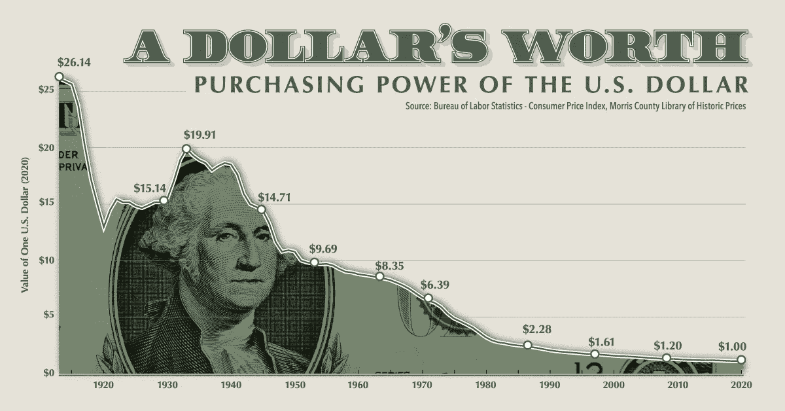
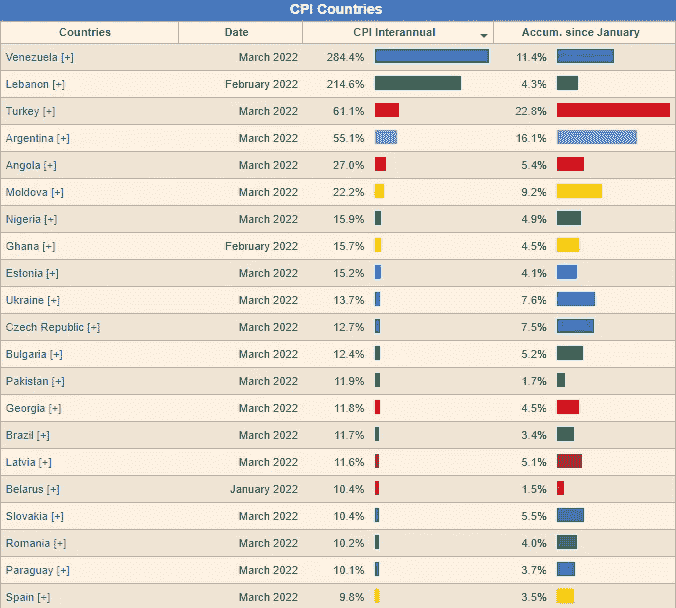
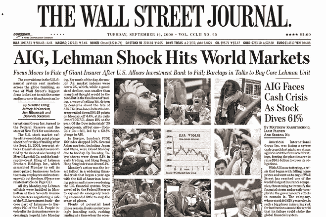
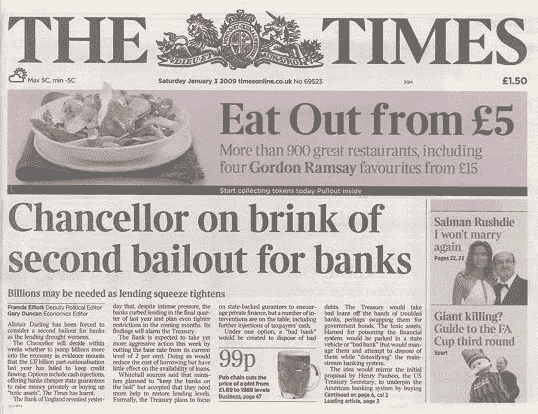
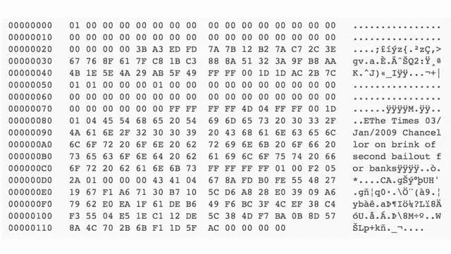

# 我们为什么需要加密货币？

> 原文：<https://medium.com/coinmonks/why-do-we-need-cryptocurrency-967e1f4cd49a?source=collection_archive---------45----------------------->

加密货币的主要用途是什么？当初为什么会被创造出来？让我们简单介绍一下这一切是如何开始的。

# 金钱和货币

首先，让我们讨论一下钱到底是什么。什么是货币？以及我们如何区分这两者。我们可以找到多种定义和关键属性。让我们做一些总结。

钱是什么？为什么我们会想到它？据信，我们的祖先在古代使用类似物物交换的方法、债务或礼物经济。一些文化演变成使用商品货币。

使用某种通用的交换媒介很方便。人们会同意**接受作为报酬的东西**。能让**长期保持稳定价值的东西**。因此**应该不容易伪造**并且**有限量供应**(不一定固定)。一些容易使用和转移的东西。还有一些**容易确定其价值的东西**。

人们试图使用多种资产，如石头、盐、贝壳或贵金属和硬币。每个人都有利弊。

金钱应该帮助我们及时保存我们的财富。当我们削减了一些货币属性，大部分用货币代替货币时，我们就演变成了国家。主要缺点是**我们失去了价值储存**。

The value of currency declines in time. [[Source](https://www.google.com/url?sa=i&url=https%3A%2F%2Fwww.visualcapitalist.com%2Fpurchasing-power-of-the-u-s-dollar-over-time%2F&psig=AOvVaw15cqtBY97IijcpzPqMyAOv&ust=1650488422454000&source=images&cd=vfe&ved=0CAwQjRxqFwoTCJjchdeCofcCFQAAAAAdAAAAABAD)]

我们都知道这张照片。美元的贬值。100 年后价格会下降。谁在乎呢。我们应该关心，因为它是最强的世界货币。结果很糟糕。

这没有任何意义。对吗？我不在乎未来几十年将会发生什么！不对。这不再是几十年的问题了。在极端情况下，我们可以在几个月内看到它。尤其是现在。

Losing value of currency is not question of decades anymore. [[Source](https://countryeconomy.com/cpi)]

每个人都注意到这些数字是游戏。现实更糟糕。工资涨得不够快，人们陷入困境。因此，我们应该尽最大努力找到一种方法来保护我们的财富。

另一个缺点是信任负责人。我们必须相信他们是出于好意。那是我们可以见证失败的地方。很多次。

# 缘由

我们都相信的金融体系欺骗了我们。富人为制造不义之财创造了有利环境。房地产市场进入了不可思议的泡沫，次级抵押贷款、不受监管的衍生品市场和作弊的评级机构导致了历史上最大的抢劫案之一。

富人和贪婪的人在赚取难以置信的金钱的同时，将世界经济拖入了衰退。它慢慢地将我们引向 2008 年 3 月贝尔斯登的崩溃，然后进一步引向 2008 年 9 月著名的 T2 雷曼兄弟的破产。

Frontpage of The Wall Street Journal in 2008\. [Source](https://www.google.com/url?sa=i&url=https%3A%2F%2Fwww.wsj.com%2Farticles%2FSB125251367648396111&psig=AOvVaw2_ggq2HuciW897KMcZtQnz&ust=1648336463129000&source=images&cd=vfe&ved=0CA0Q3YkBahcKEwjI8rqCsuL2AhUAAAAAHQAAAAAQAw)

这场危机导致许多人陷入贫困。一些企业倒闭，一些人失去了家园。我们都损失了很大一部分财富。对此事负责的人已经拿到了他们的奖金和数百万美元。为了防止更糟糕的经济混乱，政府想出了救市方案。这意味着我们都被迫为此付出代价。

The famous title of The Times was printed into the Bitcoin’s Genesis block. [Source](https://www.google.com/url?sa=i&url=https%3A%2F%2Fcryptobreaking.com%2F10-years-ago-bitcoins-genesis-block-changed-the-course-of-history%2F&psig=AOvVaw1Il56iHZUtpmXl_hOWzWqb&ust=1648337450988000&source=images&cd=vfe&ved=0CAsQ3YkBahcKEwi4zbbXteL2AhUAAAAAHQAAAAAQBA)

是的，它是用国家的钱支付的。国家的钱是从我们的税收中征收的。当你拿到工资时，你就要交税。当你购买食物时，你要交税。如果商家从中获利，就要交税。如果商家给员工发工资，你知道会发生什么。我们生活在税收的循环中。

我们向国家纳税以换取服务和保护。但这一次，失败了。它让某些人变得比他们应得的更富有，并让我们为此买单。没有人受到惩罚，没有人对此负责。我们被打败了。如果你想以娱乐方式观看，我可以推荐《T4》监守自盗纪录片或[大型短片](https://www.imdb.com/title/tt1596363)电影。

Inside Job official trailer about the 2008 financial crisis.

当前的系统有明显的漏洞。这是最后一滴了。比特币白皮书于 2008 年 10 月 28 日发布。*一个点对点的电子现金系统*。[genesis 区块](https://www.blockchain.com/btc/block/0)于 2009 年 1 月 3 日开采。里面有一条消息: ***【泰晤士报 03/1/2009 财政大臣濒临第二次银行救助】。***

The Genesis block of Bitcoin. [Source](https://news.bitcoin.com/a-deep-dive-into-satoshis-11-year-old-bitcoin-genesis-block/)

比特币。新的金融体系。没有贪婪的中间商，没有单点故障。基于密码和算法的系统。该系统有固定的规则，没有办法作弊(直到你将劫持大多数采矿权力)。我们不应忘记，不幸的是，许多人已经这样做了。

# 关键属性

我讨厌这些带有关键词的概述。这让我想起了学生时代，那时你必须记住粗体单词，并重复这些单词才能取得好成绩。但是我们在这里。加密货币应该具备哪些属性？应该是什么？

## 分散的

我们喜欢宣称加密是分散的。但是我们必须承认这不是事实，不完全是。我想在下一篇文章中更多地关注它。总结一下:[矿工或验证者集权](https://www.visualcapitalist.com/after-chinas-crypto-ban-who-leads-in-bitcoin-mining/)，大多数情况下的单一核心团队，[破坏治理](https://decrypt.co/45060/defi-drama-defi-uniswap-governance-proposal-sparks-controversy)，[无视限制](https://github.com/Uniswap/interface/blame/main/src/constants/tokenLists/unsupported.tokenlist.json)，缺乏社区参与[监督](https://www.protocol.com/bulletins/axie-infinity-ronin-hack)。

## 不变的

[付款一旦处理完毕就不可撤销](https://en.bitcoin.it/wiki/Irreversible_Transactions)。如果网络被保护免受双重花费或足够分散以防止通过 [51%攻击](https://www.crypto51.app/)重组块。

## 匿名的

默认情况下，您可以使用 crypto 假名。交易是公开的，因此是可追踪的。我们可以通过一些先进的技术实现匿名，但是仍然有元数据可以破解它。

## 不可靠的

一个由算法统治的自治网络。没有中间人，没有失败点。[直到出现一个 bug——安全漏洞](https://en.bitcoin.it/wiki/Common_Vulnerabilities_and_Exposures)。

## 未经许可

您可以全天候访问您的资产。没人需要允许你。你可以随时随地向任何人办理。你说了算。如果网络正常，并且您没有丢失您的私钥。与银行[关闭你的账户](https://www.nerdwallet.com/article/banking/can-my-bank-close-my-account)或[冻结整个国家的资产](https://www.nbcnews.com/data-graphics/russian-bank-foreign-reserve-billions-frozen-sanctions-n1292153)相反。

## 无边界的

加密让您可以选择将您的资产带到任何地方，从任何地方访问它们，或者将它们发送到任何目的地，而没有任何限制。

听起来是不是比现在的银行体系要好？你需要乞求你的银行使用你的钱并支付荒谬的费用的系统。加密货币带来了另一种选择。作为副作用，我们用它得到了*(某些情况下是**)。***

# ***黑暗面***

***在一个大多数人都被贪婪所驱使的时代，曾经有人站出来说:**不**。做出了改变。我们有机会。参与大事的机会。***

******

***‘Make me rich, ser’. [[Source](https://www.google.com/url?sa=i&url=https%3A%2F%2Fthedefiant.io%2Ffrog-nation-cfo-quadrigacx%2F&psig=AOvVaw2F3WPsU_39a3tsdrCqcrpO&ust=1650498762276000&source=images&cd=vfe&ved=0CAwQjRxqFwoTCIDD05-pofcCFQAAAAAdAAAAABAD)]***

***我们利用这个机会做了什么？我们要去哪里？仍然有人相信更好的未来，并努力去建设它。随着越来越多的成功，我们面临着骗子，罪犯和欺诈的流入。***

***我们放弃了权力下放，围绕新救世主建立了邪教。我们谈论被高估的权力下放。我们推销骗局来赚我们的钱，变得富有，享受名声。***

# ***结论***

***我们不应该忘记是什么触发了加密货币的诞生。我们不应该忘记这些事件。我们不应该对金融机构的行为视而不见。***

***我们可以看到加密如何帮助高通胀国家的人们。逃离战争的人们。在政府决策下受苦的人们。***

***加密可能不会取代当前的金融系统。可以作为它的补充。可以带来一些平衡和公平。它也可能失败、崩溃，永远无法恢复。这取决于我们的决定，接下来会发生什么是我们的责任。***

> ***加入 Coinmonks [电报频道](https://t.me/coincodecap)和 [Youtube 频道](https://www.youtube.com/c/coinmonks/videos)了解加密交易和投资***

# ***另外，阅读***

*   ***[Bookmap 评论](https://coincodecap.com/bookmap-review-2021-best-trading-software) | [美国 5 大最佳加密交易所](https://coincodecap.com/crypto-exchange-usa)***
*   ***最佳加密[硬件钱包](/coinmonks/hardware-wallets-dfa1211730c6) | [Bitbns 评论](/coinmonks/bitbns-review-38256a07e161)***
*   ***[新加坡十大最佳加密交易所](https://coincodecap.com/crypto-exchange-in-singapore) | [购买 AXS](https://coincodecap.com/buy-axs-token)***
*   ***[红狗赌场评论](https://coincodecap.com/red-dog-casino-review) | [Swyftx 评论](https://coincodecap.com/swyftx-review) | [造币厂评论](https://coincodecap.com/coingate-review)***
*   ***[投资印度的最佳密码](https://coincodecap.com/best-crypto-to-invest-in-india-in-2021)|[WazirX P2P](https://coincodecap.com/wazirx-p2p)|[Hi Dollar Review](https://coincodecap.com/hi-dollar-review)***
*   ***[加拿大最佳加密交易机器人](https://coincodecap.com/5-best-crypto-trading-bots-in-canada) | [库币评论](https://coincodecap.com/kucoin-review)***