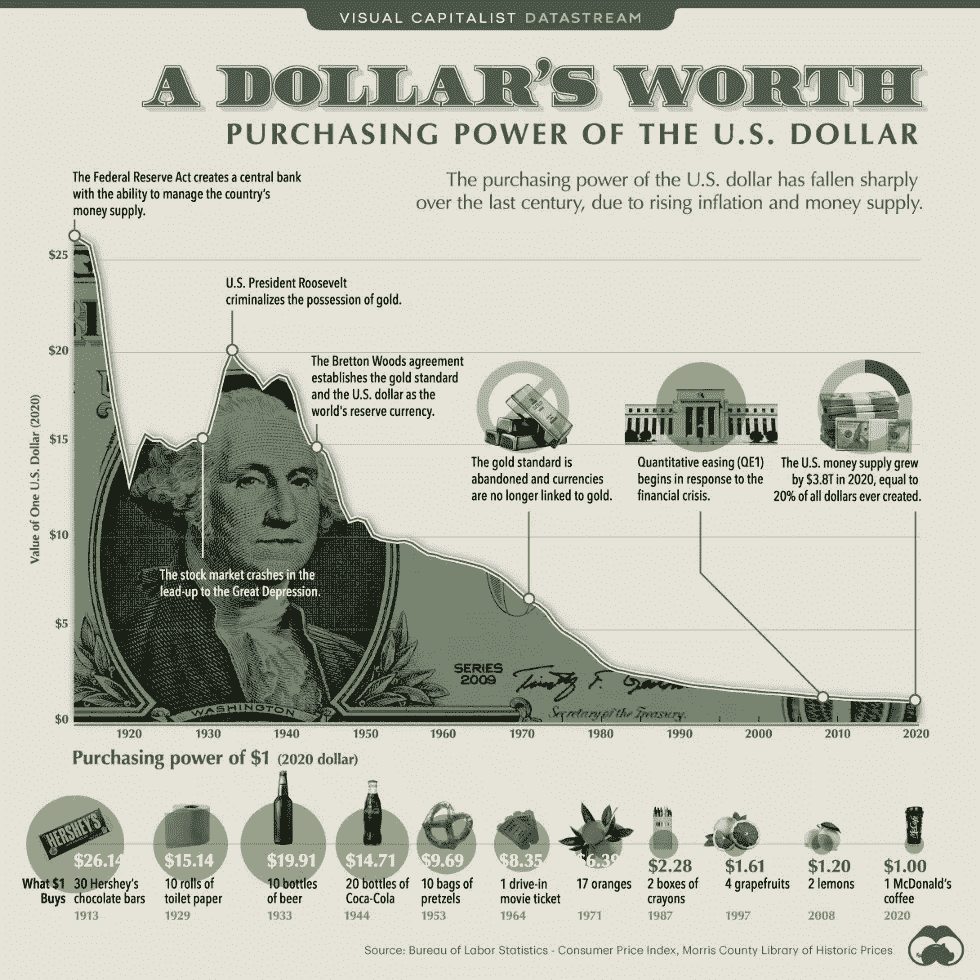

# 为什么恶性通货膨胀会导致王朝崩溃？

> 原文：<https://medium.com/coinmonks/why-does-hyperinflation-cause-dynasties-to-collapse-40d5a5f05960?source=collection_archive---------6----------------------->

## 太大而不能倒，这就像说太胖而不能节食。

我们购物车里的商品越来越少，而收据却越来越重。甚至网飞也提高了他们的月订阅费！

# 第一，什么是通货膨胀？

> *通货膨胀是给定货币的***购买力随时间的下降。**

*在酒吧里，这意味着你今天的一美元，明天会比昨天更不值钱。*

# *历史实例:*

***战后德国 1922 年**:在新成立的魏玛共和国的作用下，它发现自己处于巨大的压力之下，挣扎于一战战胜国向其索要的巨额战争赔款。这与重建战后国家的国内刺激措施相结合，再加上对生产能力的打击，如法国占领该国最强大的工业中心，使政府别无选择，只能印刷更多的钱，试图让他们的经济在任何能力下工作。这种不计后果的印刷，加上同样不计后果的借贷和国家生产能力的下降，使得德国货币的价值达到了这样一种程度:纸币更好地被用作家庭取暖的燃料，而不是交换单位。*

*饥饿的 1945 年:这个国家被第二次世界大战的余波摧毁，超过一半的工厂和企业被大规模摧毁，降低了他们为人民提供稳定生活水平的潜力。政府别无选择，只能通过私人银行向企业发放贷款，引导越来越多的资金从零开始重建。字面上。这种不计后果的货币创造，加上同样不计后果的借贷和国家生产能力的下降，见证了匈牙利 pingo 储罐对工厂的价值，该国的价格每 15 小时翻一番。*

***南斯拉夫 1992 年**:苏联的解体以及克罗地亚和波斯尼亚的持续冲突降低了工业生产能力，而联合国对该国实施的贸易禁运加速了产量的下降。为了解决这个问题，政府开启了印钞机，让借贷变得更加容易。你也许能猜到接下来会发生什么。*

*津巴布韦 2007 年:一系列考虑不周的政策导致资本大量外流，压低了美元汇率。这使得进口化肥和农业设备等农业物资变得非常昂贵，这反过来又削弱了国家的产量。这与现在臭名昭著的土地改革法案相结合，使政府别无选择，只能试图通过印刷摆脱困境，但无济于事。*

***朝鲜 2009 年**:农业产量受到制裁和糟糕天气的影响，印钞引发恶性通货膨胀。*

***委内瑞拉 2016** :持续的政治不稳定加上国际制裁让委内瑞拉政府别无选择，只能印钞以维持慷慨的生活水平。*

## *这种印钞的结果是什么？*

*这种不计后果的货币创造伴随着产出的大规模减少和恶性通货膨胀。在所有这些例子中，这些只是上个世纪的精选，有一些非常明显的共同趋势，一些不稳定的事件，如战争或自然灾害，或一项导致生产力急剧下降的政策，这些都可以通过印钞资助的刺激措施来纠正。*

> *不幸的是，几乎所有这些例子都导致某种形式的失败状态。*

*经济衰退是不幸的现实，但这应该是意料之中的。市场崩溃可能会刺痛一些投资者，并将普通人的退休时间推迟几年，但对于那些有时间视野和毅力持有广泛资产组合的人来说，一切通常都会很好，但恶性通货膨胀则不同。如果不进行某种大规模的政权更迭或完全放弃主权货币，几乎没有哪个经济体能从这种诊断中恢复过来，这两种选择都不是特别有吸引力。对美元来说，恶性通货膨胀已经结束。*

**

*冠状病毒的前沿对该国的打击尤为严重，超过 3000 万人被感染，50 万人不幸去世。虽然这场磨难的人类代价显然是最具毁灭性的，但疫情对经济的影响是不可否认的。数百万人仍然没有工作，这不是他们自己的错。一旦旅游业、个人接待业、零售业和娱乐业等稳定行业几乎被淘汰，许多中小企业甚至大型企业都被迫永久关闭，尽管有恢复正常的希望，但这些行业在很长一段时间内都不会满负荷运转。为了应对经济产出的大幅下滑，美国在过去 12 个月里印制了超过三分之一的现行货币。由于全球疫情带来的破坏，这种印钞行为与私人部门借贷的增加和生产能力的下降结合在一起。如果这一系列情况听起来很熟悉，不要担心，因为显然对美国来说这一切都将是不同的。也许美国真的是一个特殊的经济体，如此之大和有影响力，以至于它不像这些历史警示故事那样遵守同样的规则。也可能不是。但是为了确定这一点，我们总是需要关注一些重要的细节。*

## *通货膨胀何时开始成为经济中一个无法解决的问题？*

*通货膨胀是一个奇怪的概念，人们很难理解。我们倾向于用美元、日元、欧元或者任何我们或者至少是市场愿意交换的东西来表示事物的价值。这栋房子值多少钱？哦，那辆新车值 30，000 美元。水管工收了我 200 美元只是为了疏通我的水槽，令人难以置信的是，比特币现在一直交易超过 40，000 美元。我们将经济价值建立在货币价值的基础上。因此，当评估货币本身的价值时，事情往往会变得有点奇怪。你几乎可以把货币的真实价值想象成它在其他有价值的事物之间的汇率。*

*想象一下美元和 S&P500 指数之间的关系。同样，我们表示这有一个等式，其中一个指数单位自 2020 年初以来价值约为 400 美元。这个由美国 500 家最大公司组成的指数无疑变得不那么好了。当然，有一些公司受益于在家工作或提供产品以对抗疫情，但大多数公司都在挣扎。全球供应链已经放缓，使生产更加困难。人们走动少了，因此燃烧的燃料也少了，更不用说直接参与旅游业或酒店业的公司了。现在基本上靠政府维生。公平地说，这 500 家公司的集合不如 16 个月前好。它生产的产品越来越少，利润越来越少，而且更加依赖政府补贴，而这种补贴在可预见的未来可能会持续，也可能不会持续。因此，有理由认为，在所有其他条件相同的情况下，该指数今天可兑换的美元将比 2020 年初时少。但当然，事实并非如此。事实上，与 2020 年初相比，它可以兑换 30%的美元。当然，现在我们通常把股市升值视为一件好事。但同样，那是因为我们从美元的角度来衡量价值。如果股票市场升值，我们自然会认为这是因为市场中的公司为投资者做得更好。*

> *我们不认为这是因为我们以美元为基础的参考框架已经下跌。*

*在整个印钞过程中，消费者价格指数一直保持在 3%以下。当你考虑到影响物品价格的另一个因素，它们的组成部分时，这就变得更加奇怪了。过去 12 个月，铁矿石价格上涨了一倍多。像玉米和大豆这样的木材作物也是如此，它们是我们食物的重要组成部分，增长了 70%以上。但是消费者价格指数和由钢铁、木材、玉米和大豆制成的商品的价格指数几乎没有变化。这到底是怎么回事？是否有一些创造性或潜在的欺诈性会计工作正在进行？还是美国真的对通胀太好了？到目前为止，需要考虑的两大因素是，美国赚了更多的钱，却没有生产更多的东西。这意味着自然会有更多的钱来竞拍更少的东西，从而推高简单供求的价格。到目前为止，这些价格上涨只发生在股票、加密货币、房地产和原材料等资产市场。尽管这些市场与消费品和服务市场之间存在直接关系，但由于通胀率一直居高不下，消费者价格指数实际上是该报告的衡量指标。现在，坏消息是，这很大程度上可能仅仅是因为时机问题。目前，人们仍然相对担心花钱太多。美国的储蓄率正处于近年来的最高水平，这意味着对投资资产的需求上升，而普通消费受到了影响。这不会永远持续下去。在许多情况下，这种财政责任实际上甚至不是一个选择的问题，更多的是一个被困在家里，无法在假期或与朋友外出的夜晚花大钱的问题。一旦这成为可能。再一次，如果历史可以借鉴，你最好相信大多数人会很快花光他们的 COVID 储蓄。*

## *为什么人们认为美国不会受到所有这些例子的影响？*

*现在，美国经济可能还有一个可取之处，那就是它作为世界储备货币的地位。现在这个词被抛来抛去，人们经常在这场辩论中使用它来反驳美国最终可能像委内瑞拉一样的可能性，不管他们让多少钱印刷或运行，但通常情况下，人们并不完全理解它的意思。70 年前，这确实意味着 1973 年以前美元是由黄金支持的，美国拥有世界上最大的黄金储备。世界上的其他货币依次支付给美元，因此美元是今天所有全球金融的基础，这意味着一些不同的东西。美元不再由黄金支撑，大多数全球货币不再与美元挂钩，而是在外汇市场上自由浮动。今天，这仅仅意味着美元是其他国家最广泛持有的外币。仅中国就持有近 3 万亿美元，全球外汇储备总额超过 7 万亿美元。这实际上意味着，美元的价值不仅取决于其国内市场的购买力，还取决于其在全球的购买力。*

*因此，美国货币的价值更多地取决于全球的生产能力，而不是各州的生产能力。这确实给了美元一定的贬值阻力，但不是无限的。它也不能保护美国免受整个全球经济受到影响的情况，比如全球疫情。现在，当然，这不一定是一个预先确定的结论，但写作是在墙上。*

# *以今天的购买力，10 年后 100 万美元值多少钱？*

**

## *政府如何阻止通货膨胀？*

1.  *政府可以使用工资和价格控制，但这会导致经济衰退和失业。*
2.  *政府可以通过降低债券价格和提高利率来减少货币供应量。缺点是他们支付更多的钱来偿还债务，经济放缓。*

# *你如何为此做准备？*

*我们不能控制通货膨胀，但是我们可以控制我们对它的反应。*

*   *通货膨胀吞噬菲亚特*
*   *你的资产需要比通货膨胀率增长得更快才能生存。看看高增长或通缩的资产。*
*   *保持你的债务在菲亚特又名借款。*
*   *条条大路通₿——最终的通货紧缩对冲。BTC 的 CAGR 是 171%，而所有货币的通货膨胀率是 14%。这也是对不稳定政府、网络威胁和偏执领导人的对冲。*

> *加入 Coinmonks [电报频道](https://t.me/coincodecap)和 [Youtube 频道](https://www.youtube.com/c/coinmonks/videos)了解加密交易和投资*

## *另外，阅读*

*   *[最佳网上赌场](https://blog.coincodecap.com/best-online-casinos) | [币安评论](/coinmonks/binance-review-ee10d3bf3b6e) | [BitMEX 评论](https://blog.coincodecap.com/bitmex-review)*
*   *[麻雀交换评论](https://blog.coincodecap.com/sparrow-exchange-review) | [纳什交换评论](https://blog.coincodecap.com/nash-exchange-review)*
*   *[美国最佳加密交易机器人](https://blog.coincodecap.com/crypto-trading-bots-in-the-us) | [经常性回顾](https://blog.coincodecap.com/changelly-review)*
*   *[在印度利用加密套利赚取被动收入](https://blog.coincodecap.com/crypto-arbitrage-in-india)*
*   *[Godex.io 审核](/coinmonks/godex-io-review-7366086519fb) | [邀请审核](/coinmonks/invity-review-70f3030c0502) | [BitForex 审核](https://blog.coincodecap.com/bitforex-review)*
*   *[折叠 App 回顾](https://blog.coincodecap.com/fold-app-review) | [LocalBitcoins 回顾](/coinmonks/localbitcoins-review-6cc001c6ed56) | [Bybit vs 币安](https://blog.coincodecap.com/bybit-binance-moonxbt)*
*   *[加密保证金交易交易所](/coinmonks/crypto-margin-trading-exchanges-428b1f7ad108) | [赚取比特币](/coinmonks/earn-bitcoin-6e8bd3c592d9) | [Mudrex 投资](https://blog.coincodecap.com/mudrex-invest-review-the-best-way-to-invest-in-crypto)*
*   *[WazirX vs CoinDCX vs bit bns](/coinmonks/wazirx-vs-coindcx-vs-bitbns-149f4f19a2f1)|[block fi vs coin loan vs Nexo](/coinmonks/blockfi-vs-coinloan-vs-nexo-cb624635230d)*
*   *[比斯勒评论](https://blog.coincodecap.com/bitsler-review)|[WazirX vs coin switch vs coin dcx](https://blog.coincodecap.com/wazirx-vs-coinswitch-vs-coindcx)*
*   *[7 大副本交易平台](https://blog.coincodecap.com/copy-trading-platforms) | [买币点评](https://blog.coincodecap.com/buycoins-review)*
*   *XT.COM 评论[币安评论](https://blog.coincodecap.com/profittradingapp-for-binance) |*