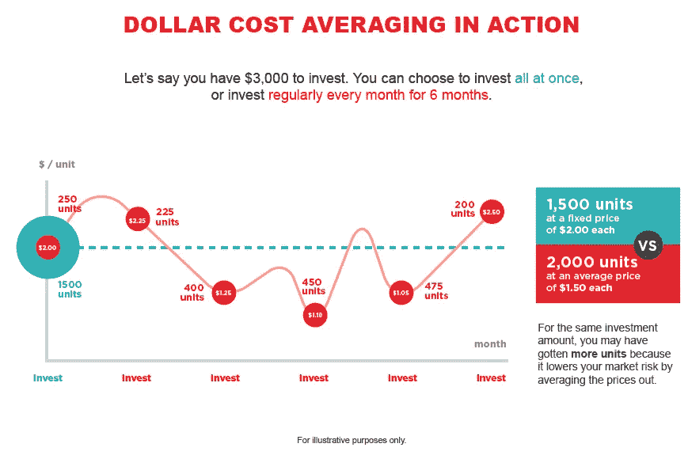

# 为什么美元成本平均法(DCA)适用于大多数加密投资者

> 原文：<https://medium.com/coinmonks/why-dollar-cost-averaging-dca-works-for-most-crypto-investors-84341a32ca9c?source=collection_archive---------29----------------------->

每个想要加入加密货币领域的人的第一步是决定遵循哪种投资策略。在几种不同的方法中，如价值平均法和一次总付法，最常用的一种是美元成本平均法(DCA)。

**平均成本(DCA)概念**

DCA 策略的定义是由价值投资理论的创始人[本杰明·格拉哈姆](https://www.investopedia.com/articles/07/ben_graham.asp)推广的。它最初被定义为“在一段时间内以固定的时间间隔在相同的投资中投资固定的金额”，这种做法的主要目标是减少投资者平均买入价格的波动影响。

虽然这个概念是为股票市场设计的，但它也适用于加密货币，特别是因为这是一个受外部因素(如全球经济、政治和媒体)影响很大的波动市场。

**关注一致性**

如果正确遵循这种方法，当投资于由普遍不确定性引起的更大波动时，会带来更多的信心。如果投资者有相同的频率，时间因素从来不是问题，因为他创造了一个长期的隧道视野。

这样做，把高价入市的风险降到最低；即使一个投资者真的在最高点进入，他也知道它在短期或中期可能会贬值，但仍然相信价值会上升。这是一种通过减少一次性购买的波动性来降低风险的策略，而不是为了最大化利润——尽管通常情况下，在进行回溯测试时，这种策略从长期来看比单笔订单表现更好。

**战略调整**

不一定需要严格遵循本杰明·格拉哈姆定义的 DCA 方法:

*   虽然推荐，**但不需要系统的遵循投资区间和成交量**。如果之前已知的事件可能在特定日期影响市场，投资者应该根据自己的信念决定是在事件之前还是之后投资(以及投资多少)。
*   时机在策略中起着至关重要的作用，可以大大增加回报。投资者可以学习一些模式，比如健康的修正。如果一个象征性的价格一周接一周地上涨，并达到 ATH(历史最高水平)，那么在不久的将来，它很可能会经历市场价格的调整

**关于承诺的一切**

这种方法适用于一个人的定期储蓄。假设你作为一名投资者，把一部分薪水存起来投资于加密，你将会养成一种习惯，这种习惯会带来更多的财务纪律，并间接带来对你所投资资产的持续监控。

如果一种资产的价格暴跌(例如比特币)，但基本面没有改变，那么你可以投资更高的金额。或者，如果价格突然飙升，你可能会考虑投资较小的价值。最重要的是在频率上进行接触。

引用沃伦·巴菲特(Warren Buffet)的话，他恰巧是本·格雷厄姆最成功的弟子:“我们的目标更加谦虚:当别人贪婪时，我们只是试图恐惧，只有当别人恐惧时，我们才贪婪。”

**警告:使用 DCA 作为辅助工具**

DCA 战略很简单，似乎对该行业的新来者很有吸引力，但投资决策应该包括对该行业及其参与者的更深入了解。对市场和公司动向的前期研究和持续监控对于决定一项投资的成功(或彻底失败)至关重要。

**在**[**Robert Ventures**](https://robertventures.com/)**，我们有一个专门的团队，专注于对投资的最佳行业和项目进行详细的尽职调查，并确定最佳时机。**

*如果您是合格投资者，并想了解更多关于我们产品的信息，请联系我们在 Robert Ventures 的***。**

**

*Visit: RobertVentures.com*

*乔·罗伯特目前是罗伯特风险投资公司的首席执行官，拥有 20 多年的资产管理经验。自创业以来，乔已经为投资者和合伙人创造了可预见的两位数回报。Joe 已经投资了股权和代币的种子轮，以及比特币、以太坊和其他顶级加密货币的投资组合。*

*如果您是合格投资者，并想了解更多关于我们产品的信息，请联系我们。*

> *加入 Coinmonks [电报频道](https://t.me/coincodecap)和 [Youtube 频道](https://www.youtube.com/c/coinmonks/videos)了解加密交易和投资*

# *另外，阅读*

*   *[Botsfolio vs nap bots vs Mudrex](/coinmonks/botsfolio-vs-napbots-vs-mudrex-c81344970c02)|[gate . io 交流回顾](/coinmonks/gate-io-exchange-review-61bf87b7078f)*
*   *[CoinFLEX 评论](https://coincodecap.com/coinflex-review) | [AEX 交易所评论](https://coincodecap.com/aex-exchange-review) | [UPbit 评论](https://coincodecap.com/upbit-review)*
*   *[AscendEx 保证金交易](https://coincodecap.com/ascendex-margin-trading) | [Bitfinex 赌注](https://coincodecap.com/bitfinex-staking) | [bitFlyer 审核](https://coincodecap.com/bitflyer-review)*
*   *[Bitget 回顾](https://coincodecap.com/bitget-review)|[Gemini vs block fi](https://coincodecap.com/gemini-vs-blockfi)cmd |[OKEx 期货交易](https://coincodecap.com/okex-futures-trading)*
*   *[AscendEx Staking](https://coincodecap.com/ascendex-staking)|[Bot Ocean Review](https://coincodecap.com/bot-ocean-review)|[最佳比特币钱包](https://coincodecap.com/bitcoin-wallets-india)*
*   *[霍比评论](https://coincodecap.com/huobi-review) | [OKEx 保证金交易](https://coincodecap.com/okex-margin-trading) | [期货交易](https://coincodecap.com/futures-trading)*