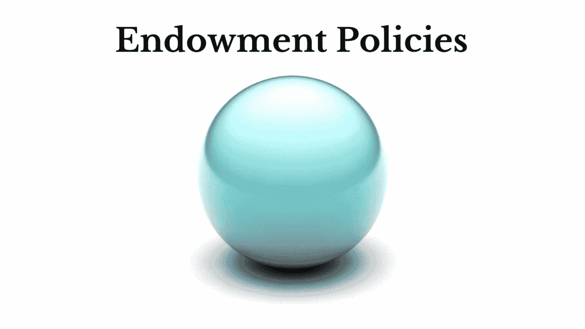

# 为什么捐赠政策是财富破坏者？

> 原文：<https://medium.com/coinmonks/why-endowment-policies-are-wealth-destroyers-a27375f30e5c?source=collection_archive---------17----------------------->

我在财务上很天真，认为捐赠政策是财富的创造者，但我意识到我的错误。

几年前，我姑姑让我通过她从 LIC(印度人寿保险公司)购买一份养老保险。我礼貌地拒绝了她的提议，有意识地努力不让我们的关系紧张。我很尊重她的为人，除了我不能…