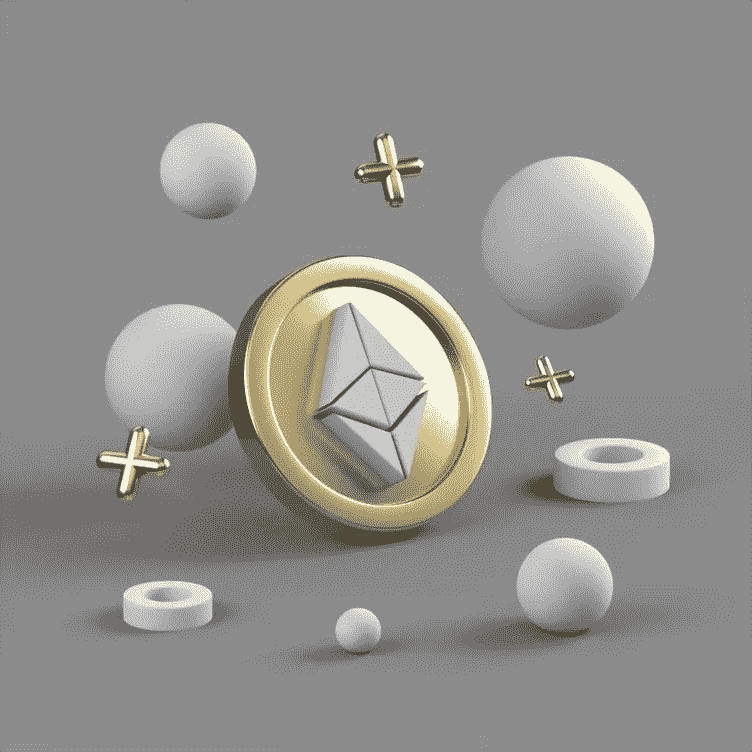

# 为什么以太坊仍然是山丘之王

> 原文：<https://medium.com/coinmonks/why-ethereum-is-still-king-of-the-hill-f9d0a02f946c?source=collection_archive---------56----------------------->

虽然有几十个所谓的“以太坊杀手”，但没有人真正成功地赶上 800 磅的大猩猩，甚至没有人接近它。

虽然有些已经比其他的更接近了，但我们真的不能说已经有一个令牌接近以太坊的用法，尽管它目前正在处理一系列问题。