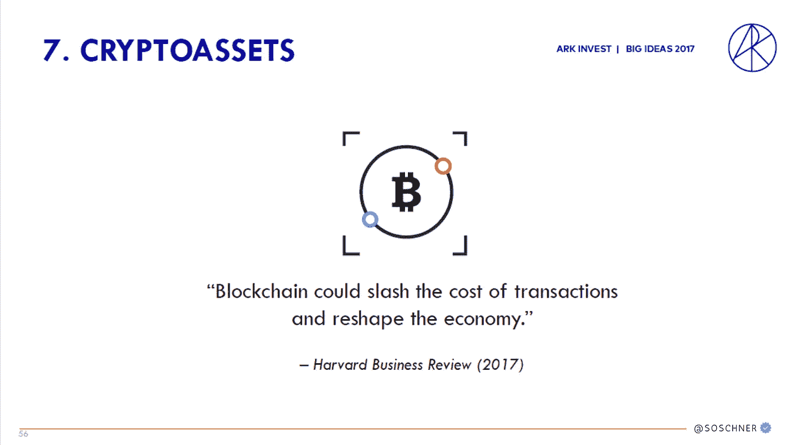

# 为什么以太坊到 2030 年将增长 75 倍

> 原文：<https://medium.com/coinmonks/why-ethereum-will-75x-by-2030-62178d71c14f?source=collection_archive---------16----------------------->

## 数字资产| NFT |方舟基金

## 凯西·伍德在《大创意报告》中解释道

[Big Ideas Report 2017](https://valueplan.files.wordpress.com/2017/06/big-ideas-2017.pdf)

在撰写本文时， [Coinmarketcap](https://coinmarketcap.com/) 记录了超过

> 18000 种不同的加密货币
> 
> 超过 400 次交流