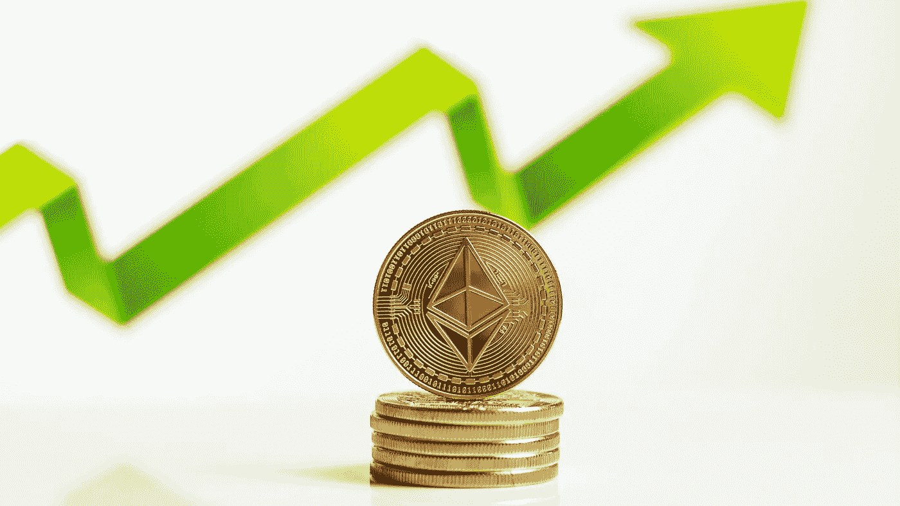

# 为什么以太坊的合并会摧毁它的对手

> 原文：<https://medium.com/coinmonks/why-ethereums-merger-could-destroy-its-rivals-2c115b1588ed?source=collection_archive---------34----------------------->

Source photo Unsplash.com

以太坊可能会重新测试其支持区域，因为市场情绪表明会出现更多亏损。Solana、Avalanche 和其他高市值加密货币是市场规模第二大的加密货币，推动了最近的飙升。

以太坊可能会在未来几个月继续主导市场。根据某些分析师，包括前 BitMEX 首席执行官亚瑟·海斯，的价格…