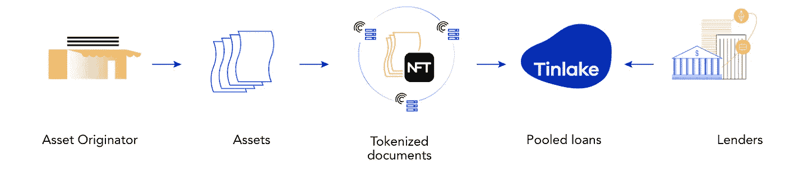

# 为什么大家都爱丁莱克？

> 原文：<https://medium.com/coinmonks/why-everyone-loves-tinlake-bfcbe7e82c2b?source=collection_archive---------16----------------------->

无论是支持加密还是反对加密，你都会喜欢 Tinlake 为这个世界所做的一切。

你知道 82%的小企业都是因为现金流不畅而倒闭的吗？现金流不佳的一个主要原因是不合理的 45-60 天付款差距，这种差距存在于现代 B2B 交易中，从交付产品和服务之日算起。这种延迟的付款时间表使小型企业暴露在残酷的市场条件下，导致成千上万的中小型企业(SMB)倒闭。这种安排最令人沮丧的一点是，它在任何给定的时间点锁定了全球供应链中价值 30 万亿美元的流动性，而流动性现金的缺乏给中小企业带来了巨大灾难。此外，主要由于融资成本非常高，传统融资的大门对这些小企业关闭或无法进入。

另一方面，我们有分散融资(DeFi ),在这种情况下，数千亿美元的流动性池可用于以非常低的成本借款。但是，缺乏能够将现实世界的资产连接到 DeFi 的适当基础设施，使得这些中小企业无法获得这种低成本的流动性。这就是 Tinlake 出现的地方，它是一个开放的 DeFi 协议和现实世界资产池市场，有望为全球中小企业释放流动性。

## 但是，廷莱克是如何工作的呢？

Tinlake 将现实世界的资产连接到 DeFi。这使得中小企业可以通过保留发票、抵押贷款或流动版税作为抵押品来利用低成本流动性。贷款寻求者通过由离心机链驱动的安全点对点网络在 Tinlake 生态系统中上传他们的财务发票。这些金融资产随后被转换为不可替代的代币(NFT ),并持有贷款条款，如借款费用和这些 NFT/代币化资产的最大融资金额，这些金额由链上定价记分卡和“定价神谕”确定。一旦对 NFT 进行了定价，资产发起人就可以选择根据其资产类别从 Tinlake 的流动性池中进行借款。在偿还贷款时，NFT 被解锁并转移回资产发起者的钱包中。

Borrowing From Tinlake | [Image Source: Centrifuge](https://docs.centrifuge.io/getting-started/understanding-tinlake/)

我们用一个简单的例子来理解这个过程。想象一下一家披萨盒制造公司的老板 Ryan，他在过去的 3 年里一直为一家跨国披萨品牌提供产品。现在是假期，Ryan 急需一些资金来给辛勤工作的员工发放假期奖金。因此，他找到了同意为他提供资金的传统金融机构，但 Ryan 在知道他们的高借贷成本(每年 15%及以上)后感到沮丧，并决定不接受他们的提议。在进一步的探索中，他了解到 Tinlake 的低融资成本，并通过其生态系统中的资产发起人上传了他的发票(资产)。上传后，他的资产被转换为 NFT，贷款本金和借贷成本被分配给它。Ryan 他对融资条款感到满意，将他的令牌化资产锁定为智能合同集作为抵押品，并通过 Tinlake 借入全部或部分批准的贷款。因此，摆脱了传统金融永无止境的债务陷阱。

## 但是，这对贷方有什么好处呢？

这些令牌化的资产为零售 DeFi 投资者和 DeFi 协议(如制造商 DAO 和 Aave)创造了*安全和稳定的*回报，这些投资者和协议经常受到加密资产高波动性的困扰。这些投资者向 Tinlake 池提供流动性，并获得丰厚的收益和 10 美元 CFG(离心机令牌)回报。对于每个锡湖池，存在两种不同的投资代币，即[锡和](https://docs.centrifuge.io/getting-started/understanding-tinlake/#drop--tin-the-two-tranches)。TIN 是高风险—高回报代币，而 DROP 是低风险、稳定回报的代币。这种安排类似于传统金融中盛行的初级/高级投资结构。真正让向 Tinlake 资金池增加流动性变得显而易见的是在任何时间点撤回投资的灵活性，因为它的资金池被设置为“循环”或开放式资金池。

## 谁能从 Tinlake 借到钱？

在撰写本文时，Tinlake 的市场上有近 15 个资产池，真实资产的总价值为 70，734，769 DAI。这些池解决了不同的市场利基，如商业房地产、零工经济预付款、新兴市场消费者贷款、金融科技债务融资、货物和货运代理发票、贸易应收账款、品牌库存融资、房地产过桥贷款等。并为他们独特的融资需求提供非常创新的解决方案。

## 这种有前途的协议的前景如何？

Tinlake 于 2019 年问世，已经以其独特的视觉震惊了世界。今天，它被认为是少数几个成功地在真实世界和 DeFi 之间架起桥梁的精英协议之一。现实世界中的资产(房地产、股票、债券等等)价值高达数十万亿美元，Tinlake 才刚刚起步！

**我喜欢让 Defi 更贴近普通人，有常规的可消化内容。🚀关注我看我以后的帖子。**

*免责声明:此信息仅用于教育目的，并非财务建议。投资前的 DYOR。*

> 加入 Coinmonks [电报频道](https://t.me/coincodecap)和 [Youtube 频道](https://www.youtube.com/c/coinmonks/videos)了解加密交易和投资

# 另外，阅读

*   [麻雀交换评论](https://coincodecap.com/sparrow-exchange-review) | [纳什交换评论](https://coincodecap.com/nash-exchange-review)
*   [美国最佳加密交易机器人](https://coincodecap.com/crypto-trading-bots-in-the-us) | [经常性回顾](https://coincodecap.com/changelly-review)
*   [在印度利用加密套利赚取被动收入](https://coincodecap.com/crypto-arbitrage-in-india)
*   [Godex.io 评审](/coinmonks/godex-io-review-7366086519fb) | [邀请评审](/coinmonks/invity-review-70f3030c0502) | [BitForex 评审](https://coincodecap.com/bitforex-review)
*   [最佳比特币保证金交易](/coinmonks/bitcoin-margin-trading-exchange-bcbfcbf7b8e3) | [萝莉点评](/coinmonks/lolli-review-e6ddc7895ad8) | [比特币保证金交易](https://coincodecap.com/bityard-margin-trading)
*   [创造并出售你的第一个 NFT](https://coincodecap.com/create-nft) | [密码交易机器人](https://coincodecap.com/best-crypto-trading-bots)
*   [如何在 CoinDCX 上购买柴犬(SHIB)币？](https://coincodecap.com/buy-shiba-coindcx)