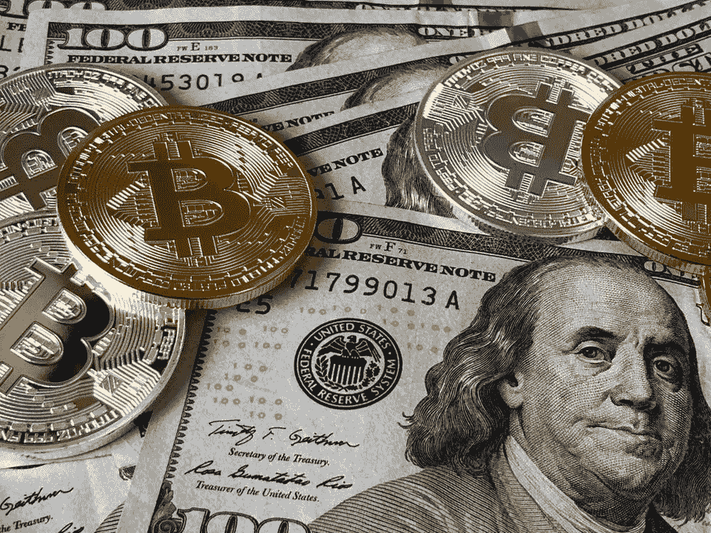

# 为什么每个人都应该拥有加密货币

> 原文：<https://medium.com/coinmonks/why-everyone-should-own-cryptocurrency-c0e97d148553?source=collection_archive---------44----------------------->

David McBee

加密货币并不适合所有人，尽管它可能适合。我之前提到过，这种数字货币有两个基本目的。首先是投资机会，其次是数字货币成为未来货币的潜力。

我谈到了加密货币市场投资潜力的风险。需要了解数字货币的未来货币潜力。世界各国政府掌握着这一部分的关键。政府控制货币的能力在引导国家或民族朝着当权者希望的方向发展方面发挥着重要作用。这是野兽的本性。

我越来越担心的是，我们美国政府中的民选官员正在采取(不是全部，但足够)这样的行为。那些官员随之而来的贪婪也起了作用。越贪婪，控制越紧；权力越大，货币的价值就越低。委内瑞拉最近的经济衰退只是这方面的一个(众多)例子。

他们声称知道什么对我们的健康最有益，或者知道如何教育我们的孩子，但却推动与此相反的立法。他们花，花，花，然后提供免费的钱，同时隐藏在适用于你的纳税申报单的小字里。这种行为正在破坏他们所代表的人民的信任。

任何政府都无法控制当前形式的加密货币——控制是最重要的。你害怕你无法控制的东西，因此寻求旨在控制它的立法，这是有道理的。这种做法是通常的商业惯例。然而，越来越多的报道称，各国政府正在推进创建数字货币的计划，这令人担忧。

仅举几个例子，中国、印度和美国的报告表明，这些政府正在积聚人力资源，以实现数字货币的创造。在我的研究中，我记得读过一句话，“数字货币是电子世界的完美货币。”

如果这是真的，而且我的研究表明这是真的，那么必须提出一个可行的问题；所有数字货币都有一席之地吗？答案是肯定的。目前世界上有近 200 种货币。每一种都有它的价值，每一种都可以根据汇率换成另一种货币。

想想这个。你拥有 1000 个比特币，但是你的国家不接受比特币作为法定货币。您正在根据汇率将一种数字货币兑换成另一种数字货币。你能把你的比特币换成你国家的法定货币吗？答案是肯定的，当然，除非世界各国政府宣布比特币非法。当然，这可能发生，但可能性有多大？

这个问题非常深入，在这个问题上会爆发很多争论——但是这个讨论是以后的事情。底线是拥有加密货币是明智之举。

> 加入 Coinmonks [电报频道](https://t.me/coincodecap)和 [Youtube 频道](https://www.youtube.com/c/coinmonks/videos)了解加密交易和投资

# 另外，阅读

*   [最佳网上赌场](https://coincodecap.com/best-online-casinos) | [币安评论](/coinmonks/binance-review-ee10d3bf3b6e) | [BitMEX 评论](https://coincodecap.com/bitmex-review)
*   [麻雀交换评论](https://coincodecap.com/sparrow-exchange-review) | [纳什交换评论](https://coincodecap.com/nash-exchange-review)
*   [美国最佳加密交易机器人](https://coincodecap.com/crypto-trading-bots-in-the-us) | [经常性回顾](https://coincodecap.com/changelly-review)
*   [在印度利用加密套利赚取被动收入](https://coincodecap.com/crypto-arbitrage-in-india)
*   [Godex.io 评审](/coinmonks/godex-io-review-7366086519fb) | [邀请评审](/coinmonks/invity-review-70f3030c0502) | [BitForex 评审](https://coincodecap.com/bitforex-review)