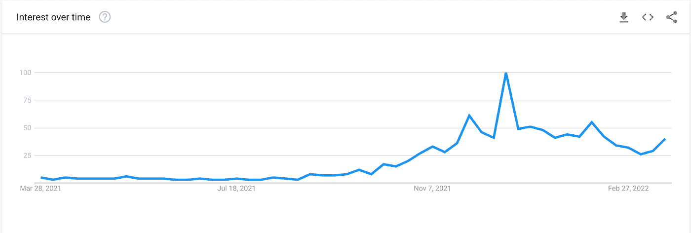
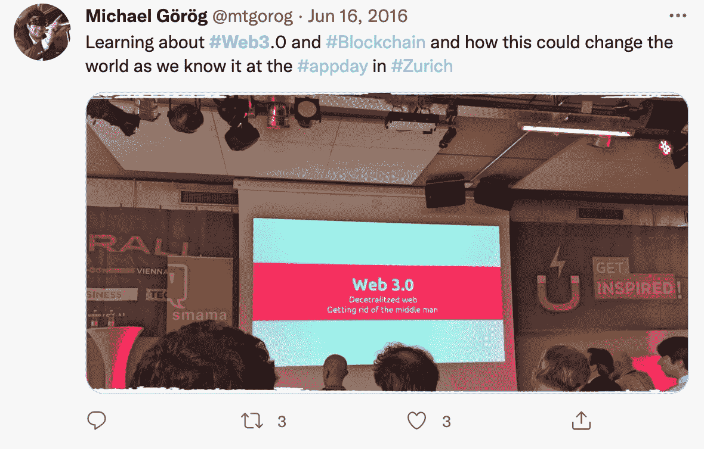

# 为什么每个人都对 Web3 如此困惑

> 原文：<https://medium.com/coinmonks/why-everyones-so-confused-about-web3-725790e9e371?source=collection_archive---------12----------------------->

在过去的 6 个月里，各种各样的媒体出版物都在努力回答这个问题:“什么是 Web3”？

*   《纽约时报》:什么是 Web3？
*   [彭博:什么是 Web3？](https://www.bloomberg.com/news/videos/2022-01-31/what-is-web3-video)
*   [《连线》:到底什么是 Web3？](https://www.wired.com/story/web3-gavin-wood-interview/)
*   《经济时报》:什么是 Web3？为什么这么多人问这个？
*   Vox:那么 Web3 到底是什么，为什么硅谷的每个人都对它着迷？
*   [coin desk:web 3 是什么，为什么大家都在谈论它？](https://www.coindesk.com/learn/what-is-web-3-and-why-is-everyone-talking-about-it/)
*   [福布斯:Web3 是怎么回事？举例说明](https://www.forbes.com/sites/bernardmarr/2022/01/24/what-is-web3-all-about-an-easy-explanation-with-examples/?sh=1d36c7aa2255)
*   NPR:人们都在谈论 Web3。它是未来的互联网还是仅仅是一个时髦的词？
*   [PC Magazine:什么是 Web3，它将如何工作？](https://www.pcmag.com/how-to/what-is-web3-and-how-will-it-work)

Web3 search interest over time

与此同时，“Web3”遇到了强大的阻力，主要来自从根本上对整个加密持怀疑态度的声音:

*   [杰克·多西:“web3 不是你的，是风投的”](https://twitter.com/jack/status/1473139010197508098)
*   斯科特·加洛韦:“瑜伽游戏的一种字体”
*   [斯蒂芬·迪尔:“Web3 是扯淡”](https://www.stephendiehl.com/blog/web3-bullshit.html)
*   [罗恩·米勒:《非理性繁荣》](https://techcrunch.com/2021/12/14/the-irrational-exuberance-of-web3/)
*   [《大西洋月刊》:“加密反弹正在蓬勃发展”](https://www.theatlantic.com/technology/archive/2022/02/crypto-nft-web3-internet-future/621479/)

我想提供一个人的观点，他从根本上对 crypto 持乐观态度，但却对“Web3”的定位持怀疑态度。坦白地说，我是一家邪恶的中央集权的大型科技公司的软件工程经理，Web3 应该可以拯救所有人。

我们将从分析作为媒体现象的“网络 3”迷因开始。接下来的时间线试图为我们如何陷入这一术语泥潭提供一个不敬的叙述:

**2014 年**

正如许多“什么是 Web3”的解释者正确指出的那样，以太坊的联合创始人[加文·伍德](https://www.wired.com/story/web3-gavin-wood-interview/)在 2014 年首次在加密背景下创造了这个术语，值得称赞。这是他 2014 年 4 月的博文。

伍德的愿景可以归结为通过分散化技术在网络上托管大部分数据的想法。因此，你的猫视频(静态文件)不会被托管在谷歌等企业巨头运营的服务器上，而是会分布在一个不受审查的合作节点网络上。为了管理可变的状态，比如你的追随者列表，可以使用分布式事务共识引擎(比如以太坊)。因此，是的，在这个重建互联网的愿景中，每一个“赞”，每一条“推文”，每一条“分享”，大概都需要通过一个共识引擎(区块链)的重量级机器，以避免不得不信任那些邪恶的公司来管理你的宝贵数据。伍德利用当时的争议激发了这个想法，称之为“后斯诺登网络”的架构。

对于今天经常与区块链互动的人，或者熟悉他们如何从工程角度工作的人来说，这可能听起来很轻率，但值得称赞的是，最初的博客帖子至少包含一些接近实际技术提案的内容——这比这个术语的后续版本要多得多。为了完整起见，让我们来介绍一下:Wood 列出了实现他的完全去中心化网络愿景所需的技术堆栈的 4 个主要必要组件:

*   静态内容发布:Wood 描述了一个方案，听起来基本上像后来的 Filecoin & IPFS，这是一个加密的本地文件托管服务，用于许多基于以太坊的 NFT。在 Wood 的设想中，*所有的静态内容都将由这样的系统托管。*
*   动态消息:Wood 描述了一个加密的对等消息传递系统。可以说，这种需求如今已经被 Telegram 这样的服务所满足(尽管在 Wood 的设想中，这将是一种更低级的互联网范围的服务)
*   无信任事务:这将是更新所有可变状态的引擎(我们以快速、高效、可伸缩的方式存储的东西，但显然是 Wood 的老式技术，如关系数据库、键值存储或现有的无数种数据存储中的任何一种)。由于当时 Wood 仍然是以太坊基金会的一部分，以太坊被作为“第一个可行的”解决方案范例。
*   集成用户界面:这将是一种新型的浏览器，它知道如何与前面的层对话。可以说，我们实际上已经看到这部分内容通过像 Metamask 这样的浏览器扩展实现了。

在这篇老掉牙的博客文章之后，就“Web3”而言，从工程的角度来看，它意味着特定和具体的东西，事情从这里开始走下坡路了。

**2015–2019**

“Web3”迷因持续存在，尽管仅限于相对小众的密码圈。一个流行的以太坊 javascript 库( [web3.js](https://github.com/ChainSafe/web3.js/) )在 2015 年 2 月 24 日发布了第一个 0.0.15 版本(顺便说一下，使用这个库是我自己第一次接触到“web3”这个术语)。

A 2016 era crypto meetup

在此期间，“Web 3.0”一词一度被更普遍地用来指现在被遗忘的“[语义网](https://www.w3.org/standards/semanticweb/)”概念，其炒作周期已经消失(例如，参见《连线》2014 年:[“从电子商务到 Web 3.0:让机器人购物”](https://www.wired.com/insights/2014/09/e-commerce-to-web-3-0/))

到 2017 年，伍德已经从以太坊转移到了波尔卡多特。2017 年，他创立了“Web3 基金会”，该基金会被用作一种工具，用于无耻的 1 . 5 亿美元的网络代币预售，主要面向未披露身份的中国投资者(可笑的是，其中一半以上因不称职而损失了)。在寻找时间清理他恶心的“[小说](https://www.buzzfeednews.com/article/ryanmac/ethereum-cofounder-sex-underage-girl-fiction)”的网页时(如果这是 Web3，最好不要丢失你的删除键！)，Wood 为“Web3”技术栈发布了一个更新的技术愿景，现在显然需要一个“[第 0 层](https://www.coindesk.com/podcasts/coindesks-money-reimagined/layer-zero-web-3-gavin-wood-on-polkadot-and-the-future-of-the-internet/)”基础技术，当然 Polkadot 会提供。

2018-2019 年见证了深度熊市“隐秘的冬天”。在主流媒体中，以加密为中心的“Web3”概念仍然没有真正的吸引力。

**2019–2022**

反“大技术”情绪在美国达到狂热程度。这种情绪的火焰被两党的政治家玩世不恭地煽动起来，尽管两党对如何解决这一问题有截然相反的政策规定(要么要求提高或降低政府审查水平)。“大科技”成为美国工人阶级的一个方便的两党替罪羊，他们可以看到自己越来越落后——部分原因是股票和房地产市场释放的无情的金融资产通胀，这在很大程度上是由政客们自己长达数十年的债务狂欢和 2008 年对金融业的可耻救助造成的，这使得美联储·QE 和 ZIRP 有必要执政十年。

2020 年 6 月，主要科技公司的负责人被拖到国会进行例行的电视喊话。10 月 6 日，众议院反垄断小组委员会发布了一份重要的报告，呼吁加强新的大型科技监管。

两周后，2021 年 10 月 13 日，知名风险投资公司安德里森·霍洛维茨(Andreesen Horowitz)匆忙加入了与[如何赢得未来:第三代互联网议程](https://a16z.com/wp-content/uploads/2021/10/How-to-Win-the-Future-1.pdf)的政策对话。“Web3”是其组织主题。他们对 Web3 的定义是:“一组包含区块链、加密协议、数字资产、去中心化金融和社交平台、NFTs 和 DAOs 的技术”。因此，显而易见，Web3 的这个新迭代被定义为一个包罗万象的袋子。我们已经脱离了技术愿景或路线图的领域，进入了政治和影响力的领域。

a16z 的报告利用了这种时代精神，巧妙地回应了足够多的大型技术替罪羊，然后像柔道一样，将这种愤怒和担忧转向倡导对加密友好的监管，作为所有问题的解决方案。

> *“Web 2.0 已经改变了我们的经济和社会互动，使社会受益匪浅。与此同时，很少有人会争论 Web 2.0——社交媒体和今天的大型技术平台——在前进的道路上走错了方向。公共部门和私营部门都没有找到解决潘多拉魔盒的方法，这个魔盒由隐私泄露、虚假信息、垄断行为和算法偏差组成，已经成为互联网的主要特征。与此同时，专制政府从未有过如此多的数据来监视、审查和操纵本国和其他国家的公民。”*

这份报告的发布代表了上图所示的“Web3”文化基因增长图中的向上拐点。仅在 a16z 合伙人 Chris Dixon 的 Twitter 账户上，我们就从过去 6 年零条“web3”推文增加到每周多条 web3 推文。大约在这个时候，它开始渗透到我的个人过滤泡沫中:我开始看到它出现在我的 LinkedIn feed 中，我的好朋友也开始使用它，每个人都有自己对它确切含义的看法。

**一个人拍的**

Gavin Wood 版本的 Web3 想法从一开始就是不可行的，只代表了一个工程想法的模糊草图。我想到的画面是一个秘密的兄弟拿着一个巨大的烟枪，大声地咳出烟，然后说，“如果我们，就像，把*一切都分散开，怎么样？我们可以在以太坊上重建整个互联网！不，在波尔卡多特上！”。*

非常非常少的应用程序实际上值得使用分散的共识引擎来管理它们的状态。非主权货币肯定是其中之一；对我来说，顶层的加密金融合约是有意义的。但是，试图在区块链的基础上重建像脸书、亚马逊、谷歌和 Twitter 这样的 Web2 平台服务，以拯救我们免于“去平台化”和集中化的邪恶，这是完全没有意义的，即使区块链 L2 提高了他们的规模能力。这类似于为地球上的每架飞机都配备了空军一号一样的超重型弹道装甲，迫使乘客承担不必要重量的相关成本。需要承认的是，这将使我们所了解和热爱的互联网变得不可能。

此外，开源、自托管的社交媒体平台的替代品已经存在。它们一毛钱一打。你已经可以通过你自己的服务器分享你愚蠢的想法，这样你就不必把你的数据交给任何邪恶的公司，如果你愿意的话。你听不到太多这样的话，因为一般来说，人们没有意识到现状有什么问题值得烦恼。加密根本不是从 T2 的大型集中式互联网广告电子商务公司手中夺回“个人数据控制权”的合适工具。

基于这种营销活动的不真诚，新近对加密感到好奇的人可能会得出结论，加密实际上毫无价值。但我认为这是错误的。我的信念是，加密有助于扩展我们对金钱的看法，并有助于探索数字资产&数字金融工具中令人兴奋的设计空间。从根本上说，加密 API 专注于移动数字资产；在十多年的时间里，Crypto 找到的唯一一个“适合产品市场”是在金融和货币领域。因此，尽管试图预测像加密这样的东西最终能达到多远的极限是疯狂的(就像试图预测 80 年代初互联网革命的最终极限一样)，但似乎很清楚，如果加密要革命性地改变什么，革命应该在金融领域开始(注意“金融领域”应该广义地解释，包括金融化/令牌化的数字收藏品或 NFT、社交令牌等)。只有实现了这个目标，我们才可以开始谈论重建目前由“集中式”Web2 提供的服务。我不认为 Web3 会在 Web2 已经取得成功的地方产生任何吸引力。

这是我对 Web3 想法的最新加密包版本的主要问题:它以愤世嫉俗的方式参与了美国皇冠上的宝石互联网公司的替罪羊，作为目前要解决的主要问题，鼓励人们奇怪而徒劳地专注于重建 Web2，而不是利用加密的力量摆脱中央银行和金融中介。不幸的是，为了政治上的权宜之计，一个错误的反派人物不得不成为 Web3 叙事的中心。集中式的互联网公司并不是密码帮助解决的问题；中央银行家和我们的中央金融系统。

让我们回顾一下。Gavin Wood 对 Web3 的最初设想已经实现了一点一滴，但作为我们应该努力实现的宏伟最终状态，其背后的工程物质与大麻烟雾的数量差不多(实际上主要用于推广以太坊和波尔卡多特)。较新的 a16z Web3 重启是一个明显的玩世不恭的政治策略。那我们该怎么办？

在这篇谩骂之后，这可能看起来令人震惊，但是我自己实际上已经开始使用术语“Web3 ”,并且已经变得有点喜欢它了。不过，和几乎所有人一样，我对它的含义有自己的看法。

我可以看到“Web3”是一个非常好的术语，用来描述使用基于浏览器的钱包软件登录到基于 Web 的设备的新兴体验，这些设备连接到基于智能合约的分散式应用程序。这有点像加文·伍德(Gavin Wood)的观点，但在合理、适当的范围内。

我喜欢“Web3”关注建设和创新，而不仅仅是交易和持有。我喜欢它将加密定位为互联网发展的新阶段。我喜欢的是，对密码友好的监管事业可能会因此而得到推进。我喜欢它给新一代用户一个对这个领域感到兴奋的理由。

但我也明白了为什么它让人们感到困惑。

> 加入 Coinmonks [电报频道](https://t.me/coincodecap)和 [Youtube 频道](https://www.youtube.com/c/coinmonks/videos)了解加密交易和投资

# 另外，阅读

*   [如何在 FTX 交易所交易期货](https://coincodecap.com/ftx-futures-trading) | [OKEx vs 币安](https://coincodecap.com/okex-vs-binance)
*   [OKEx vs KuCoin](https://coincodecap.com/okex-kucoin) | [摄氏替代度](https://coincodecap.com/celsius-alternatives) | [如何购买 VeChain](https://coincodecap.com/buy-vechain)
*   [ProfitFarmers 回顾](https://coincodecap.com/profitfarmers-review) | [如何使用 Cornix 交易机器人](https://coincodecap.com/cornix-trading-bot)
*   [如何匿名购买比特币](https://coincodecap.com/buy-bitcoin-anonymously) | [比特币现金钱包](https://coincodecap.com/bitcoin-cash-wallets)
*   [瓦济里克斯 NFT 评论](https://coincodecap.com/wazirx-nft-review)|[Bitsgap vs Pionex](https://coincodecap.com/bitsgap-vs-pionex)|[Tangem 评论](https://coincodecap.com/tangem-wallet-review)