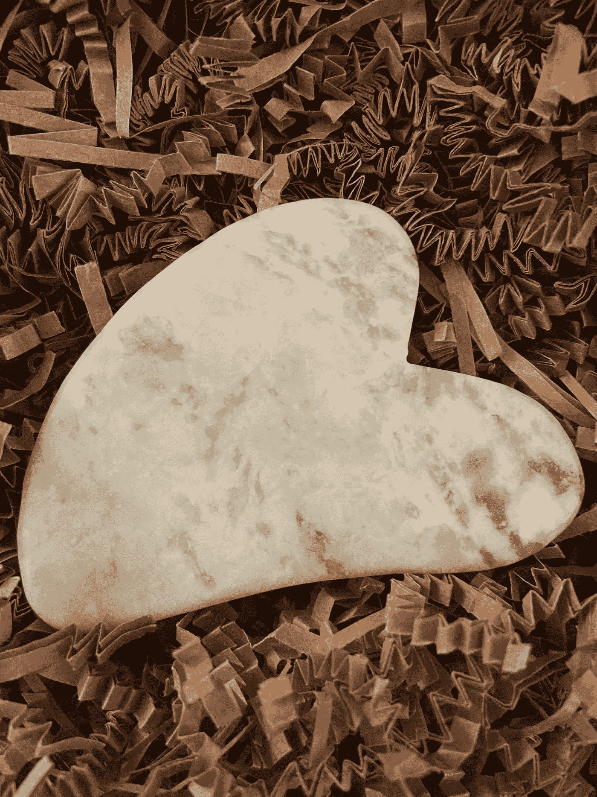

# 为什么刮痧对你有好处？

> 原文：<https://medium.com/coinmonks/why-gua-sha-is-good-for-you-d76b44816a2?source=collection_archive---------45----------------------->

资料来源:奥多拉·凯恩

## 面部浮肿和紧张消失！

无论你是男性还是女性，你都需要这种天然的心形石头来缓解面部肌肉和颈部的紧张感。你有没有一觉醒来，觉得自己的眼睛和脸颊浮肿，在你洗完脸后，就是拒绝离开，不管有多…