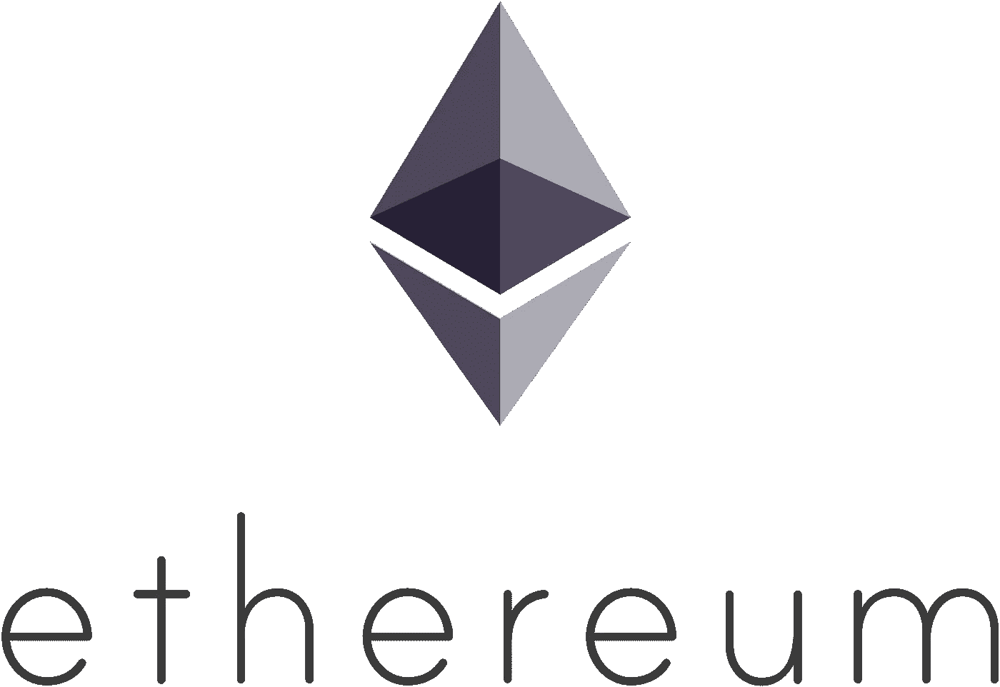

# 为什么我看好 2022 年的以太坊

> 原文：<https://medium.com/coinmonks/why-i-am-bullish-on-ethereum-in-2022-ca83573aa7c3?source=collection_archive---------31----------------------->

Crypto 是技术、金融和互联网文化在西部的交叉部分。我的希望是，我不会成为互联网上的另一个声音，用所有大写字母尖叫说以太将达到 12k，60k 甚至 100k。我不想吸引那些被贪婪和自私的野心所困扰的月球人。在这个世界上，没有什么比一个人渴望自己的利益，并试图尽可能少地努力获得财富更令人厌恶的了。

1.  以太坊是一个互联网平台
    我认为以太坊不仅仅是在账户之间传递价值。它的目标是成为世界计算机。现在，显然有许多其他项目已经开始进入这一领域，但其中许多项目都与 EVM 兼容，显示了 ETH 在这一领域的强大优势。
2.  以太坊现在正变得通货紧缩。新乙醚的发放将减少 90%,这将意味着燃烧率将可能在几年内高于发放率，如果不是几十年的话。
3.  以太坊将是高度可扩展的。现在伤害平台的主要是费用成本和平台的速度和吞吐量。这将大大增加到超过 100k 传输/秒，我相信这将使人们离开层 2s 开始再次使用主线。此外，这些改进并不一定会使 L2 连锁店比现在更快或更便宜。

我相信比特币将被以太超越(一些人称之为“伟大的翻转”)，但我必须考虑一个反对这个观点的论点。以太坊被设计成计算机而不是货币要复杂得多。这种简单性通常是您对特定应用程序的期望。很难相信那些被设计成图灵完全的具有高价值的东西，因为它可能引入多种方式来阻止。

# "简单是可靠的先决条件."

~埃德格·迪克斯特拉

总而言之，我认为现在“进入”以太坊是一个好的举措。我相信在未来 5 年持有它也是一个好的举措，我们应该会看到一个良好的回报。我建议把它放在像利多(stETH)这样的液体硬币里

对于那些想快速致富的人，请听听这句警告。这个世界充满了贪婪。衡量你堕落的程度，并寻求与你的金钱和投资相称。

> 加入 Coinmonks [电报频道](https://t.me/coincodecap)和 [Youtube 频道](https://www.youtube.com/c/coinmonks/videos)了解加密交易和投资

# 另外，阅读

*   [WazirX vs coin dcx vs bit bns](/coinmonks/wazirx-vs-coindcx-vs-bitbns-149f4f19a2f1)|[block fi vs coin loan vs Nexo](/coinmonks/blockfi-vs-coinloan-vs-nexo-cb624635230d)
*   [本地比特币审核](/coinmonks/localbitcoins-review-6cc001c6ed56) | [加密货币储蓄账户](https://coincodecap.com/cryptocurrency-savings-accounts)
*   [什么是融资融券交易](https://coincodecap.com/margin-trading) | [成本平均法](https://coincodecap.com/dca)
*   [支持卡审核](https://coincodecap.com/uphold-card-review) | [信任钱包 vs 元掩码](https://coincodecap.com/trust-wallet-vs-metamask)
*   [Exness 回顾](https://coincodecap.com/exness-review)|[moon xbt Vs bit get Vs Bingbon](https://coincodecap.com/bingbon-vs-bitget-vs-moonxbt)
*   [如何开始用加密贷款赚取被动收入](https://coincodecap.com/passive-income-crypto-lending)
*   [BigONE 交易所评论](/coinmonks/bigone-exchange-review-64705d85a1d4) | [电网交易 Bot](https://coincodecap.com/grid-trading)
*   [氹欞侊贸易评论](https://coincodecap.com/anny-trade-review) | [CoinSpot 评论](https://coincodecap.com/coinspot-review)
*   [新加坡十大最佳加密交易所](https://coincodecap.com/crypto-exchange-in-singapore) | [购买 AXS](https://coincodecap.com/buy-axs-token)
*   [投资印度的最佳加密软件](https://coincodecap.com/best-crypto-to-invest-in-india-in-2021) | [WazirX P2P](https://coincodecap.com/wazirx-p2p)