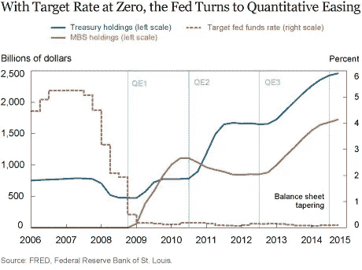
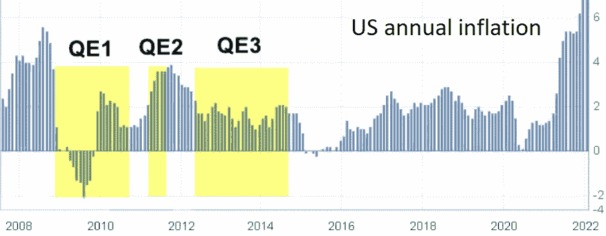
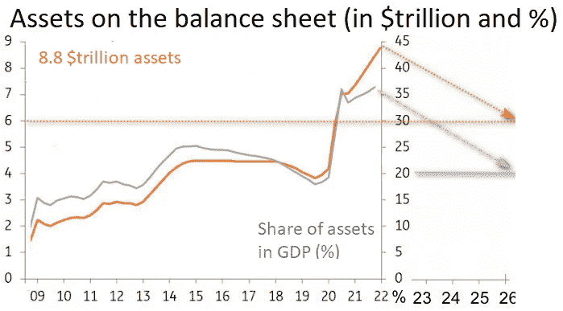
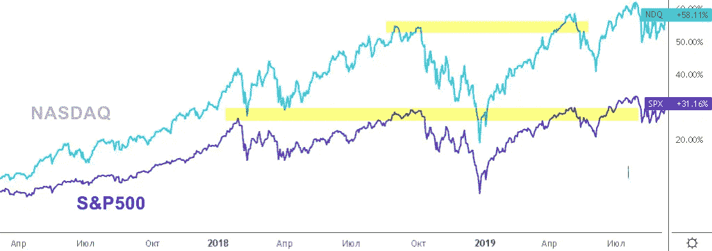
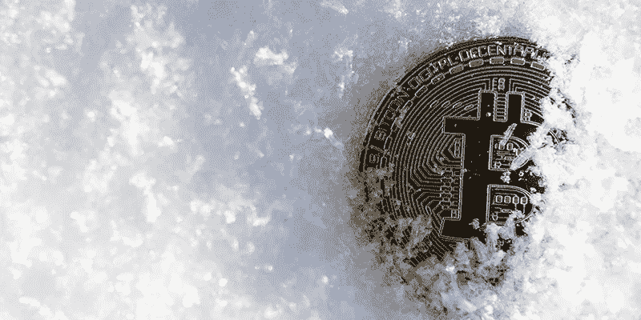

# 为什么我不担心我在这些困难时期的投资:美联储将推出量化紧缩计划，俄罗斯和乌克兰战争——这将如何影响未来几个月的货币、股票和密码？

> 原文：<https://medium.com/coinmonks/why-i-dont-worry-about-my-investments-during-these-hard-times-qt-program-russia-ukraine-war-96fcddfddeb1?source=collection_archive---------26----------------------->

我在 2022 年初写了这篇文章，写给那些在艰难时期担心自己投资的人。记住:“压力只不过是巨大机遇的影子”——迈克尔·约翰逊。

大多数外汇交易员、股票市场投资者和加密货币交易使用的策略是在长期 QE(量化宽松)计划(美国美联储的量化宽松)的条件下创建的。在接下来的一年里，美国监管机构采取了相反的 QT(量化紧缩)计划——量化紧缩。

美联储货币政策的新路线是为未来三年设计的。这篇文章预测了 QT 对金融市场(包括加密货币)的影响，以警告读者可能需要修改长期交易和投资策略。

投资者可能对股票市场的历史类比感兴趣。诚然，对于一直在有利的 QE 条件和低通胀下增长的加密货币来说，第二季度将是一个困难时期。

# 美联储的量化宽松计划是什么？

2008 年的大规模经济[危机](https://tlap-com.translate.goog/torgovat-na-foreks-v-krizis/?_x_tr_sl=ru&_x_tr_tl=en&_x_tr_hl=fr&_x_tr_pto=wapp)迫使美国美联储[推出](https://tlap-com.translate.goog/moi-vpechatleniya-ot-ssha/?_x_tr_sl=ru&_x_tr_tl=en&_x_tr_hl=fr&_x_tr_pto=wapp)QE(量化宽松)计划，以避免贴现率为零时出现的“[流动性](https://tlap-com.translate.goog/chto-takoe-likvidnost-na-foreks/?_x_tr_sl=ru&_x_tr_tl=en&_x_tr_hl=fr&_x_tr_pto=wapp)陷阱”。

碰巧的是，自 2006 年以来，金融监管机构一直在奉行宽松的货币政策。抵押贷款危机迫使美联储大幅降息以支持金融市场。

刺激是不够的，美联储推出了 QE——回购长期抵押贷款和政府债券，不参考利率，实际上是用过剩的流动性“淹没”经济。

金融监管者预计 GDP 增长将超过货币供应的增长，同时将通胀率分散到 2——2 . 5%的水平。如果通货膨胀增长加快，美联储预计将通过提高贴现率转向紧缩货币政策。

首轮 QE1 始于 2008 年危机年，结束于 2010 年。通胀率升至 2.6%，但量化宽松取消后，降至百分之一，因此美联储决定在同年 11 月推出 QE2。

第二个 QE 周期于 2011 年 6 月结束，当时美联储设法将通胀率“分散”至 3.6%。失去激励后，美国经济再次跌破 2%的目标水平，这使得美联储不可能开始提高贴现率。

2012 年 9 月，金融监管机构回归 QE 工具，不再设定最后期限。第三个周期没有导致通胀上升，但极大地膨胀了美联储的资产负债表，美联储在其账户中购买并持有长期政府债券。

2014 年通胀回归零，意味着三轮量化宽松未能提振美国经济。2014 年 10 月，美联储不仅决定放弃 QE，还在经济史上首次推出了 QT 量化紧缩计划。

金融监管机构再次恢复购买债券，迫使 2020 年的经济危机受到新冠肺炎大规模感染后果的拖累。冠状病毒通过空气飞沫传播，迫使政府实行封锁，剥夺了企业和民众的收入。

就流动性注入的规模而言，QE4 是史无前例的，违反了这一工具发挥作用的主要规则。市场获得了 1.5 万亿美元的回购，7500 亿美元用于债券回购。举个例子，值得一提的是前三次量化宽松的总额，相当于 1.2 万亿美元。

美国经济无法通过自身的增长来“消化”排放的增加，企业受到了限制，无法像以前那样有效地利用以贷款形式获得的资金。结果出现了巨大的通货膨胀，在各种探索 QE 副作用的经济学教科书中都有描述。

# 为什么美国美联储的 QT 是不可替代的解决方案

第四，“冠状病毒”QE 周期在 2021 年 1 月初将美联储的资产负债表膨胀至 8.8 万亿美元。通过购买债券发行的超额货币(实质上是“印刷的”)占该国 GDP 的 36%，其增长不足以覆盖如此数量的自由货币供应。

美联储的资产负债表在 1 月份继续增长 600 亿美元，在 2 月份继续增长 300 亿美元，即使 QE 在 3 月份停止增长，美国经济也没有时间加速，这将导致通胀率出现两位数的百分比增长，有可能导致消费者需求、收入下降和经济停滞。金融监管机构不能允许这样的情况，所以会按下“所有的按钮”。

一轮加息周期将于 3 月份开始，随后是夏季的债券抛售。美联储主席杰罗姆·鲍威尔在 1 月份的新闻发布会上承诺“大幅削减”资产负债表。

高盛(Goldman Sachs)的分析师分享了一个内幕消息，建议在未来三年内撤回 20-25 亿美元的印刷美元。QT 的目标水平是余额 60 亿美元或 GDP 的 20%。

简化计算表明，美国经济以 5 %- 6%的速度增长，贴现率在 2%的范围内，足以在未来几年大幅降低通货膨胀率。事实上，美联储每月将不得不拿出 1000 亿美元，外汇交易员正在等待监管机构每次拍卖后图表上的“美丽蜡烛”。

# QT 的推出对外汇市场有何影响？

从金融体系中抽取美元被称为一个美丽的宏观经济术语——货币供应冲销。美联储曾诉诸此类操作，外汇市场历史上唯一一次大规模出售债券的例子发生在 2017 年至 2018 年。

金融监管机构立即确定了第一季度的主要目标之一——通过刺激国内需求来提高当地生产商的竞争力。2017 年 10 月量化紧缩的开始与利率的上升相结合，这使得停止和扭转欧元兑美元的增长趋势成为可能。如图所示，美联储政策冻结了美元指数(DXY)的走软。

总的来说，开始时货币供应量的回笼量可以忽略不计，但每个月都在增加 100 亿美元以上。外汇交易员并不担心 QT，直到 2018 年初吸尘器开始从市场上一次性撤走 300 亿美元。

由于稳定的外汇提款，DXY 美元指数稳定增长的趋势已经形成。所有主要货币都受到了美元走强的影响，但杰罗姆·鲍威尔在唐纳德·特朗普的压力下被迫放弃了该计划。新当选的总统不关心刺激国内需求，他需要股票市场的增长。

# QT 计划和股票市场

股市和经济指标已经成为唐纳德·特朗普所有演讲的标志。美国总统为企业减税，修订预算政策，导致股价创纪录上涨，尤其是科技公司的股价。

然而，与中国的贸易战导致股票下跌，S&P500 和纳斯达克在强劲抛售开始前成功刷新了 2018 年的高点，恰逢第一季度发布周年。到那时，货币供应的冲销水平已经达到每月 500 亿美元。

只有在第一季度完全取消后，指数才能够回到高位。总的来说，2018-2019 年的动态可以描述为横盘运动，对平坦的上边界进行假突破。

# cryptowinter 2018——与 QT 巧合还是巧合？

2017 年，比特币涨到 2 万美元，到 2018 年下跌 80%。当时，这是加密货币市场短暂历史中的第七起崩盘。然而，受 2017 年 BTC 强劲增长的吸引，世界媒体炒作了数字货币的通常下跌。

在记者的建议下，2018 年被称为“加密冬天”，现在这个市场上的新人交易员都被吓到了。

由于传统的比特币反弹，第一季度影响了加密货币市场:

*   对美元的增长从 1.5%；
*   美国股市的跌幅在 1%到 2%之间。

国际货币基金组织的研究记录了自 2018 年以来比特币与股票指数的相关性增加。很可能，加密货币获得了央行分散的部分流动性，或者部分股票的投机利润去持有各种代币、替代硬币和购买 BTC 了。

然而，值得回顾一下 2018 年加密冬天的客观原因，这些原因对这个行业产生了具体影响:

*   大规模禁止 ICO——通过发行自己的加密货币来收集投资；
*   将占交易最大份额的加密货币交易所驱逐出 mainland China；
*   利用杠杆进行交易的衍生品的出现，以及开空头的可能性。

# 对 QT2 的推出有什么期待？

计划于 2022 年夏季实施量化紧缩计划。货币市场将在第二季度发布时做出反应，直到这一刻其他基本面因素和经济指标决定趋势。

如果杰罗姆·鲍威尔决定每月进行 1000 亿美元的冲销，那么很快外汇将继续大幅加强美元指数，这将持续到与欧元平价。欧洲央行将不会反对美联储的“吸尘器”。克里斯蒂娜·拉加德倾向于软货币政策，并在购买的债券到期后以自然的方式减少欧洲央行的资产负债表。

长期趋势会让你在鞅策略和网格上获利。建立一个积极的货币交易金字塔是合理的，但这种策略在外汇交易中几乎从未出现过。

经过年底的大幅调整后，股市处于有吸引力的水平。彭博分析师认为，我们将迎来另一波股市下跌，跌至 2021 年的水平。

如果 QT 推出时股指已经到位，那么在一段时间内，反弹将抵消货币政策破坏带来的负面影响。这一趋势将创下新高，可能成为未来许多年的增长限制因素。与此同时，波动性将成为另一个提前取消“通常”止损的问题，因此值得考虑在市场波动范围内计算损失和利润限额的风险管理策略。

加密货币的进程很大程度上取决于代码的成功实施、大规模实施以及单个替代硬币的区块链的潜在优势。这些因素会让交易者总能找到赚取“x”(等于 100%利润的计量单位)的话题。

与此同时，比特币和最大的加密货币直接依赖于股价和美元。QT 可以导致它们的价值减少 80%,之后回到高点的路径可能会延迟几年。

# 遗言…

量化紧缩 QT 是新的货币政策措施之一，其必要性源于 QE 对映计划的失败。美联储需要在 2019 年将其资产负债表卸载 2.2 万亿美元，以避免今天的通胀飙升，这可能会阻止危机后的经济复苏。

杰罗姆·鲍威尔的决定受到了唐纳德·特朗普的干预，后者出于政治目的需要市场的增长。现在，美联储主席可能再次受到总统的压力。乔·拜登计划在两年内连任，他对在经济下滑的背景下竞选一点也不舒服。

很可能 QT2 会像 QT1 一样更早结束，这再次证明了加密货币生态系统的稳定性和优势，其中规则由开源“决定”，要改变需要与分散在世界各地的矿工或验证者达成大规模共识。

> 加入 Coinmonks [电报频道](https://t.me/coincodecap)和 [Youtube 频道](https://www.youtube.com/c/coinmonks/videos)了解加密交易和投资

# 另外，阅读

*   [BigONE 交易所点评](/coinmonks/bigone-exchange-review-64705d85a1d4) | [电网交易 Bot](https://coincodecap.com/grid-trading)
*   [氹欞侊贸易评论](https://coincodecap.com/anny-trade-review) | [CoinSpot 评论](https://coincodecap.com/coinspot-review)
*   [新加坡十大最佳加密交易所](https://coincodecap.com/crypto-exchange-in-singapore) | [购买 AXS](https://coincodecap.com/buy-axs-token)
*   [投资印度的最佳加密软件](https://coincodecap.com/best-crypto-to-invest-in-india-in-2021) | [WazirX P2P](https://coincodecap.com/wazirx-p2p)
*   [7 个最佳零费用加密交换平台](https://coincodecap.com/zero-fee-crypto-exchanges)
*   [最佳网上赌场](https://coincodecap.com/best-online-casinos) | [期货交易机器人](/coinmonks/futures-trading-bots-5a282ccee3f5)
*   [分散交易所](https://coincodecap.com/what-are-decentralized-exchanges) | [比特 FIP](https://coincodecap.com/bitbns-fip) | [宾邦评论](https://coincodecap.com/bingbon-review)
*   [用信用卡购买密码的 10 个最佳地点](https://coincodecap.com/buy-crypto-with-credit-card)
*   [加拿大最佳加密交易机器人](https://coincodecap.com/5-best-crypto-trading-bots-in-canada) | [Bybit vs 币安](https://coincodecap.com/bybit-binance-moonxbt)