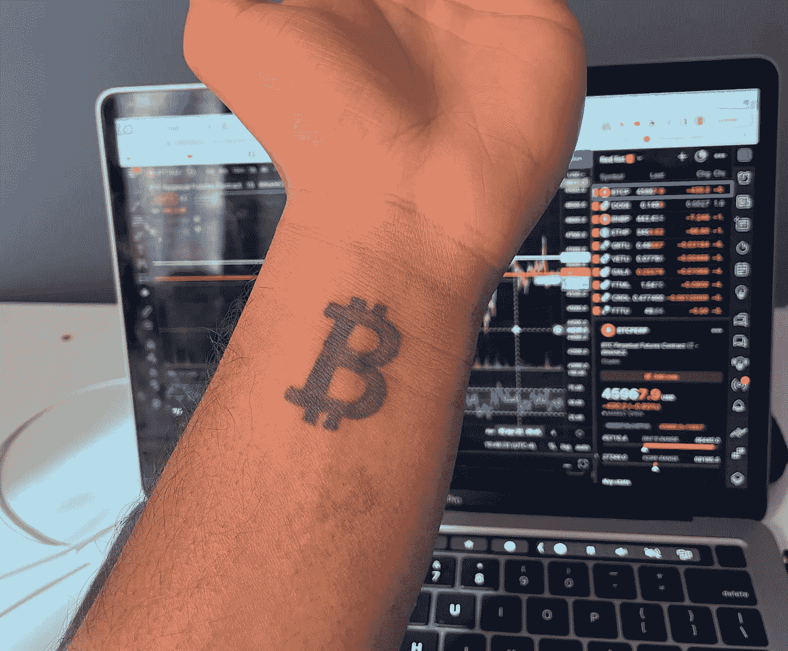

# 为什么我会有比特币纹身

> 原文：<https://medium.com/coinmonks/why-i-got-a-bitcoin-tattoo-7787cd2c0671?source=collection_archive---------56----------------------->

我手腕上有个比特币纹身。这是完全真实的，它将永远在我身上。这可能看起来很愚蠢。有点像，但是我要证明我买一个的理由。我是谁的背景。我的名字是 Aden Rao，今年 18 岁，我从事股票和加密交易，我有一个名为@genzmoneyy 的抖音，拥有 36000 多名粉丝，我在那里谈论与金钱相关的事情，如比特币。在过去的几年里，我对 crypto 非常感兴趣。我从加密期货赚了很多钱，我开始了解更多关于比特币的知识，这让我有了这个纹身。

# 如果比特币涨到 0 美元会发生什么

所以让我们把这种情况抛开，假设比特币在未来 30 年内降至 0。我不认为它会，但即使发生了，我认为它仍然会很酷，看起来在我的手腕上，有点像一段历史。一个匿名人(或多个匿名人)创造的数字货币能够增长到超过 1 万亿美元的市值。我认为这真的很不现实。我通常戴着手表，所以我在手腕上纹了这个纹身，因为如果我想掩饰，我可以戴手表。

# 比特币涨到 100 万美元

我认为这是更有可能的情况。我真的相信在我有生之年比特币会涨到 100 万美元。我会写一个完整的帖子来解释为什么，但基本上来说，回顾过去并说我预测到了这一时刻真的很好。我非常相信这一点，所以我纹了一个比特币来证明这一点。

# 我从加密中赚了很多钱

我纹比特币的另一个原因是，加密是我第一个赚了 6 位数的东西。这几乎是我性格的一部分，我对此充满热情。

以上就是我做比特币纹身的全部原因，感谢阅读。

> *加入 Coinmonks* [*电报频道*](https://t.me/coincodecap) *和* [*Youtube 频道*](https://www.youtube.com/c/coinmonks/videos) *了解加密交易和投资*

# 另外，阅读

*   [Bookmap 评论](https://coincodecap.com/bookmap-review-2021-best-trading-software) | [美国 5 大最佳加密交易所](https://coincodecap.com/crypto-exchange-usa)
*   最佳加密[硬件钱包](/coinmonks/hardware-wallets-dfa1211730c6) | [Bitbns 评论](/coinmonks/bitbns-review-38256a07e161)
*   [新加坡十大最佳加密交易所](https://coincodecap.com/crypto-exchange-in-singapore) | [收购 AXS](https://coincodecap.com/buy-axs-token)
*   [红狗赌场评论](https://coincodecap.com/red-dog-casino-review) | [Swyftx 评论](https://coincodecap.com/swyftx-review) | [CoinGate 评论](https://coincodecap.com/coingate-review)
*   [投资印度的最佳加密软件](https://coincodecap.com/best-crypto-to-invest-in-india-in-2021)|[WazirX P2P](https://coincodecap.com/wazirx-p2p)|[Hi Dollar Review](https://coincodecap.com/hi-dollar-review)