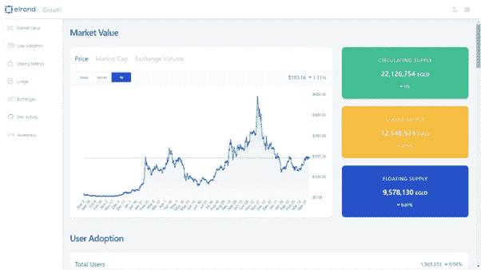
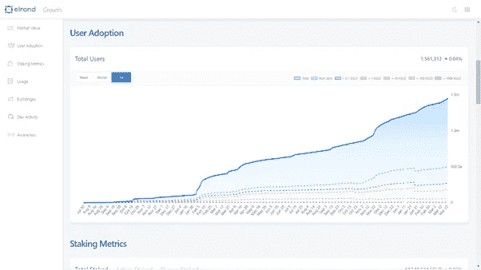
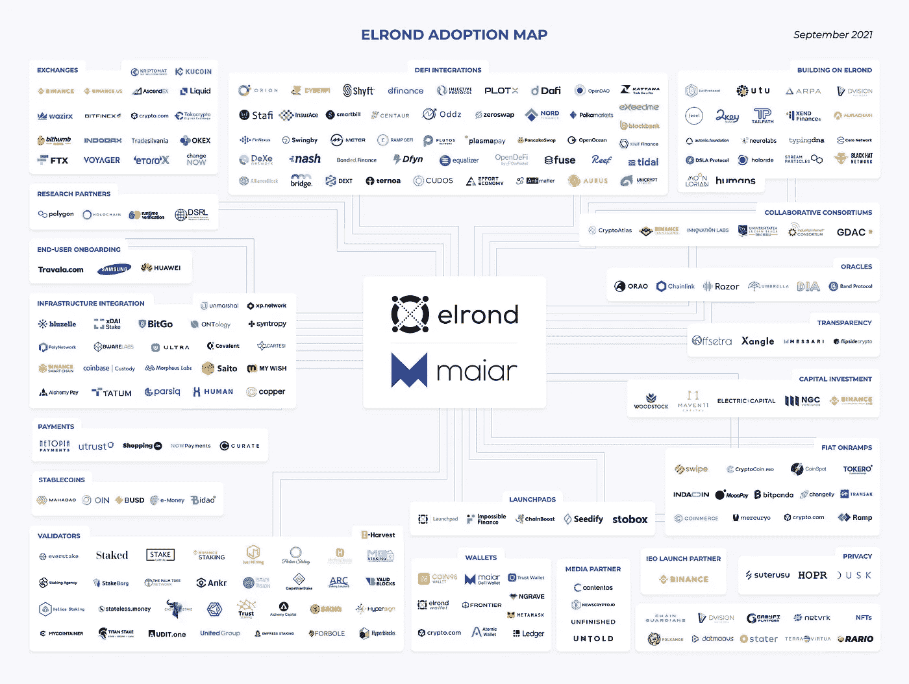

# 我为什么要抓住埃尔隆德

> 原文：<https://medium.com/coinmonks/why-i-hold-elrond-ff5f7d7e6703?source=collection_archive---------12----------------------->

[https://elrond.com/](https://elrond.com/)

什么是埃尔隆德？

埃尔隆德是一种第 1 层网络，旨在集中解决可扩展性问题。在外行看来，it 是基础，是允许应用程序构建在其上的基础设施，旨在比其他网络运行得更快。埃尔隆德利用安全利益证明(SPoS)共识机制，这是对流行的利益证明(PoS)共识机制的改进，这就是如何将块添加到区块链的。埃尔隆德的本地令牌用于支付 Egld 中的所有交易费用。

**我为什么相信它？** 
第 1 层不可忽略。以前我写过关于可伸缩性及其重要性的主题。简而言之，可伸缩性是最危险的障碍，区块链技术要想在全球广泛采用，必须克服这个障碍。可扩展性被定义为在任何时间点有效利用系统的能力，而不管用户总数如何。吞吐量或每秒事务数(TPS)是网络验证事务的速度，是衡量可扩展性的最佳指标。Visa 的平均 TPS 为 1700，而比特币的平均 TPS 为 5。区块链不能以这样的速度作为全球交易网络认真对待。随着越来越多的用户进入加密生态系统，对已经拥堵的网络提出了更高的要求，可扩展性问题变得越来越严重。埃尔隆德就是为了解决这个问题而设计的。该团队于 2017 年 10 月组建，mainnet 于 2020 年 7 月上线。由 Mincu 兄弟(Beniamin 和 Lucian)和 Lucian Todea 组成，前者是早期的加密采用者，此前曾运营 Metachain capital，该公司早期投资了 Tezos 和币安等项目，后者是科技企业家，Soft32 的创始人兼首席执行官，也是 DNA 打字和智能账单的天使投资人。从那以后，这个团队不断扩大，并且充满了有能力的开发人员。但核心团队是可怕的，他们有丰富的经验和看到 crypto 增长领域的良好愿景。

埃尔隆德网络的中心目标是克服阻碍主流采用的严重可扩展性限制。其目的是使网络达到至少等同于集中式网络的性能。埃尔隆德网络当前 TPS 为 15，000，交易成本为 0.001 美元，即 0.1 美分。已经实现的宏伟愿景。

**EGLD** 
投资者快手最高总供应量:31415926
流通供应量:21727123
历史最高价:545.64 美元
历史最低价:6.51 美元
现价:192.50 美元

[https://growth.elrond.com/](https://growth.elrond.com/)

Staked Supply: 12，524，598
Floating Supply: 9，586，387

由于网络依赖于安全利益证明(SPoS)共识机制，这意味着本地令牌 Egld 可以被 Staked 来帮助运行网络。验证者从网络的交易费用中得到回报，并且节点的当前 APR 是 13.95%，委托者的当前 APR 是 12.56%。

建立一个节点的最低股份要求是 2500 Egld，而成为委托人的最低股份要求是 1 Egld。对于一项相对安全的投资来说，这是一个令人难以置信的 4 月。这个风险评估是相对于加密领域的。但借用传统金融的术语来帮助更好地理解比特币和以太坊可以被视为蓝筹股/中坚力量，我会将埃尔隆德归类为有朝一日将成为蓝筹股/中坚力量的快速增长者。当前持有的 Egld 比持有的多。这是一个看涨的信号，持有 Egld 的人认为它的价格将继续上涨，因此将它作为回报，而不是将它放在手上快速转手。当人们“停放”他们的资产时，这是对未来前景充满信心的标志。

[https://growth.elrond.com/](https://growth.elrond.com/)

2021 年 2 月初，总用户数为 20 万，刚刚超过 150 万。埃尔隆德正在吸引越来越多的新用户，从而吸引越来越多的资本投资。

**埃尔隆德有什么特别之处？** 
在加密领域，比特币是价值储存的黄金标准——这是由它的稀缺性决定的——多年来，它的价值一直在升值，并将继续升值。

以太坊是可编程的区块链，是所有去中心化金融(DeFI)的核心。在以太坊链上，程序员可以创建执行功能的智能合同，这已经诞生了一个完整的生态系统。埃尔隆德网络旨在实现这两个目标。这是一个完整的 defi 生态系统，开发者可以使用区块链开发去中心化应用程序(Dapps ),而 Egld 这种原生令牌的创建是为了与比特币作为价值储存手段相抗衡。

埃尔隆德区别于其他第 1 层的两个主要特征是其自适应状态分片和安全利益证明(SPoS)共识机制。

**自适应状态分片** 
分片是数据库分区的一种形式。一种用于划分区块链网络工作负载的技术，每个节点仅保存与其特定碎片相关的信息，并负责整个事务的一小部分。这大大提高了网络的整体处理能力。

埃尔隆德引入了动态自适应分片，允许根据需要进行重组。埃尔隆德的网络由碎片组成，每个碎片被分配一组验证器来产生每个块。网络利用不同的时间段来组织其网络。从技术的角度来看，这个想法很棒，但是对于大多数用户来说太复杂了。重点是埃尔隆德网络通过改善节点间的通信来减少延迟——当向碎片分配新工作时通常遇到的延迟减少了。当一个时期到期时，网络会进行自我修剪，允许碎片根据网络使用情况进行重组，提高效率。

**【安全证明(SPoS)** 
【埃尔隆德】再一次重点阐述了用其共识机制处理潜伏。它引入了一个改进，允许分片中的每个节点在一轮开始时确定共识组(验证者)的成员。这将为一个碎片挑选节点的时间减少到了不到 100 毫秒。这大大提高了网络的速度或 TPS。另一个变化是引入了对验证者的评级。埃尔隆德通过积极评价其验证者来完善其共识机制。下注更多硬币且在过去诚实的节点更有可能被选为验证者。这鼓励了诚实的验证者，这有利于网络的安全。

**埃尔隆德的生态系统**

[https://elrond.com/assets/files/elrond-ecosystem.pdf](https://elrond.com/assets/files/elrond-ecosystem.pdf)

埃尔隆德是一个巨大的网络，并且还在继续增长。目前网络上最伟大的项目是 Maiar。Maiar 是一个数字钱包和全球支付应用程序。它方便了从手机或谷歌浏览器扩展购买和传输加密。这是最简单的互动钱包之一，很明显它是在全球范围内采用的。只需一个电话号码，Maiar 就能给朋友和家人汇款。

马亚尔交易所是埃尔隆德网络的经济引擎。正是埃尔隆德的分散化交易所(DEX)允许用户完成互换，获得流动性池，并从事产量农业。

埃尔隆德网络是一个自身不断扩张的完整生态系统。目前有一个空投正在进行，Metabonding，其中 Egld 或 LKMEX(锁定 MEX)的赌注者将有资格要求 4 个令牌，很快将在 Maiar 交易所发布。

**lk MEX 是什么？** 
Locked Mex (LKMEX)是在 Maiar 交易所发现的一种代币奖励。如果用户选择接受 LKMEX 而不是 MEX，农场的 APR 奖励将翻倍。每个月都会创建一个新的 LKMEX 代币，该月的所有奖励锁定一年，其中 17%可用，随后是一个授权期，其中 17%在随后的每个月解锁。对埃尔隆德来说，另一个非常乐观的信号是，用密码术语来说，一年就是一辈子。人们选择一年后才开始解锁的代币奖励，这一事实表明了人们对该项目难以置信的长期信心。

**原生令牌 Egld** 
它用于支付交易、存储、验证器奖励和智能合约执行。每笔交易的一部分费用都被烧掉了，一部分给了验票员，一部分给了埃尔隆德社区基金。最大供应量为 31，415，926。由于燃烧，未来可能会更低。奖励计划的最大特点之一是埃尔隆德把开发者放在第一位。这个奖励系统是在 Fantom 网络上看到的，那里的开发者得到奖励，并鼓励有机生态系统的发展。如果一个开发者创建了一个智能合同，并且很多人使用 kit，那么这个智能合同的 30%的费用归开发者所有。这鼓励了有能力的开发者在埃尔隆德网络的基础上开发伟大的去中心化应用(dApps ),这将为网络带来越来越多的用户。

**未来** 
埃尔隆德始终如一地实现其路线图目标，并计划在 2022 年第二季度引入链上治理和第四阶段的标桩。链上监管将使 Egld 持有人能够对网络提案进行投票，并在决定网络未来命运方面发挥主导作用。符合分散金融的民主化价值观。

埃尔隆德网络提供了可扩展性解决方案，拥有不断扩大的用户基础，并继续促进其庞大生态系统的增长。它从一开始就被培养成一个整体项目，并已深深扎根。我相信埃尔隆德的一个关键原则是它提供的简单性，随着越来越多的参与者加入加密领域，这一价值不可低估。受益于新资本流入的项目将是普通人最容易接触到的项目，而埃尔隆德在这方面表现出色。埃尔隆德向其用户提供传统金融和分散金融的混合，因此所有人都可以使用。

期待看到 2022 给这个项目带来什么。

> 加入 Coinmonks [电报频道](https://t.me/coincodecap)和 [Youtube 频道](https://www.youtube.com/c/coinmonks/videos)了解加密交易和投资

# 另外，阅读

*   [去中心化交易所](https://coincodecap.com/what-are-decentralized-exchanges)|[Bitbns FIP](https://coincodecap.com/bitbns-fip)|[Bingbon 评论](https://coincodecap.com/bingbon-review)
*   [用信用卡购买密码的 10 个最佳地点](https://coincodecap.com/buy-crypto-with-credit-card)
*   [加拿大最佳加密交易机器人](https://coincodecap.com/5-best-crypto-trading-bots-in-canada) | [Bybit vs 币安](https://coincodecap.com/bybit-binance-moonxbt)
*   [阿联酋 5 大最佳加密交易所](https://coincodecap.com/best-crypto-exchanges-in-uae) | [SimpleSwap 评论](https://coincodecap.com/simpleswap-review)
*   购买 Dogecoin 的 7 种最佳方式
*   [最佳期货交易信号](https://coincodecap.com/futures-trading-signals) | [流动性交易所评论](https://coincodecap.com/liquid-exchange-review)