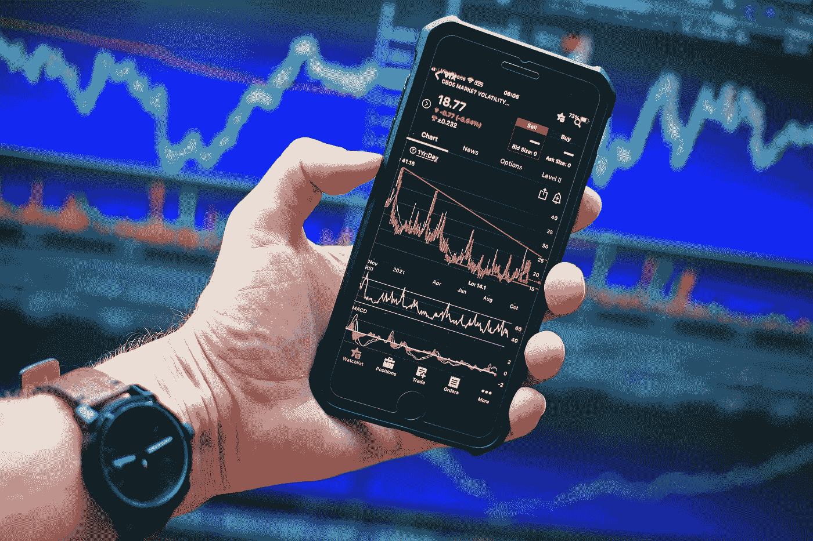

# 为什么我投资我的储蓄在密码上？

> 原文：<https://medium.com/coinmonks/why-i-invested-my-savings-in-crypto-e9330e0cd0c8?source=collection_archive---------29----------------------->

## 我是一个疯狂到赔钱的投资者。

Image by [Sergei Tokmakov Terms.Law](https://pixabay.com/users/sergeitokmakov-3426571/?utm_source=link-attribution&utm_medium=referral&utm_campaign=image&utm_content=6693060) from [Pixabay](https://pixabay.com/?utm_source=link-attribution&utm_medium=referral&utm_campaign=image&utm_content=6693060).

经常有人问我，为什么要把毕生积蓄投入加密货币。老实说，这是个公平的问题。毕竟，加密货币是一种相对较新且未经测试的资产类别。但我认为加密货币是明智投资的原因有三个。你想知道我的推理吗？

首先，加密货币由区块链技术提供支持，这是一种不可改变的安全数据处理方式。

第二，加密货币是无国界的，全球都可以使用，这意味着它可以被世界上任何地方的任何人使用。

第三，加密货币是通货紧缩的，这意味着流通中的加密货币供应永远是有限的。这三个因素给了加密货币坚实的基础，这也是为什么我相信它是我一生积蓄的明智投资。

现在你知道我是一个疯狂的人，我的行为基于支持我推理的数据和研究，让我们更好地理解为什么投资加密货币仍然是值得的。

## 加密货币仍处于早期阶段。

加密货币仅出现了大约十年，仍处于早期阶段。这意味着有很大的增长潜力。例如，比特币是第一种也是最知名的加密货币，其价格从 2010 年的 0.003 美元上涨到 2020 年的 11，000 美元以上。这是超过 3600 万的增长率！我相信未来我们会看到其他加密货币发生类似的变化。

## 加密货币不稳定

加密货币也很不稳定，所以它们的价格可以很快上下波动。这种波动性可能会让一些人感到害怕，但我相信这对投资者来说是一个绝佳的机会。当加密货币的价格上涨时，你有机会赚很多钱。但是你也有机会损失很多钱。这就是为什么我只投资我准备好要损失的钱。

## 加密货币有风险

加密货币也有风险，因为它们不受政府或金融机构的监管。这意味着如果出了问题，没有人保护你。例如，如果你失去了加密货币投资，就没有像股票和债券那样的政府保险。然而，我相信风险值得回报，这也是我仍然投资加密货币的原因。

这些只是我认为投资加密货币是明智决定的几个原因。当然，加密货币还处于早期阶段；它们不稳定且有风险。但我认为潜在的回报大于风险。这就是为什么我仍然将毕生积蓄投资于加密货币。

# 最后的想法

作为一个加密货币的新手，我仍然不了解这个市场的一切。当然，在我参与一些硬币涨跌的这四年里，我学到了一些东西，但这并不意味着我什么都知道。

我还有很多要学的，也恳请大家不要把我的思考当成单一的观点。如果你真的想进入这个市场，研究一下这个市场，做一些图表分析，参加关于这个主题的讲座，明白什么是最适合你的，风险自担。

在犯错误的过程中，我们学会了克服问题的最好方法。

你怎么想呢?投资加密货币是明智的决定吗？请在下面的评论中告诉我你的想法！

感谢阅读。祝您愉快！

*如果你喜欢你在这里读到的，* ***我谦卑地请求你跟随我，这样我就能达到 100 个追随者的标志*** *。这样你就能帮我实现一个梦想:)*

> *加入 Coinmonks* [*电报频道*](https://t.me/coincodecap) *和* [*Youtube 频道*](https://www.youtube.com/c/coinmonks/videos) *了解加密交易和投资*

# 另外，阅读

*   [3 商业评论](/coinmonks/3commas-review-an-excellent-crypto-trading-bot-2020-1313a58bec92) | [Pionex 评论](https://coincodecap.com/pionex-review-exchange-with-crypto-trading-bot) | [Coinrule 评论](/coinmonks/coinrule-review-2021-a-beginner-friendly-crypto-trading-bot-daf0504848ba)
*   [莱杰 vs n rave](/coinmonks/ledger-vs-ngrave-zero-7e40f0c1d694)|[莱杰 nano s vs x](/coinmonks/ledger-nano-s-vs-x-battery-hardware-price-storage-59a6663fe3b0) | [币安评论](/coinmonks/binance-review-ee10d3bf3b6e)
*   [加密交易机器人](/coinmonks/crypto-trading-bot-c2ffce8acb2a) | [Bingbon 评论](https://coincodecap.com/bingbon-review)
*   [Bybit Exchange 评论](/coinmonks/bybit-exchange-review-dbd570019b71) | [Bityard 评论](https://coincodecap.com/bityard-reivew) | [Jet-Bot 评论](https://coincodecap.com/jet-bot-review)
*   [3 commas vs crypto hopper](/coinmonks/3commas-vs-pionex-vs-cryptohopper-best-crypto-bot-6a98d2baa203)|[赚取加密利息](/coinmonks/earn-crypto-interest-b10b810fdda3)