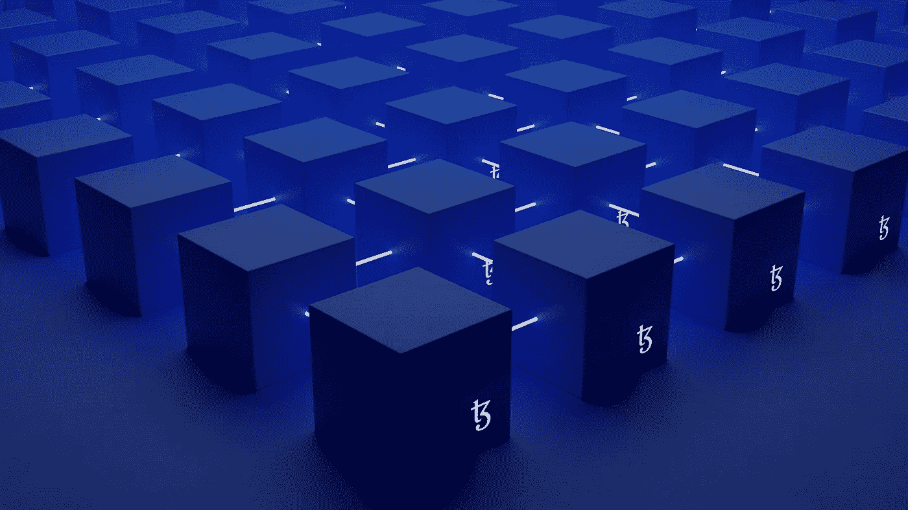
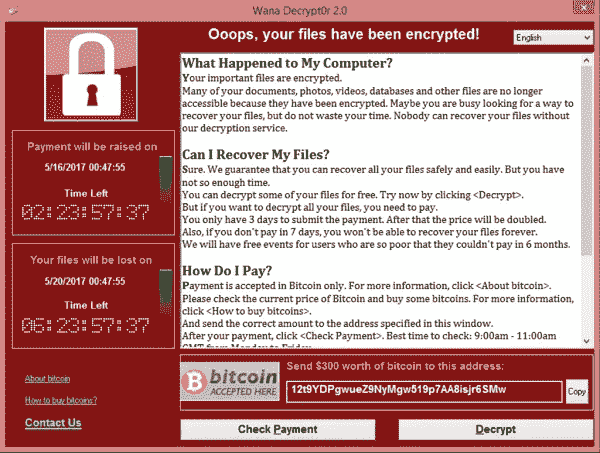
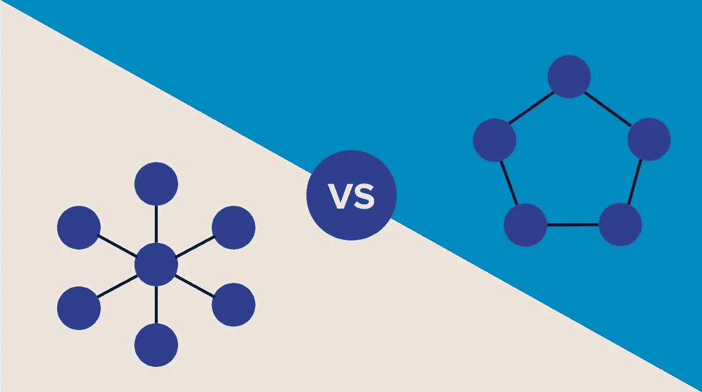
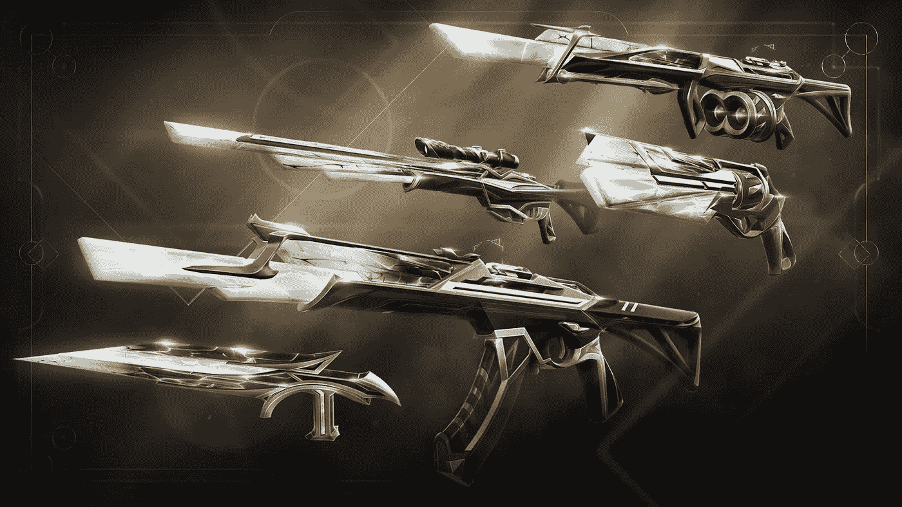
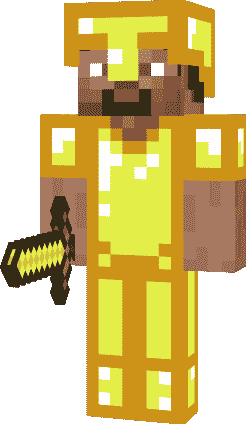
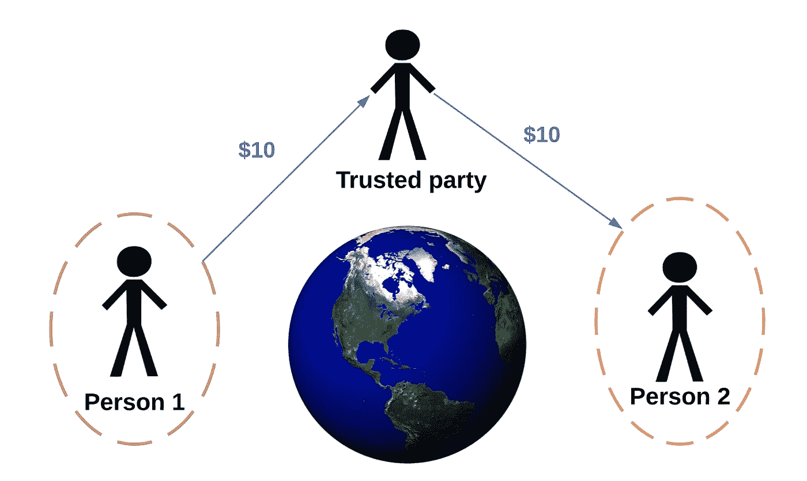

# 为什么我看好区块链，你也应该看好

> 原文：<https://medium.com/coinmonks/why-im-bullish-about-blockchain-and-you-should-be-too-2e966fc4cd7b?source=collection_archive---------26----------------------->

区块链是一种新技术，可以改变人们的行为，彻底改变现代应用的构建方式，并赋予普通人某种权力。但人们对它的实用性持怀疑态度。

随着我在这个领域的探索，我看到越来越多的文章谈论为什么区块链会失败。有一种观点认为开发者不应该浪费时间学习基于 Web3 的技术。

但是，我坚信这项技术，并鼓励越来越多的人尽早进入并了解这项技术，以收获它的好处。我会告诉你我为什么要这么做的原因，让你决定你的立场。

# 在你阅读之前

 [## 区块链不仅是蹩脚的技术，也是对未来的糟糕展望

### 区块链不仅是蹩脚的技术，而且是对未来的糟糕愿景。它至今未能获得通过是…

medium.com](/@kaistinchcombe/decentralized-and-trustless-crypto-paradise-is-actually-a-medieval-hellhole-c1ca122efdec) 

这是一篇获得 6 万次掌声的文章，我强烈建议你读一读。

 [## Kai Stinchcombe 反区块链断言的事实概述

### 让我们调查事实。

paulrberg.medium.com](https://paulrberg.medium.com/fact-overview-of-kai-stinchcombes-anti-blockchain-assertion-85cfdd3f5ec) 

这篇文章回答了前一篇文章中提出的一些论点。这是一篇很好的短文。

我不是在这里争论细节。这些包括——区块链对环境有害，它不是真正分散的，它是可被黑客攻击的，等等。这些文章和许多其他文章都涉及到它们。

我在这里的工作是激励你开始这个领域。我认为这项技术相当新，有很大的潜力。我会解释为什么我会这么想。

# 我为什么看多？

我们经常听到的一个论点是，区块链已经存在了很长时间(从技术上讲，从 1995 年开始)，但还没有被采用。那么它真的为人们解决了什么问题吗？

如果目前的系统有任何痛点，我们不会已经看到很多区块链的应用了吗？为什么大部分人还不知道这项技术？让我们来回答这个问题。

## 一个个人的例子

当我大约 14 岁的时候，我对计算机产生了兴趣。这是因为我对新技术感到兴奋，并开始寻找应用它们解决问题的方法。

我学到了许多不同的东西，但直到现在才知道区块链。为什么？

**首先，**在比特币之前，区块链还没有普及(或者至少我还没有接触到)。比特币提供了一个被广泛采纳的新想法，最终，有了一个可能解决重复消费的解决方案。

但即使对于比特币，我听到的也是与非法活动、人们用一种虚构的货币赌博以及其他各种负面看法有关的新闻。

Wannacry collecting ransom via Bitcoin

**其次**，区块链应用需要一些额外的步骤，比如设置钱包和签署交易。这就引入了一点学习曲线。

上一次你的朋友推荐你尝试一些难学的东西，而你真的尝试了，是什么时候？

之所以采用 Web2，是因为它易于使用，并且符合现有的社会规范。即使网速很慢，关于易于使用的应用程序的说法还是传开了，并很快被采用。

口碑可以实现指数级增长。这也是为什么这么多 app 里都有转诊系统的原因。这就是为什么 Web2 很容易被采用的原因。

第三，如前所述，区块链的概念引入了新的社会概念。外行人很难理解分权制，因为集权制已经成为我们历史的一部分。

传统上，我们已经习惯了赚取不公平利润的中间商、我们不得不信任的大机构、腐败的政府、中央集权的银行等等。(当然不是对所有情况都有效)。

*Web2 什么也没做，只是把这个离线系统搬到了电脑上*。没有什么新的东西要学，只是像以前一样生活，但现在有了家的舒适。因此，易于采用。

## 一种新的生活方式

一种新的生活方式正在被引入没有中央权力的地方。这一构想至少有一定的吸引力，值得我们关注，因为它可能开启新的可能性。

由君主制、独裁制等转变而来。民主是一种新的生活方式。传统规范被打破，人们被赋予权力。现在，我们可以说，民主尽管有缺陷，但本质上是最好的政府形式。

这说明当这样的重大变化发生时，社会也会随之改变。久而久之，我们无法想象没有他们的生活。我们应该欢迎这样的变化。

> 没有一个人有他们想要解决的问题，发现可用的区块链解决方案是解决问题的最佳方式，并因此成为区块链爱好者。
> 
> 摘自上面链接的 Kai Stinchcombe 的文章。

嗯，我就是那个人。在之前的一篇文章中，我确切地谈到了我以前是一个批评家，但是当我看到一个由区块链最好地解决的问题时，我变成了一个热心者。现在，我发现自己陷入了一个兔子洞，学习智能合约、Web3、NFTs 等等。

总之，这是一个新的机会。如果你有时间和资源来学习，一定要花一些时间。你可能喜欢也可能不喜欢，但这里有尝试和喜欢它的动机。

# 看涨的动机

当我谈到区块链时，我指的不是加密货币。我不太喜欢交易比特币来获利。我只关心底层技术。

## 数字资产

元宇宙、NFTs 和其他处理数字资产的企业需要区块链来证明所有权。他们可以求助于在私人数据库中存储数据的老方法，但它有一些缺陷。

为了增加个人风格，我从不在我喜欢的游戏中购买武器皮肤。那是因为我觉得它们在它之外没有价值。如果我对自己的皮肤感到厌倦，我就什么也做不了。如果公司不再支持这款游戏，或者有更好的游戏上市，我的钱就浪费了。

Beautiful, aren’t they?

如果游戏提供这些皮肤作为数字资产，我可能会重新考虑。现在，它们就像任何在任何地方都有价值的实物商品一样(前提是人们同意它确实有价值)。

这让我们想到了我们社会中的金钱概念。人们通常认为加密货币是噱头，是虚构的货币。同样的人相信美元和黄金，我觉得这很讽刺。

事实上，除了小麦、大米等之外，没有什么东西是有价值的。美元、黄金和其他“有价值”的物品对生存毫无用处。

两个人都认为一美元有价值，这就赋予了它价值。它只是一张没有任何内在效用的纸。黄金只是一种闪亮的金属，你甚至不能用它来制造设备。

Or can you?

既然我已经解释了数字资产是如何有价值的，一个集中的数据库在存储它们的时候不会灌输信任。

在元宇宙和现实生活之间打个比方——想象你去商场买衣服。商场告诉你，你只能在那里穿那些衣服，其他商场不接受你的服装。没道理？

这也是集中式数据库所做的。如果你的头像衣服存储在某个特定元宇宙的数据库中，你就不能在其他 metaverses 中使用它们。但在区块链，理论上，你的资产可以用于任何元宇宙，任何游戏，任何你参与的数字努力。

这里有一个可能的反驳——但是集中式数据库可以公开一个 API，所以我们可以在其他地方使用这些数据。那么，你愿意把你的整个生意建立在信任别人继续为你提供服务的基础上吗？

这是一个商业决定，你可能会喜欢它。但是当分散解决方案可用时，有些人可能不喜欢这个想法。

简而言之，数字资产最好存放在区块链，随着人们更多地接触数字世界，对区块链的需求也在增长。

## 消除信任/权力下放

我在上一节中介绍了这一部分的核心思想——您信任第三方公司在没有必要的时候继续为您提供服务。

我在上面链接的第二篇文章中指出了一种新的可能性。你可以在区块链运行整个银行系统，所有的程序对你来说都是透明的。

不需要成千上万的员工来完成应该自动化的重复性任务。信任雇员的需要也是无效的。

你可以看到所有的公司现在都在运营，并至少告诉他们一些可以分散的方面。这并不一定意味着那样会更有效率，但是你的想象力可以天马行空。

## 机会

我是一个电脑爱好者。我喜欢几乎所有与电脑相关的东西。无论是 web 开发、机器学习还是安全——如果涉及到 0 和 1，我可能会直接跳进去。我喜欢做东西，把手弄脏，边做边学。

我一直在探索，但是没有什么能比做一些以前没有做过的东西更令人满意了。或者建立一些已经存在的东西，但是以一种不同的更好的方式。

如果你和我一样，Web 3 为你打开了无限的大门。无论你是想要一份工作，还是想要自己创业，你要解决的问题都是独一无二的，未经探索的，你会成为那个领域的先锋。

如果你对创业特别感兴趣，你可以看到复制 Web 2 世界并在 Web 3 中创造价值的新企业。我认为 OpenSea 是 Web 3 世界的亚马逊。三角形、多边形等是 AWS。

14 million possibilities, and more

我想说的是，这个空间为你提供了一个机会去建造一些东西，并在途中赚钱。你看看 web2 世界，你得到的大部分想法都已经形成，或者已经有最优秀的人在为之努力。在 web3 中，没有人是那么大的专家。你可以成为这里的领袖。

## 提前入职福利

沃伦·巴菲特致富的重要因素是他在很小的时候就学会了投资，而且他已经投资了很长时间。

在一个快节奏和不断创新的世界里，变化是不可避免的。在正确的时间(早期)付出额外努力的人会得到最大的财富回报。

Web 3 并不像你希望的那样早，但也不算太晚。我认识的大多数专业人士都不知道这个领域。他们不知道它是如何运作的，也不愿意通过学习来跨越这道门槛。他们在任何方面都没有错，但他们错过了一个机会。

# 结论

作为一名开发人员，我环顾四周，看到了 NodeJS 开发人员、React 专家等过度拥挤的市场。作为他们中的一员，我想选择一个领域，在那里我可以利用我现有的技能，并尽早进入，创造出我在人群中可能无法产生的影响。

区块链已经存在，即使加密货币和 NFT 价格是泡沫，这项技术的力量也不能被忽视。

我不会放弃我在 Web 2 中看到的机会。Web 2 也不会去任何地方，它也不会过时。但是我已经跳上了 Web 3 的浪潮，不是出于 FOMO，而是因为我看到了它带来的社会变化和它能解决的问题。你也应该开始这段旅程！

准备好开始了吗？我将在以后的文章中分享我使用的资源。关注以获得通知！

在 [LinkedIn](https://www.linkedin.com/in/aditya-rana-swe/) 上与我联系。