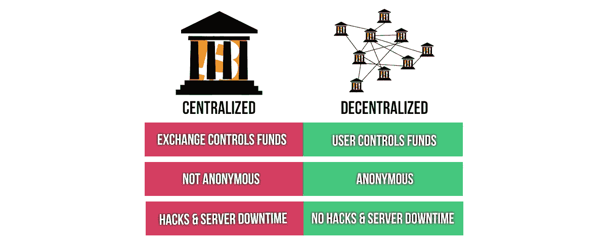

# 为什么我现在离开了中央交易所

> 原文：<https://medium.com/coinmonks/why-im-now-moving-away-from-central-exchanges-1077460bef3f?source=collection_archive---------53----------------------->

最近世界上发生了一些事情，这让我确信我已经把几乎所有的密码都从交易所里拿走了。

# 最近的新闻事件

上个月在加拿大有很多自由抗议，主要来自卡车司机。

作为对这些抗议的回应，加拿大政府颁布了一项紧急法案，允许他们采取更强硬的措施。

加拿大政府的问题是自由抗议者通过 gofundme 获得支持，因此他们关闭了这个网站。不再捐款。然后，加密和比特币运动开始了，他们开始向一个特定的比特币地址捐款，这些钱随后会捐给自由抗议者。加拿大政府也有能力抓住他们，但是如果捐赠更有策略的话，这是可以避免的。

举例来说，如果他们在冰冷的钱包里选择了一个比特币地址，政府就永远无法拿走他们的资金。但他们的错误在于选择了政府可以控制的集中交易所的地址。因此他们冻结了资金。

# 为什么我应该将我的加密从 exchanges 中移除？

1.  正如我刚才明确指出的，政府可以冻结它，甚至带走它们。是的，你没看错。甚至中央交易所的首席执行官们也承认，如果政府告诉他们给他们资金，他们必须服从。
2.  这些硬币实际上不是你的，你必须得到许可才能取出它们。如果你真的拥有它们，并且可以随时使用它们，没有愚蠢的取款费或最低取款额，那就更好了。
3.  你的硬币可能实际上并不在那里，有时交易所说他们有比实际更多的某种代币余额。
4.  安全，你的交易所很有可能被黑，然后你可能会失去你的资金。装有所有密码的冷钱包会更安全。

# 那我该怎么办？

将所有或大部分密码从交易所中取出，放入数字钱包或冷钱包中。

数字钱包是你可以安装在电脑上的应用程序，我用 Exodus 做例子。或者更好的是从 Trezor 购买 pyhsical 硬件钱包。

除非你把你的钥匙给别人，或者你的电脑中了病毒，否则你的资金将永远无法被任何有硬件钱包的人获取。

# 结论

把它从交易所拿走，动作要快。这可能看起来有点偏执，但最好现在就表现出偏执，尽一点点努力，然后在几个月后当你失去所有资金时后悔。