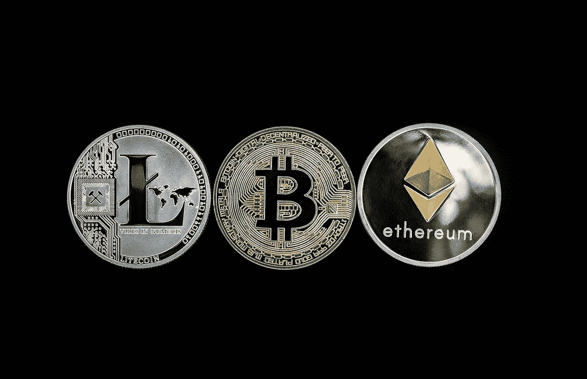

# 为什么投资 altcoin 而不投资比特币？

> 原文：<https://medium.com/coinmonks/why-invest-in-altcoin-and-not-bitcoin-f9bf9f89ac6a?source=collection_archive---------15----------------------->

Altcoin Vs Bitcoin

自 2009 年比特币作为第一种加密货币首次亮相以来。在所有其他加密货币、代币出现之前，它已经被全世界的人和组织所接受。比特币以外的加密货币被称为替代货币(Altcoins)，简称替代货币，由机构投资者和全世界的加密影响者使用。

这些加密货币是为不同的目的而构建的，尽管被分为不同的类别，如稳定硬币、基于采矿、基于赌注和治理令牌。这些将在另一篇文章中解释，所以请确保您关注我，并确保您订阅了我的文章，以便在我发帖时直接发送到您的收件箱。

现在说了这么多，很多人一直在问“我应该把我的钱投资于什么加密货币”,我不提供金融建议，但我清楚地知道，替代货币是对投资组合多样化感兴趣的加密货币市场投资者的好选择。虽然有些，比如以太坊的以太，可以通过名字识别，但是超过 10，000 枚的替代硬币中的大多数仍然没有留下印记。替代硬币代表了加密货币重塑现代金融的潜力。但是投资者在投资之前应该做好调查。与替代币相关的风险与比特币投资相似，在某些情况下甚至更大。

我将添加一篇由我的朋友 Ugwu Silas 撰写的文章的链接，这篇文章详细介绍了如何在密码领域研究一个非常重要的课题。

**山寨币是好的投资吗？**

替代币有许多与比特币相关的投资风险。此外，许多小代用币[缺乏流动性](https://www.investopedia.com/terms/i/illiquid.asp)。但以太和 XRP 等成熟的替代币是比特币的竞争对手。

写这篇文章是为了告诉你为什么更好的方法是把你的钱投资到可替代的硬币上，这些硬币在被购买时的价格是之前价格的 100 倍，而不是投资到自创造以来已经超过 1000 倍的比特币上。我没有什么理由认为替代币是比比特币更好的投资方式；

1.  **独特的使用案例**:大多数替代币被认为具有比 btc 独特的使用案例和效用，例如以太坊，以太坊通过其开创性的智能合约等功能组合，被用于金融、网页浏览、游戏、广告、身份管理和供应链管理等各种创新应用，这些应用往往令人惊讶，因为这些投资者通常利用以太坊区块链而不是比特币区块链中提供的服务。
2.  **快速交易和低费用**:大多数替代币的交易速度更快，而比特币的高波动性、交易次数和费用可能会对许多客户造成障碍，这些客户不愿意冒险花费超过他们需要的小额购买，替代币可以提供更便宜和更快的交易。
3.  **盈利能力**:投资 altcoin 在某些情况下可以给出比比特币还高的回报，你要问我为什么？让我举一个过去的例子。假设投资者 A 和 B 在比特币和索拉纳上分别投资了相同金额的资金 7200 美元，截至 2020 年 10 月，比特币约为 7200 美元，索拉纳为 1.5 美元。投资者 A 决定购买 1 个比特币，在他的研究 B 决定购买一个 altcoin sol(sol)后，他以 7200 美元的价格购买了 4800 个 sola。在我写这篇文章的时候，比特币是 40，300 美元，索拉纳是 102 美元。现在让我们用当前的价格来计算当前的利润，因为比特币是 40，300 美元，记住他用 7200 美元买了 1 个，他的利润是 40，300-7200 美元(原始投资)= 33，100 美元。因此，投资者 A 目前有 33100 美元的利润。对于投资者 B，由于索拉纳目前的价格是 102 美元，请记住他以 7200 美元的价格购买了 4800 索尔，因此可能是 102*4800 美元= 489600 美元，那么 489600 美元–7200 美元(原始投资)= 482400 美元。因此，投资者 B 目前有 482400 美元，与比特币相比，这实际上是一笔巨大的利润。

我说过我会分享一个链接到 [Ugwu Silas](https://medium.com/u/98709eb7cf66) 关于如何做你的研究的文章在下面；

仔细阅读理解概念。

 [## 如何做自己的研究

### 加密新手经常问我如何知道一个 rugpull 令牌，蜜罐，如何破译骗局和其他问题

medium.com](/@ugwusilas62/how-to-do-your-own-research-a0f04b9acd5c) 

感谢你阅读我的文章。

> 交易新手？尝试[加密交易机器人](/coinmonks/crypto-trading-bot-c2ffce8acb2a)或[复制交易](/coinmonks/top-10-crypto-copy-trading-platforms-for-beginners-d0c37c7d698c)