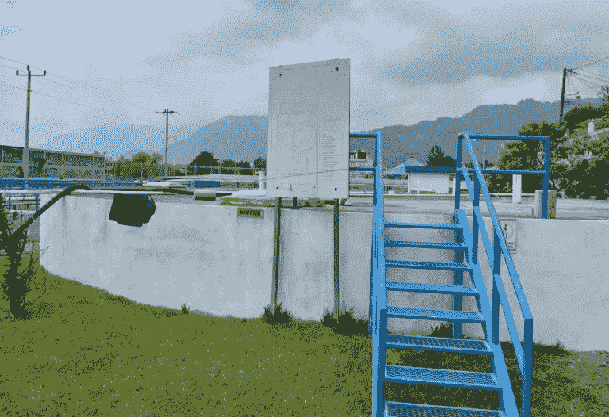

# 为什么危地马拉的一个市长在开采比特币？利用沼气和 BTC 抗击 FUD

> 原文：<https://medium.com/coinmonks/why-is-a-mayor-of-guatemala-mining-bitcoin-using-biogas-and-btc-to-combat-fud-6b9ebcaee90f?source=collection_archive---------31----------------------->

**Visit our website:-** [**https://bitcoinsupports.com/**](https://bitcoinsupports.com/)

在危地马拉，一个比特币项目改善了空气质量，促进了碳负比特币采矿，并将一名比特币矿工交给了市长。比特币(BTC)社区又开始行动了，它解构了遥远地方散布恐惧和散布橙色的政客。一项比特币的努力已经成功地将一名矿工交到了阿蒂特兰湖脚下的当地市长手中，这是危地马拉一个风景优美但贫困的地区。这一过程增加了当地的收入，也改善了空气质量。在当地市长 Cesar Piedrasanta 收到一台过时的 S9 比特币挖矿机后，危地马拉 Panajachel 的一个约有 2 万人的社区开始对比特币产生兴趣。这是中美洲或南美洲第一个开采 BTC 的自治市。

**Visit our website:-** [**https://bitcoinsupports.com/**](https://bitcoinsupports.com/)

尽管这本身就很了不起，但它有两个至关重要的分支。比特币湖团队成员比尔·惠特克(Bill Whittaker)表示，首先，与“5 岁”矿工一起采矿有助于“解决与比特币采矿相关的电子垃圾(或‘电子垃圾’)问题”。电子垃圾是一个术语，用来描述用更新、更高效的形式取代旧的、低效的采矿基础设施。最近纽约的采矿禁令解决了报告的问题，根据 Science Direct，由于主要是过时的采矿设备，一次比特币交易产生了 272 公斤的电子垃圾。另一方面，危地马拉市长开着他的旧 S9 开得很好。

其次，团队打算用比特币矿工的收益来解决影响废水处理厂的困难。

**Visit our website:-** [**https://bitcoinsupports.com/**](https://bitcoinsupports.com/)

废物处理厂(WWTP)是一个主要的污染者，因为“由于工厂消化池顶部的密封破裂，没有足够的压力来燃烧设施的甲烷排放。”结果，空气被令人不快且有气味的污染物污染。Whittaker 和他的同事们计划修复 WWTP，然后收集曾经泄漏的沼气，这样沼气就可以用作电力来源。更清洁的空气，更绿色的能源，更多的比特币:这是一个三赢的局面。

**完整博客访问:-**[**https://bitcoinsupports . com/why-is-a-mayor-of-Guatemala-mining-bit coin-using-biogas-and-BTC-to-combat-fud/**](https://bitcoinsupports.com/why-is-a-mayor-of-guatemala-mining-bitcoin-using-biogas-and-btc-to-combat-fud/)

**免责声明:以上为作者观点，不应视为投资建议。读者应该自己做研究。**

> 加入 Coinmonks [电报频道](https://t.me/coincodecap)和 [Youtube 频道](https://www.youtube.com/c/coinmonks/videos)了解加密交易和投资

# 另外，阅读

*   [分散交易所](https://coincodecap.com/what-are-decentralized-exchanges) | [比特恩斯 FIP](https://coincodecap.com/bitbns-fip) | [宾邦评论](https://coincodecap.com/bingbon-review)
*   [用信用卡购买密码的 10 个最佳地点](https://coincodecap.com/buy-crypto-with-credit-card)
*   [加拿大最佳加密交易机器人](https://coincodecap.com/5-best-crypto-trading-bots-in-canada) | [Bybit vs 币安](https://coincodecap.com/bybit-binance-moonxbt)
*   [阿联酋 5 大最佳加密交易所](https://coincodecap.com/best-crypto-exchanges-in-uae) | [SimpleSwap 评论](https://coincodecap.com/simpleswap-review)
*   购买 Dogecoin 的 7 种最佳方式 | [ZebPay 评论](https://coincodecap.com/zebpay-review)
*   [最佳期货交易信号](https://coincodecap.com/futures-trading-signals) | [流动性交易所评论](https://coincodecap.com/liquid-exchange-review)