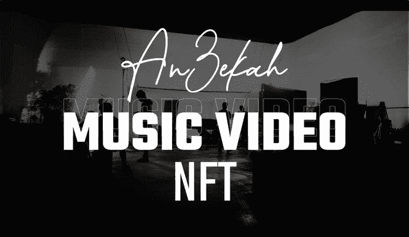
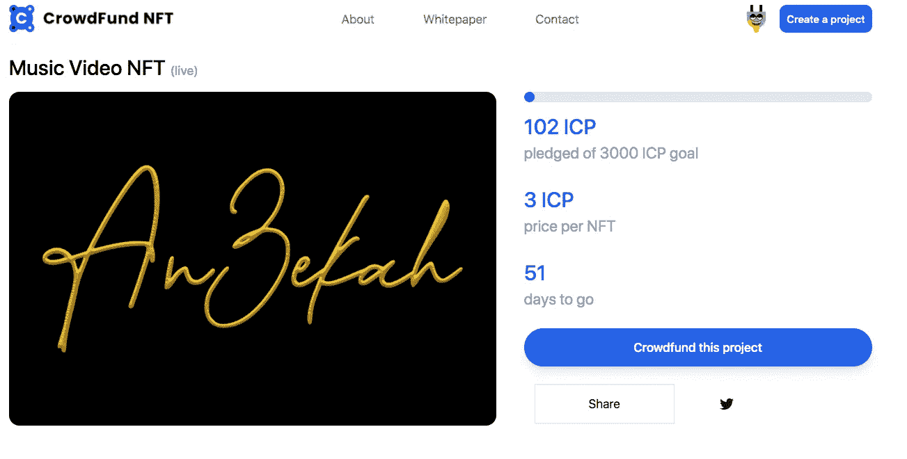

# 为什么一个流行音乐人会转向互联网计算机(ICP)上的音乐 NFTs？

> 原文：<https://medium.com/coinmonks/why-is-a-trending-musician-is-moving-to-music-nfts-on-the-internet-computer-icp-66b99387111f?source=collection_archive---------21----------------------->

介绍伦敦的歌手兼歌曲作者 An3ekah(发音为 a-NEE-卡)。当他们收购沃伊赛(音乐应用)时，她的歌曲[《欲望》和](https://open.spotify.com/artist/6DsN7Ev4alpuq3z62zwCUH)在 Snapchat 上获得了超过 1500 万次的播放量。在深入了解她的故事之前，先听听她美妙的声音，看看她为什么会火起来。

**Snapchat 得到了它需要的东西，然而 An3ekah 一分钱也没赚到。**她热爱创作音乐，所以她继续追寻自己的激情，然而很快她就开始有被大平台剥削的感觉。她开始质疑——这对我有什么好处？她意识到，整个传统音乐行业的结构并没有真正支持艺术家，赚钱的是中间的所有其他参与者，艺术家可能赚得最少。

**那么音乐产业有什么问题呢？**很简单——艺人赚的钱不够。超过 700 万名艺术家在 Spotify 上发布了他们的音乐。他们中只有 0.19%的人年收入超过 5 万美元，超过 95%的艺术家甚至连 1 万美元都没挣到！对于那些有兴趣了解音乐行业详细运作的人来说，这里有一个很棒的 Twitter 帖子:

报告称，前三大唱片公司(环球音乐集团、索尼音乐娱乐和华纳音乐集团)占据了音乐录制市场 68%的份额。而标签是如何行使这种权力的呢？作者:

*   拿走所有艺术家版税的 76-85 %,
*   多专辑独家交易将艺人与唱片公司捆绑在一起，但让唱片公司随时退出交易，
*   让他们分享其他音乐家演出的交易，如表演、模特、商品销售

回到 An3ekah 的故事，她因失去对音乐的控制而不知所措，她决定改变她的生活，将她的音乐转移到互联网电脑上，并把她的事业掌握在自己手中。她想带头并激励其他人远离大标签和平台，赚取他们应得的东西。

*An3ekah 不仅仅是一位杰出的艺术家，她还是一位善于分析的艺术家*，因此她评估了实现目标的不同方法，她明白三个关键因素是:

1.  **资金**用于生产、营销&投放市场，这是唱片公司提供的交换版税的主要元素
2.  一个**区块链音乐平台**来托管她在链上的音乐，没有去平台化的风险
3.  这是建立粉丝社区的一种方式，不仅支持她的艺术，还能让她回馈给谁。

她决定选择互联网电脑来开始她的 Web3.0 音乐生涯，因为她发现了 ICP 社区非常欢迎的生态系统中所有需要的解决方案。

她目前正在 **Crowdfund NFT** 上运行一个[众筹活动——这是一个相当于 ICP 上的 Web3 项目的 Kickstarter，人们可以在那里为 NFT 的项目提供资金。这个平台还允许她回馈她的社区，这对她来说非常重要。她已经给了她的早期信徒一个 NFT。她喜欢她自己和她的社区完全投入到项目中的感觉，喜欢每个人都分享成功的好处。](https://kn5ky-6iaaa-aaaai-qbikq-cai.ic0.app/project.html?projectId=8)

她选择的音乐托管平台是 [Canistore](https://canistore.io/) ，这是一家分散式媒体服务提供商，基于由 [DFINITY](https://medium.com/u/f46cd59473d8?source=post_page-----66b99387111f--------------------------------) **∞开发的 ***互联网计算机*** 的革命性技术。** Canistore 的目标是构建下一代社交商店移动应用，消除平台风险&，由社区管理和拥有。艺术家可以直接获得收入，并感到安全，他们的内容在互联网计算机上是安全的，不能被垄断公司删除。这是她在 Canistore (Alpha )上的音乐预览

An3ekah 岁就开始写歌唱歌，至今没有停止过。她的第一首歌是关于交通灯的，从那以后，她继续为她的家人和朋友表演音乐，直到她成为一名专业艺术家&为别人代笔。她的梦想是制作她的第一部音乐录影带，也为其他人树立一个榜样，打破音乐行业的枷锁，追随他们的梦想。所以，请通过帮助她的众筹来支持她，成为她的旅程的一部分，并在这个过程中获得回报。随着第一部音乐视频《NFT》在 Canistore 上的发布，An3ekah 将引领一场艺术革命。

你可以在任何大的密码交易所购买 ICP，并加入众筹基金来帮助她启动她的项目:[https://kn5ky-6iaaa-aaaai-qbikq-cai.ic0.app/project.html?projectId=8](https://kn5ky-6iaaa-aaaai-qbikq-cai.ic0.app/project.html?projectId=8)

> 加入 Coinmonks [电报频道](https://t.me/coincodecap)和 [Youtube 频道](https://www.youtube.com/c/coinmonks/videos)了解加密交易和投资

# 另外，阅读

*   [BigONE 交易所点评](/coinmonks/bigone-exchange-review-64705d85a1d4) | [电网交易 Bot](https://coincodecap.com/grid-trading)
*   [氹欞侊贸易评论](https://coincodecap.com/anny-trade-review) | [CoinSpot 评论](https://coincodecap.com/coinspot-review)
*   [新加坡十大最佳加密交易所](https://coincodecap.com/crypto-exchange-in-singapore) | [购买 AXS](https://coincodecap.com/buy-axs-token)
*   [投资印度的最佳加密软件](https://coincodecap.com/best-crypto-to-invest-in-india-in-2021) | [WazirX P2P](https://coincodecap.com/wazirx-p2p)
*   7 个最佳零费用加密交易平台
*   [最佳网上赌场](https://coincodecap.com/best-online-casinos) | [期货交易机器人](/coinmonks/futures-trading-bots-5a282ccee3f5)