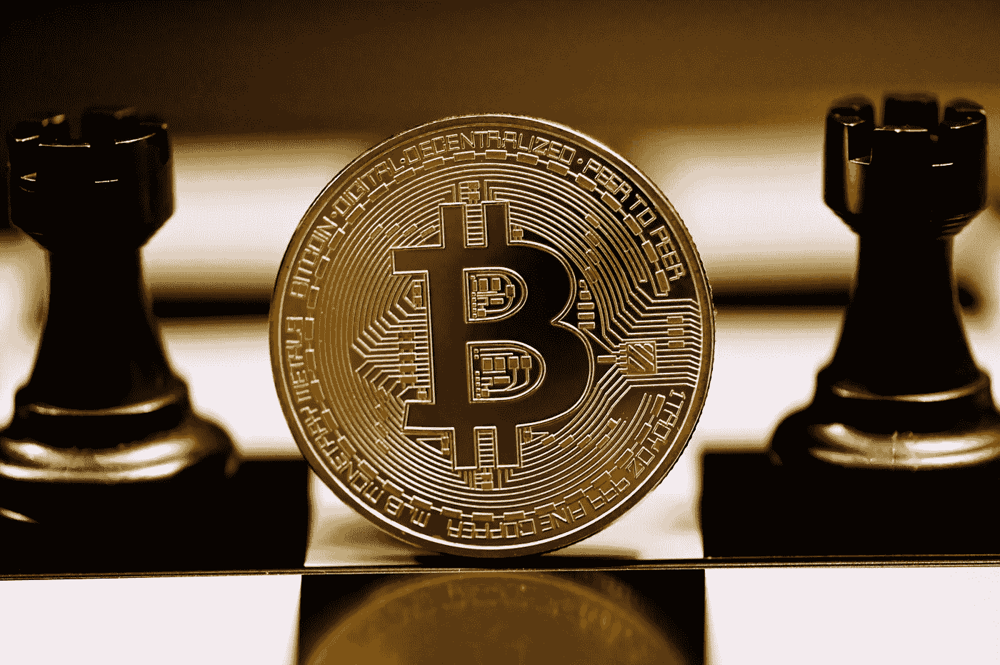

# 为什么比特币是唯一真正的稳定币？

> 原文：<https://medium.com/coinmonks/why-is-bitcoin-the-only-true-stablecoin-19c78ac29331?source=collection_archive---------43----------------------->

Source photo Unsplash.com

熟悉加密货币市场的人都知道中央管理的稳定货币，这是一种与美元等参考资产挂钩的加密货币。Tether (USDT)和 USD coin (USDC)就是两个例子，虽然还有其他的如 Paxos 和 DAI，但前两者似乎是使用最广泛的。稳定币经常被投机者用来交易比特币，但也有…