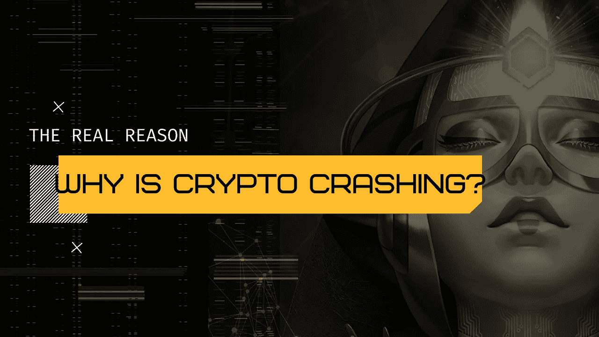

# 为什么加密系统现在崩溃了？

> 原文：<https://medium.com/coinmonks/why-is-crypto-crashing-right-now-4c8105a9b83d?source=collection_archive---------17----------------------->

加密货币价格自 11 月以来一直在下跌，现在投资者开始抛售，这导致价格进一步下跌。为了了解和展示加密货币市场的波动性，加密货币公司 Coin Metrics 报告称，加密货币在 1 月的一天损失了超过 1500 亿美元的价值。11 月初，由于投资者希望比特币 1 万亿美元的市值在交易开始前保持不变，比特币的价格飙升至近 7 万美元。比特币价格自 1 月份以来首次跌破 3 万美元，在越来越多的人有兴趣采取行动之际，突显出加密货币的波动性。

比特币价格在 4 月份创下 64000 美元的历史新高后，本周早些时候跌破 33000 美元。在本月早些时候突破 40，000 PS 后，比特币的价格降至 26，000 PS，这表明了加密货币的波动性。过去几周，比特币经历了不稳定的崩溃，包括 4 月 17 日和 18 日周末的一天暴跌。在国家禁止加密货币。

此举被誉为一个里程碑，也是加密货币成为主流的另一个迹象，但比特币基地股票现在的交易价格低于其最初的发行价。特斯拉的决定是在特斯拉购买了价值 15 亿美元(10.6 亿英镑)的比特币股份后做出的，这反过来导致比特币和特斯拉的市场价格暴涨。马斯克一直是加密货币的长期支持者，特斯拉的决定反映在全球加密货币市场上，其他数字代币越来越便宜。在埃隆马斯克(Elon Musk)令人震惊地宣布特斯拉将不再接受特斯拉比特币之后，加密货币的价格上周也受到了打击。

由于担心化石燃料的使用，埃隆·马斯克宣布特斯拉将不再接受加密货币后，比特币的价格开始上涨。比特币和其他加密货币的价格暴跌，包括主要代币以太坊、BNB 币、索拉纳币、卡尔达诺币和 XRP 币，在短短 24 小时内从合并的加密市场中抹去了近 2000 亿美元。比特币价格跌破 39000 美元，拖累主要加密货币价格……[+]以太坊、比南斯 BNB、索拉纳、卡尔达诺和 XRP。比特币的价格已经从 11 月份每比特币近 7 万美元的峰值暴跌，以太坊、BNB、索拉纳、卡尔达诺和 XRP 的价格总和从加密货币市场抹去了超过 1 万亿美元。

在 1 月 21 日周五加密货币市场崩盘后，比特币的价格跌得更低，今天比特币正在逼近 3 万美元的新门槛(1 月 24 日周一)。与此同时，根据 CoinGecko 的数据，全球加密货币市值今天下跌了超过 5%，跌破 2 万亿美元大关，至 1.98 万亿美元，这是由今天加密货币价格下跌造成的。比特币和以太坊等加密货币的月度下跌在最近几天加速，价格现在处于六个月低点，抹去了数十亿美元。

其他流行的加密货币，包括以太坊、币安币、Cardano、Dogecoin 和 Ripple，价格都大幅下跌。其他加密货币遭受的损失与以太币和迷因币一样多，如果不是更多的话，他们也得出了类似的结论。比特币自 11 月达到峰值以来的下跌抹去了超过 6000 亿美元的市值，加密货币市场累计损失超过 1 万亿美元。此外，由于 Elon Musk 的声明，加密货币的市场价格最近下跌，这使得金融公司怀疑这些货币是否真的会让它们流行起来。

支持比特币的通常投资观点是，比特币可以对冲政府刺激导致的通胀上升。比特币是一种高度波动的加密货币，具有繁荣和萧条周期，其价格飙升，然后回到地面。华尔街的智慧将熊市定义为从近期高点下跌 20%或更多，但值得注意的是，比特币以其波动性而闻名。

例如，比特币在 2017 年 12 月创下了近 2 万美元的纪录，但截至 2018 年 12 月，交易价格低于 3500 美元。一家加密货币交易所的创始人预测，到 2021 年底，每比特币将飙升至 300，000 美元，随后将下跌 80%—90 %,经历一个持续多年的“加密冬天”。该国之王比特币的易手价格略高于 33，000 美元，比比特币 11 月份创下的纪录低约 51%。

比特币价格最近上涨了近 15000 美元，在比特币于 11 月份接近 70000 美元的历史新高后，比特币的广告牌被抹去。有人可能会说，比特币的下跌是波动性的又一个例子，这种波动性使比特币成为日常货币变得极其困难，但从我们所看到的情况来看，目前比特币价格的实际下跌并不那么不寻常。和其他加密货币。与此同时，全能的技术大王埃隆·马斯克(Elon Musk)正在传播“加密货币骗子”之类的术语，就好像特斯拉没有购买价值 15 亿美元的比特币一样；或者汽车公司不接受 Dogecoin 作为付款方式。

> 加入 Coinmonks [电报频道](https://t.me/coincodecap)和 [Youtube 频道](https://www.youtube.com/c/coinmonks/videos)了解加密交易和投资

## 另外，阅读

*   [WazirX vs coin dcx vs bit bns](/coinmonks/wazirx-vs-coindcx-vs-bitbns-149f4f19a2f1)|[block fi vs coin loan vs Nexo](/coinmonks/blockfi-vs-coinloan-vs-nexo-cb624635230d)
*   [比斯勒评论](https://coincodecap.com/bitsler-review)|[WazirX vs coin switch vs coin dcx](https://coincodecap.com/wazirx-vs-coinswitch-vs-coindcx)
*   [7 大副本交易平台](https://coincodecap.com/copy-trading-platforms) | [BuyCoins 点评](https://coincodecap.com/buycoins-review)
*   [XT.COM 评论](https://coincodecap.com/profittradingapp-for-binance)币安评论 |
*   [SmithBot 评论](https://coincodecap.com/smithbot-review) | [4 款最佳免费开源交易机器人](https://coincodecap.com/free-open-source-trading-bots)
*   [杠杆代币](/coinmonks/leveraged-token-3f5257808b22) | [最佳密码交易所](/coinmonks/crypto-exchange-dd2f9d6f3769) | [Paxful 点评](/coinmonks/paxful-review-4daf2354ab70)
*   [加密套利](/coinmonks/crypto-arbitrage-guide-how-to-make-money-as-a-beginner-62bfe5c868f6)指南| [如何做空比特币](/coinmonks/how-to-short-bitcoin-568a2d0b4ae5)
*   [币安期货交易](https://coincodecap.com/binance-futures-trading)|[3 commas vs Mudrex vs eToro](https://coincodecap.com/mudrex-3commas-etoro)
*   [如何购买 Monero](https://coincodecap.com/buy-monero) | [IDEX 评论](https://coincodecap.com/idex-review) | [BitKan 交易机器人](https://coincodecap.com/bitkan-trading-bot)
*   [尤霍德勒 vs 考尼洛 vs 霍德诺特](/coinmonks/youhodler-vs-coinloan-vs-hodlnaut-b1050acde55a) | [Cryptohopper vs 哈斯博特](https://coincodecap.com/cryptohopper-vs-haasbot)
*   [顶级付费加密货币和区块链课程](https://coincodecap.com/blockchain-courses)
*   [MXC 交易所评论](/coinmonks/mxc-exchange-review-3af0ec1cba8c) | [Pionex vs 币安](https://coincodecap.com/pionex-vs-binance) | [Pionex 套利机器人](https://coincodecap.com/pionex-arbitrage-bot)