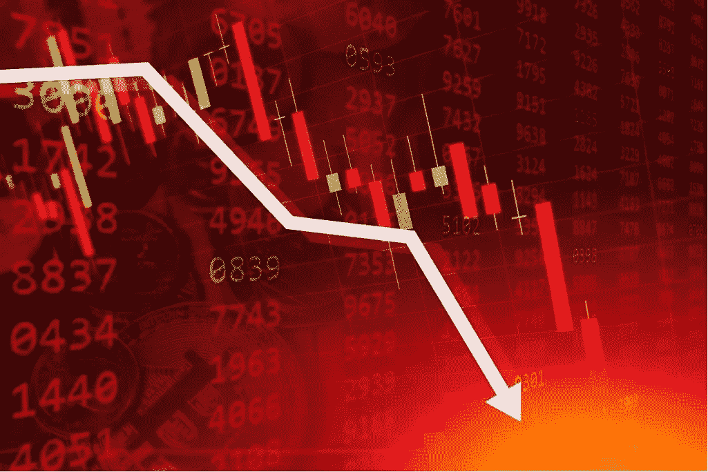
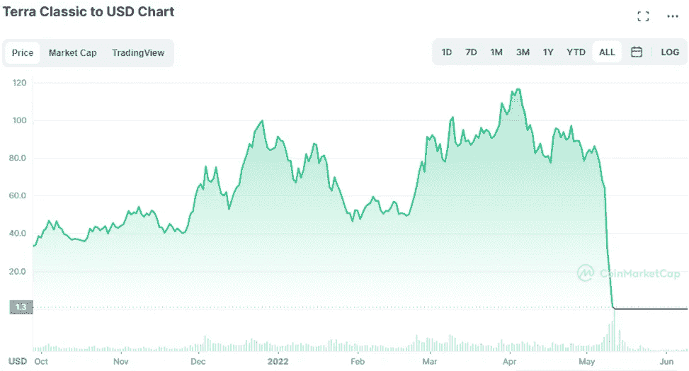
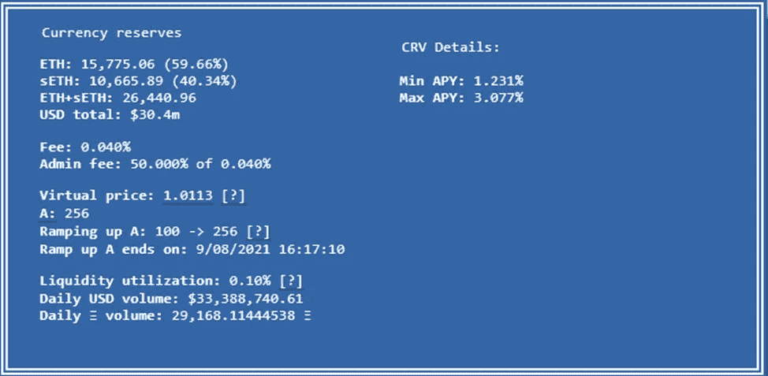
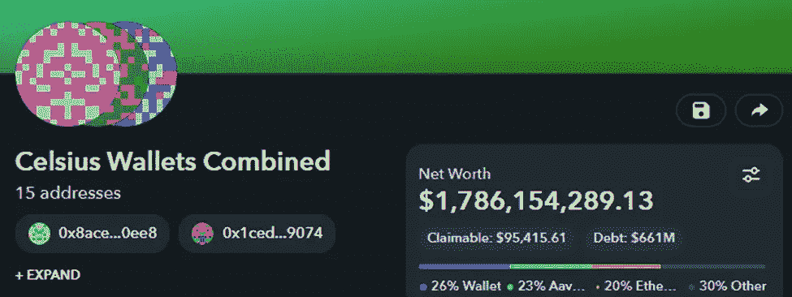
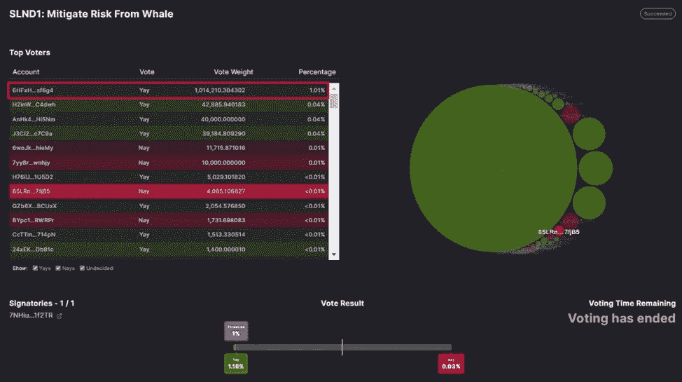
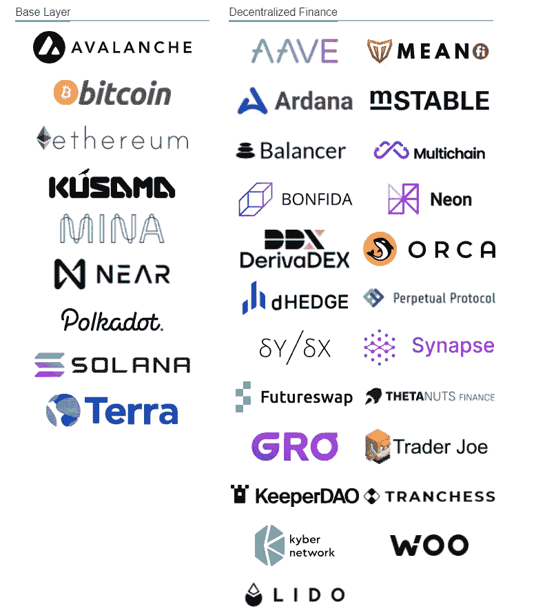

# 为什么 crypto 现在如此疯狂？

> 原文：<https://medium.com/coinmonks/why-is-crypto-crazy-right-now-75f0929abeb9?source=collection_archive---------30----------------------->

熊市是可怕的事情。然而，消除恐惧的最好方法是知识。在过去的几周/几个月里，crypto 中发生了一系列疯狂的事情，其中大部分基本上都是其他潜在的灾难性场景。下面是每个项目的一个简短片段，旨在帮助你在当前的下降趋势中导航，并在未来更容易发现糟糕的项目:

Terra 和 just 德佩格:不，我并没有迟到，只是我们仍能感受到 Terra 崩溃的后果。如果你想了解 Terra 发生了什么，[这里](https://totiavlad.substack.com/p/what-on-terra-luna-is-happening-with?utm_source=%2Fprofile%2F87329865-vlad-totia&utm_medium=reader2)是我写的关于这个主题的两部分系列文章:Terra 和 Anchor 被市场和被认为是负责任和严肃的 TradFi 发起基金广泛使用，以至于许多机构和其他类似的鲸鱼仍然试图掩盖或证明他们在 Anchor 中的损失。UST 还被用作许多其他稳定债券和货币市场的抵押品，从而进一步传播了流动性不足的传染病。

**2- Lido 和 stETH depeg** : Lido Finance 是一家流动赌注提供商，当用户在他们的平台上下注时，它会提供 stETH 作为奖励。stETH 与 ETH 的比例应该是 1:1。它的许多机构客户，由于他们在 UST +当前熊市的风险敞口，已经开始大规模赎回他们的 ETH(因此给 stETH 带来了卖出压力)，stETH 目前与美元脱钩 5%。如果情况变得更糟，从 ETH 流出的流动性将在市场上造成巨大且不可预见的后果。

另一个风险是，一旦以太坊升级到 2.0，由于利多的绝对优势，PoS 共识可能会受到集中攻击。鉴于其现有的潜在流动性问题，这可能意味着大规模的麻烦。

**3- Celsius 及其流动性问题**:是啊那么，机构投资者从以上几点来看利多呢？其中最大的是这些家伙。Celsius 提供计息储蓄账户、借款和支付。它的储蓄利息来自 DeFi 投资，比如利多。Celsius 得到 stETH，然后用它存入的 ETH 来支付，stETH 产生奖励，Celsius 把这些奖励的一部分给他们的客户，剩下的自己留着。由于 stETH 目前与美元脱钩，Celsius 仍然需要向其客户支付 6%-10%的固定利率，因此它以很高的折扣兑换，进一步加剧了潜在的美元贬值。

Celsius 似乎还有进一步的风险敞口问题，因为它显然也在以用户存放在其平台上的 LINK 等资产为抵押借款，实际上是在做空自己的客户。自从 Terra 崩溃以来，Celsius 一直存在的流动性问题似乎相当糟糕，因为据报道，Celsius 拥有的一些地址总计不到 20 亿美元，而根据这个[钱包捆绑包](https://zapper.fi/bundle/0x8aceab8167c80cb8b3de7fa6228b889bb1130ee8%2C0x1cedc0f3af8f9841b0a1f5c1a4ddc6e1a1629074%2C0x87a67e7dc32fdc79853d780c6f516312b4a503b5%2C0xeee27662c2b8eba3cd936a23f039f3189633e4c8%2C0xc131701ea649afc0bfcc085dc13304dc0153dc2e%2C0x84e1f49a6b65882c7365b6a775999cfcb481f22f%2C0xcf7a68127285c7c6c8546ce51b89d7e820f6d294%2C0x4f6742badb049791cd9a37ea913f2bac38d01279%2C0xdbaa0bcec419c47a75efbb93c745aebae3fe9c7b%2C0x3b6543ebe26824bd8156a103063f56ce50f88080%2C0xef22c14f46858d5ac61326497b056974167f2ee1%2C0x3be6d80fdce385358f5762998882efc282df7b9a%2C0x845cbcb8230197f733b59cfe1795f282786f212c%2C0x0fc8415a9b8f535e9f48ba245b1b18a37fb03a90%2C0x8665d75ff2db29355428b590856505459bb675e3?label=Celsius+Wallets+Combined&id=0x7d3a40822eb2701f5d08e3a24b0bfefbd173e1ae&addresses=0x8aceab8167c80cb8b3de7fa6228b889bb1130ee8%2C0x1cedc0f3af8f9841b0a1f5c1a4ddc6e1a1629074%2C0x87a67e7dc32fdc79853d780c6f516312b4a503b5%2C0xeee27662c2b8eba3cd936a23f039f3189633e4c8%2C0xc131701ea649afc0bfcc085dc13304dc0153dc2e%2C0x84e1f49a6b65882c7365b6a775999cfcb481f22f%2C0xcf7a68127285c7c6c8546ce51b89d7e820f6d294%2C0x4f6742badb049791cd9a37ea913f2bac38d01279%2C0xdbaa0bcec419c47a75efbb93c745aebae3fe9c7b%2C0x3b6543ebe26824bd8156a103063f56ce50f88080%2C0xef22c14f46858d5ac61326497b056974167f2ee1%2C0x3be6d80fdce385358f5762998882efc282df7b9a%2C0x845cbcb8230197f733b59cfe1795f282786f212c%2C0x0fc8415a9b8f535e9f48ba245b1b18a37fb03a90%2C0x8665d75ff2db29355428b590856505459bb675e3)，它们应该在 100 亿美元左右。

**4- Solend，流动性和鲸鱼** : Solend 是 Solana 上的货币市场，就像其他链上的 Aave 和艾斯特一样。用户在上面借入和借出资产。Solend 面临着与市场其余部分相同的熊市、流动性不足和 depeg 风险。最重要的是，一只鲸鱼最近存放了 570 万索尔，占该平台供应存款的 95%和 USDC 借款的 88%。如果索尔跌至 22.30 美元，该协议将自动清算高达 20%的鲸鱼抵押品。SOL 的价格已经反弹到大约 36 美元，清算从未到来。

然而，由于索伦德提议就控制鲸鱼钱包进行投票，反对的声音很大。很明显，甚至有一个 DAO 是专门为这次投票设计的，里面有最大的钱包，占了超过 1%的投票权。然而，投票没有通过，有问题的钱包仍然完好无损。不是最成功的捕鲸活动。

**5-三箭资本及其输掉的赌注:** 3AC 是最重要、最显眼的加密基金之一。他们也是一个最好的例子，一个机构打赌咬了比它可以负责任地咀嚼的多得多的东西，[最近承认了当 Terra 生态系统内爆时它遭受的损失。该基金目前正在探索资产出售方案，甚至包括被另一家公司收购。本质上，3AC 现在在很多地方都欠了很多资本，根据 T4 的研究，比如 BitMEX。它还在许多其他著名的区块链和加密项目中拥有大量其他资产，这些资产基本上将不得不亏本出售，这给市场带来了更大的出售压力。](https://www.coindesk.com/business/2022/06/17/three-arrows-capital-confirms-heavy-losses-from-lunas-collapse-exploring-potential-options-report/)

加密还不是一个很大的世界，灾难会有连锁反应。熊市通常是剧烈的、突然的，周围的人会恐慌。对周围正在发生的事情有一些想法和基本的了解，可以让你在艰难的市场中生存下来，以便在繁荣的市场中奋斗。

> 加入 Coinmonks [电报频道](https://t.me/coincodecap)和 [Youtube 频道](https://www.youtube.com/c/coinmonks/videos)了解加密交易和投资

# 另外，阅读

*   [用信用卡购买密码的 10 个最佳地点](https://coincodecap.com/buy-crypto-with-credit-card)
*   [加拿大最佳加密交易机器人](https://coincodecap.com/5-best-crypto-trading-bots-in-canada) | [Bybit vs 币安](https://coincodecap.com/bybit-binance-moonxbt)
*   [阿联酋 5 大最佳加密交易所](https://coincodecap.com/best-crypto-exchanges-in-uae) | [SimpleSwap 评论](https://coincodecap.com/simpleswap-review)
*   购买 Dogecoin 的 7 种最佳方式 | [ZebPay 评论](https://coincodecap.com/zebpay-review)
*   [最佳期货交易信号](https://coincodecap.com/futures-trading-signals) | [期交所评论](https://coincodecap.com/liquid-exchange-review)
*   [用于 Huobi 的加密交易信号](https://coincodecap.com/huobi-crypto-trading-signals) | [Swapzone 审查](/coinmonks/swapzone-review-crypto-exchange-data-aggregator-e0ad78e55ed7)