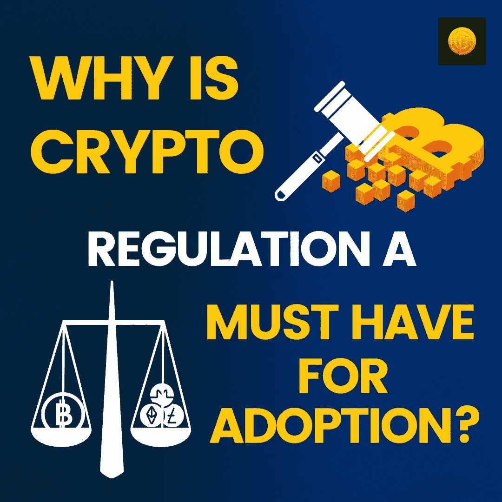

# 为什么加密法规是必须采用的？

> 原文：<https://medium.com/coinmonks/why-is-crypto-regulation-a-must-have-for-adoption-3d3cefb2b486?source=collection_archive---------67----------------------->

在最近的一项命令中，SEC 大声疾呼地强调要通过一项行政命令，明确消除所有疑虑，让 crypto 在未来十年里强劲发展。出于这个原因，监管成为加密货币交易的一部分是必要的。到目前为止，加密社区强烈反对监管，因为他们觉得这可能会扼杀创新，并将所有加密货币都束缚在司法框架内。然而，这里有一些很好的理由来证明为什么密码监管对于市场的进一步成熟是必要的。

# 密码法规如何塑造密码市场？

**建立强大的市场**

目前，[的密码市场](https://www.coindhan.com/)非常不稳定。因此，许多投资者试图远离投资加密引用快速下滑和升值。但当市场成熟时，在这种情况下，更多的投资者将进入市场，其结果将使 crypto 成为一个平衡的投资市场。有利的一面是，即使那些认为加密是高风险资产的投资者也愿意探索这些选择。然而，也不能排除短期影响。显然，当中国开始打击加密时，它把市场放在了[冷库](https://blog.coindhan.com/2022/02/16/top-cold-wallets-to-pick-in-2022/)。当监管出台时，我们可能会看到同样的效果。然而，长期结果将是无与伦比的，而且肯定对市场有利。

**投资者保护**

投资者保护是关键，这只有在市场得到监管的情况下才能实现。比如 Mt Gox 破产，很多投资者血本无归。同样，当 YAM、Squid Game 和 Iron Finance 等项目告吹时，投资者可能没有避难所来拯救他们的损失。话虽如此，保护的需求不可避免地出现，这可以正确地修复现有加密市场的缺陷，并为未来做好准备。一个受监管的市场将非常符合这种需求。

**更安全的生态系统**

拥有一个安全的贸易生态系统是一大优势！或许，这就是为什么 SEC 主席加里·詹斯勒(Gary Genslar)经常引用过去的事件来插入 crypto 是狂野西部的原因。毫无疑问，在过去的几年里，我们看到了秘密犯罪的增加。2020 年创纪录的 78 亿美元以骗局的名义被取走，多少为投资者描绘了一幅可怕的加密画面。当法规出台时，为了更好的结果和社区的信任，这种情况可以被合理地消除。

