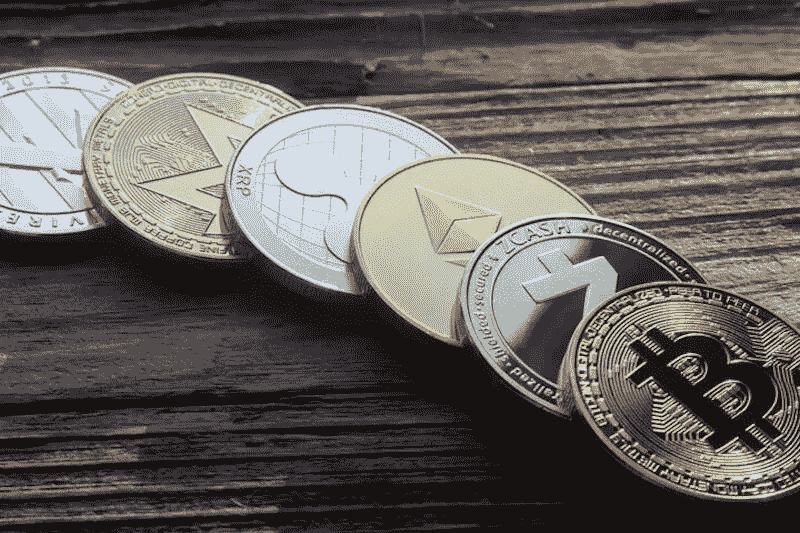

# 为什么 crypto 今天上线了？

> 原文：<https://medium.com/coinmonks/why-is-crypto-up-today-dfaca38aeb71?source=collection_archive---------84----------------------->

在过去的 24 小时里，加密市场全线大幅上涨。从许多方面来看，乌克兰战争已经成为世界秩序的转折点，其中之一就是展示了这些资产的威力和用途。

本文简要概述了 crypto 发展到今天的主要原因。这些因素包括乌克兰人的加密支出增加，以及俄罗斯公民将其视为避风港。

采用加密技术的历史性时刻

过去的周末是加密货币采用的历史性时刻。乌克兰在推特上发布了一份关于加密货币捐赠的官方请求。捐款涌入，超过 1500 万美元，这还不包括其他各种组织起来筹集资金的秘密倡议。

## [注册 COINBASE 帐户，并从您的第一笔订单中获得 5 美元优惠](https://yazing.com/deals/coinbase/Mic93503528)

乌克兰政府正在使用捐赠的密码购买关键物资，包括天然气，食品和军事设备，因为该国继续不懈地与俄罗斯军队作战。据估计，到目前为止，他们已经在加密方面花费了大约 1000 万美元。

无国界货币的力量

对乌克兰的财政支持突显了比特币和以太坊等无国界资产的力量，并提醒人们 DeFi 和其他非托管解决方案可以发挥的关键作用。逃离乌克兰的人只需要一个种子短语就可以运送他们的比特币或以太坊。

乌克兰请求捐赠加密资产的举动是全球采用该资产类别过程中的一个重要里程碑。自然，这反映在它的价格增长上。

俄罗斯在密码价格上涨中的作用

俄罗斯人正争先恐后地囤积加密技术，以保护他们的资产，并绕过国家实施的资本管制。对俄罗斯的制裁正促使俄罗斯公民购买加密货币，作为在冲突中幸存下来的一种方式，这导致卢布贬值超过 30%。

Chainalysis 的数据显示，俄罗斯联邦在全球加密应用中排名第 18 位。毫无疑问，弗拉基米尔·普京挑起的这场冲突将巩固加密技术在这个国家的应用。随着俄罗斯公民试图应对经济后果，这甚至可能将它推至历史高点。

最后一个促成因素是交易者的净空头头寸平仓，CoinDCX 将其归因于空头挤压。

主要的秘密价格变动

比特币(BTC/美元)今天上涨 13%，在撰写本文时交易价格超过 43，000 美元。第二大加密货币以太币(ETH/USD)在 24 小时内上涨了 10%。币安硬币(BNB/美元)，第四大密码和币安的本土标志，今天上涨了 11%。

## [新客户:注册并从你的第一笔订单中获得 5 美元的优惠。](https://yazing.com/deals/coinbase/Mic93503528)

> 加入 Coinmonks [电报频道](https://t.me/coincodecap)和 [Youtube 频道](https://www.youtube.com/c/coinmonks/videos)了解加密交易和投资

# 另外，阅读

*   [如何在 Uniswap 上交换加密？](https://coincodecap.com/swap-crypto-on-uniswap) | [A-Ads 审核](https://coincodecap.com/a-ads-review)
*   [WazirX vs coin dcx vs bit bns](/coinmonks/wazirx-vs-coindcx-vs-bitbns-149f4f19a2f1)|[block fi vs coin loan vs Nexo](/coinmonks/blockfi-vs-coinloan-vs-nexo-cb624635230d)
*   [本地比特币审核](/coinmonks/localbitcoins-review-6cc001c6ed56) | [加密货币储蓄账户](https://coincodecap.com/cryptocurrency-savings-accounts)
*   [什么是保证金交易](https://coincodecap.com/margin-trading) | [美元成本平均法](https://coincodecap.com/dca)
*   [支持卡审核](https://coincodecap.com/uphold-card-review) | [信任钱包 vs MetaMask](https://coincodecap.com/trust-wallet-vs-metamask)
*   [Exness 回顾](https://coincodecap.com/exness-review)|[moon xbt Vs bit get Vs Bingbon](https://coincodecap.com/bingbon-vs-bitget-vs-moonxbt)
*   [如何开始用加密贷款赚取被动收入](https://coincodecap.com/passive-income-crypto-lending)
*   [BigONE 交易所评论](/coinmonks/bigone-exchange-review-64705d85a1d4) | [电网交易机器人](https://coincodecap.com/grid-trading)
*   [氹欞侊贸易评论](https://coincodecap.com/anny-trade-review) | [货币现场评论](https://coincodecap.com/coinspot-review)