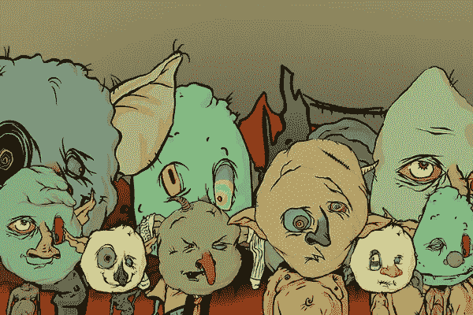

# 妖精小镇为什么这么受欢迎？展示 NFTs 丑陋的一面证明是强大的。

> 原文：<https://medium.com/coinmonks/why-is-goblin-town-nft-so-popular-e304c58d0204?source=collection_archive---------2----------------------->

## 哥布林镇是 NFT 市场上新的丑陋、恶心、愚蠢的自画像——也是最热门的新系列。👺

Goblins from Goblin Town — the new, grimy, ugly, and timely NFT collection. Source [@goblintown.wtf](https://twitter.com/goblintownwtf) on Twitter.

## 这些丑陋恶心的妖精是什么？

最近几周，熊市能量重创了 NFT 推特空间。进入哥布林镇，这是 NFT 收藏的一个丑陋的烂摊子。没有效用，没有路线图，没有不和谐的社区，没有支持。目前没有人知道是谁制造了这些妖精，也不知道它们为什么会爆炸。“投资者”仅仅是出现在 [goblintown.wtf](http://goblintown.wtf) 网站上的收藏家，他们创造了一个免费的妖精。

## 妖精城是谁造的？

还没有人知道，而且从表面上看，似乎也没有人在乎。他们仍然在二级市场上被吞并，**尽管他们背后的团队仍然不确定(未知。)**

通常，NFT 系列的一个强大卖点是其背后的团队。哥布林镇故意留下许多未解之谜。团队的影响力并不能决定项目的价值——很容易看到执行的质量。

> 加入 Coinmonks [Telegram group](https://t.me/joinchat/Trz8jaxd6xEsBI4p) 学习加密交易和投资

哥布林镇网站非常有创意——它鼓励互动，同时巧妙地只透露必要的细节。它敦促你在 Twitter 上找到更多的信息，那里关于它的消息像野火一样传播。这个执行水平指向一个在 NFT 领域有经验的团队；**有人推测，宇迦实验室的** [**无聊猿游艇俱乐部的**](https://boredapeyachtclub.com/#/) **的创造者，也曾参与制作这些小妖精。**

The quality of execution has investors wondering who could be behind these goblins.

## 为什么每个人都在嘲笑这些妖精？

他们不可爱，不干净，不酷，也不可爱。他们是妖精，我们都要去妖精镇。

哥布林镇在投资人面前吐槽自己毫无用处。该网站明明白白地写着，***“没有路线图。没有不和。没有效用。”在充斥着欺诈和骗局的海洋中，这是一个令人耳目一新的透明声明。***

## 哥布林镇的投资者竞相下跌，下跌，下跌。

在一个充满了承诺收益、上升趋势和增值的项目的空间里，具有讽刺意味的是，这些妖精引起了这么多投资者的共鸣。

哥布林镇的自我意识渗透在它的图像和信息中。网站说明了妖精们是如何分配的——***“每个钱包 1 个免费+气体薄荷。”在那之后是一个声明，每个 NFT 投资者都需要阅读:***

> ***不要 f******贪。我们就是这样走到今天的。***

告诉投资者不要贪婪违背了更常见的 NFT 理念。它反对制造尽可能多的炒作的 NFT 来快速翻盘和扫地的想法(在一个系列中购买许多低价 NFT。)挑战这种被广泛接受的观念是有风险的；这是大多数 NFT 项目都避免的一场赌博。

但也许这正是这个空间所需要的。

这种大胆的举动也表明了这样一种观点，即《妖精之城》的创作者不会有任何损失——他们甚至不需要卖掉他们的《妖精之城》来赚钱，**这个造币厂对每个人都是免费的。**

A meme retweeted by the [Goblin Town Twitter](https://twitter.com/goblintownwtf) account.

## 一张又丑又可爱的自画像。

在一个“成为你的 NFT 个人资料图片”是一个普遍概念的文化中，分发免费的地精图片看起来很无礼。但是社区正在接受它。

妖精和 NFT 文化有一些有趣的联系，最引人注目的是这个系列中的 1 比 1 NFT，它的特征是“是妖精吗？是 orc？是凯文！”这是对凯文的直接引用，他是臭名昭著的 Pixelmon 收藏中的一个 NFT，这个项目因为是一个非常昂贵的骗局而成为头条新闻。凯文提醒 NFT 社区它曾经在哪里——它并不总是以干净的艺术、有力的营销和酷的社区为中心(见[志那都红豆](https://www.azuki.com))。)市场并不总是美好的，NFT 社区似乎更愿意欣赏丑陋的一面。

*goblintown#1474 aka Kevin. Source* [*OpenSea*](https://opensea.io/assets/ethereum/0xbce3781ae7ca1a5e050bd9c4c77369867ebc307e/1474)

## 哥布林镇的未来

哥布林镇在市场上找到了最佳位置。这些妖精是一种有趣的方式来自我反省当前 NFT 社区的目的。它们可能标志着市场的转变，向发人深省、及时和有趣的 NFT 项目的可喜转变。

告诉我你对地精镇的想法，如果你喜欢这个故事，请留下掌声。💛*你也可以在* [*推特上找到我*](https://twitter.com/_emilyeth) *上的猎取 NFT 项目进行调查。* 🧐

> 加入 Coinmonks [电报频道](https://t.me/coincodecap)和 [Youtube 频道](https://www.youtube.com/c/coinmonks/videos)了解加密交易和投资

# 另外，阅读

*   [3 商业评论](/coinmonks/3commas-review-an-excellent-crypto-trading-bot-2020-1313a58bec92) | [Pionex 评论](https://coincodecap.com/pionex-review-exchange-with-crypto-trading-bot) | [Coinrule 评论](/coinmonks/coinrule-review-2021-a-beginner-friendly-crypto-trading-bot-daf0504848ba)
*   [莱杰 vs Ngrave](/coinmonks/ledger-vs-ngrave-zero-7e40f0c1d694) | [莱杰 nano s vs x](/coinmonks/ledger-nano-s-vs-x-battery-hardware-price-storage-59a6663fe3b0) | [币安评论](/coinmonks/binance-review-ee10d3bf3b6e)
*   [Bybit Exchange 评论](/coinmonks/bybit-exchange-review-dbd570019b71) | [Bityard 评论](https://coincodecap.com/bityard-reivew) | [Jet-Bot 评论](https://coincodecap.com/jet-bot-review)
*   [3 commas vs crypto hopper](/coinmonks/3commas-vs-pionex-vs-cryptohopper-best-crypto-bot-6a98d2baa203)|[赚取加密利息](/coinmonks/earn-crypto-interest-b10b810fdda3)
*   最好的比特币[硬件钱包](/coinmonks/hardware-wallets-dfa1211730c6) | [BitBox02 回顾](/coinmonks/bitbox02-review-your-swiss-bitcoin-hardware-wallet-c36c88fff29)
*   [BlockFi vs 摄氏](/coinmonks/blockfi-vs-celsius-vs-hodlnaut-8a1cc8c26630) | [Hodlnaut 点评](/coinmonks/hodlnaut-review-best-way-to-hodl-is-to-earn-interest-on-your-bitcoin-6658a8c19edf) | [KuCoin 点评](https://coincodecap.com/kucoin-review)