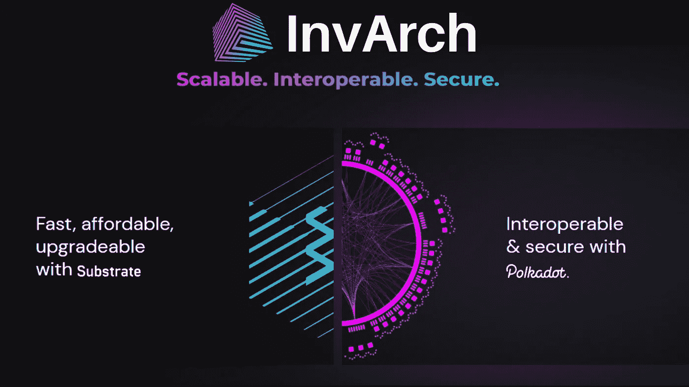
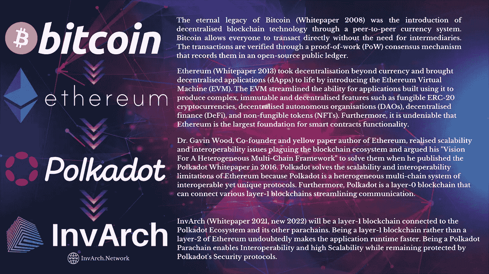
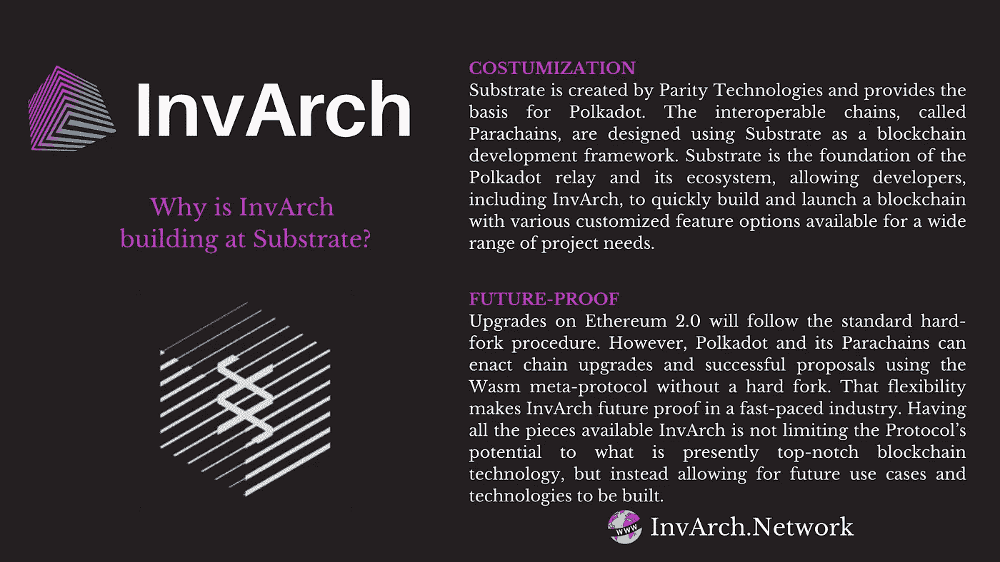
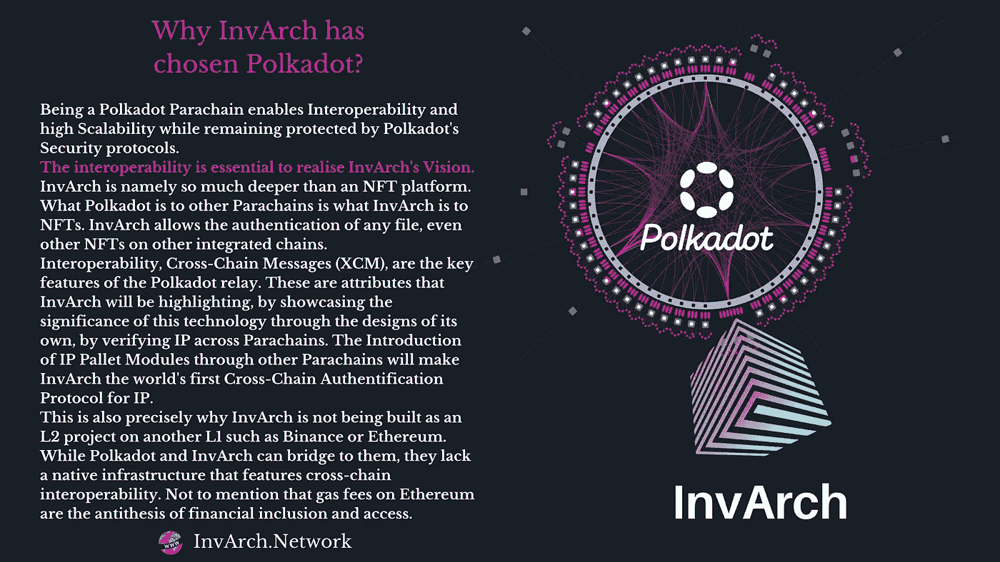
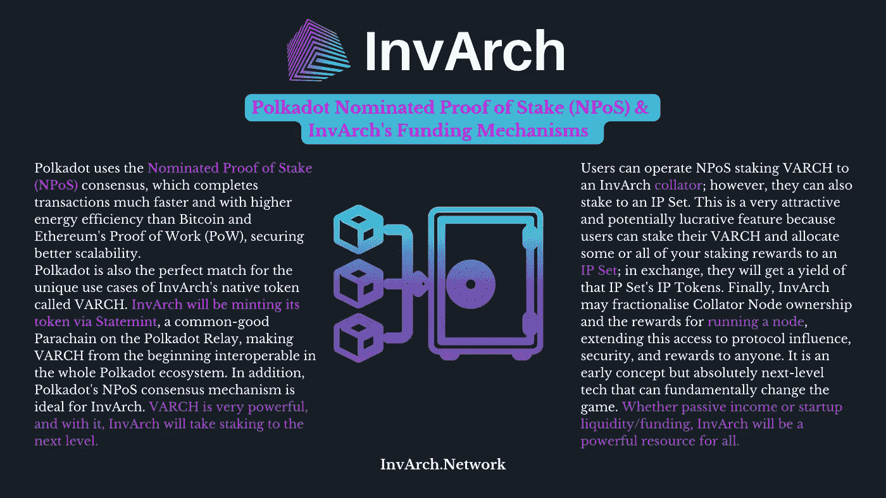

# 为什么因瓦奇建筑在基板&来到波尔卡多特？

> 原文：<https://medium.com/coinmonks/why-is-invarch-building-at-substrate-coming-to-polkadot-993a5b36cec2?source=collection_archive---------58----------------------->

## Web3 的 IP 所有权、效用和跨链认证协议 InvArch

## 介绍

一个常见问题是，为什么 InvArch，一个关键使用 NFT 技术的项目，正在 Substrate 建造并来到 Polkadot，而不是选择以太坊或另一个区块链。本文为这个合理的问题提供了一些答案。

在新的 InvArch [白皮书](http://InvArch_ Draft)中描述的协议愿景将 InvArch 描述为一种协议，该协议利用区块链技术允许个人将其知识产权(IP)标记并存储为知识产权文件(IPF)，将 IPF 组合成称为 IP 集的集合，并利用与 IP 集挂钩的可编程 IP 令牌。因此，InvArch 希望解决当今的知识产权问题，并提供分散的 IP 存储、认证、保护、所有权和效用。如果不看看因瓦奇之前的区块链技术，就无法理解为什么选择基片和波尔卡多特来实现这一设想。

## 比特币和以太坊

**比特币** ( [白皮书](https://bitcoin.org/bitcoin.pdf) 2008)的永恒遗产是通过点对点货币系统引入去中心化的区块链技术。比特币允许每个人直接交易，不需要中介。交易通过工作证明(PoW)共识机制进行验证，该机制将交易记录在开源公共分类账中。

**以太坊** ( [白皮书](https://ethereum.org/en/whitepaper/) 2013)通过引入以太坊虚拟机(EVM)将去中心化超越了货币，并将去中心化应用(dApps)带入了生活。EVM 简化了使用它构建的应用程序的能力，以产生复杂、不可变和去中心化的功能，如可替代的 ERC 20 加密货币、去中心化自治组织(Dao)、去中心化金融(DeFi)和不可替代令牌(NFT)。此外，不可否认的是，以太坊是智能合约功能的最大基础。问题在于，以太坊是基于一种类似于比特币的权力共识模型，只能验证有限且预设数量的交易。网络利用率的提高导致燃气费飙升和处理速度延迟，凸显了以太坊的可扩展性问题。

## 波尔卡多特和基板

以太坊的联合创始人和黄皮书作者 Gavin Wood 博士意识到了困扰区块链生态系统的可扩展性和互操作性问题，并在 2016 年发表了白皮书时，提出了他的“异构多链框架愿景”来解决这些问题。Polkadot 解决了以太坊的可伸缩性和互操作性限制，因为 Polkadot 是一个异构的多链系统，具有可互操作的独特协议。此外，Polkadot 是一种第 0 层区块链，可以连接各种第 1 层区块链简化通信。

因瓦奇将是一个**第一层区块链**，与波尔卡多特生态系统及其其他副链相连。作为以太坊的第一层区块链，而不是第二层，无疑会使应用程序的运行速度更快。

这里是**基质**进入游戏的地方。基板由[奇偶技术](https://parity.io/)创建，并为 [Polkadot](https://polkadot.network/) 提供基础。可互操作的链，称为 Parachains，是使用 Substrate 作为区块链开发框架设计的。Substrate 是 Polkadot relay 及其生态系统的基础，允许包括 InvArch 在内的开发人员快速构建并推出一款区块链，该产品具有各种定制的功能选项，可满足广泛的项目需求。因此，InvArch parachain 将是一种基于基板的区块链，完全支持 EVM 和 WASM 技术。以太坊 2.0 上的
**升级**将遵循标准的硬分叉过程，这可能需要很多年，需要验证器升级它们的节点来实现协议更改。然而，由于 Substrate，Polkadot 和它的 Parachains 可以使用 Wasm 元协议进行链升级和成功提案，而无需硬分叉。这种灵活性使得 InvArch **在一个快节奏的行业中经得起未来考验。拥有 InvArch 的所有可用部分不会将协议的潜力限制在目前顶尖的区块链技术上，而是允许未来的用例及技术被构建。**

不仅如此，作为一个 Polkadot 副链能够实现**互操作性**和高**可伸缩性**，同时仍然受到 Polkadot 的**安全**协议的保护。

互操作性对于实现因瓦奇的愿景至关重要。因瓦奇比 NFT 平台要深得多。波尔卡多特之于其他副链，就像因瓦奇之于 NFTs。InvArch 允许认证任何文件，甚至是其他集成链上的其他 NFT。互操作性、跨链消息(XCM)是 Polkadot 中继的关键特征。通过展示这项技术的重要性，通过自己的设计，通过验证跨 Parachains 的 IP，InvArch 将突出这些属性。通过其他 Parachains 引入 IP 托盘模块将使 InvArch 成为全球首个针对 IP 的跨链**认证**协议。这也正是为什么因瓦奇没有作为 L2 项目在另一个 L1 如币安或以太坊上建造。虽然 Polkadot 和 InvArch 可以桥接它们，但它们缺乏具有跨链互操作性的本地基础设施。更不用说以太坊的汽油费是金融包容性和准入的对立面。

此外，Polkadot 使用**提名的股权证明(NPoS)** 共识，比比特币和以太坊的工作证明(PoW)更快地完成交易，能效更高，确保了更好的可扩展性。我要进一步补充的是，Polkadot 是 InvArch 的本地令牌 VARCH 的**独特用例的完美匹配。InvArch 将通过 Statemint 制造其令牌，state mint 是 Polkadot 中继上的一个公共链，使 vArch 从一开始就可以在整个 Polkadot 生态系统中互操作。此外，Polkadot 的 NPoS 共识机制对于 InvArch 来说非常理想。VARCH 非常强大，有了它，InvArch 将把赌注提高到一个新的水平。用户可以操作 NPO，将 VARCH 绑定到 InvArch 排序器；但是，他们也可以投资一个 IP 集。这是一个非常有吸引力和潜在利润的功能，因为用户可以下注他们的 VARCH，并将他们的部分或全部赌注奖励分配给一个 IP 集；作为交换，他们将获得该 IP 集的 IP 令牌收益。最后，InvArch 可能会将 Collator 节点所有权和运行节点的回报进行细分，从而将这种访问扩展到协议影响、安全性和对任何人的回报。这是一个早期的概念，但绝对是可以从根本上改变游戏的下一级技术。无论是被动收入还是创业流动资金/资金，InvArch 都将是所有人的强大资源。**

## 结论

Substrate 和 Polkadot 将帮助 InvArch 成为世界上第一个可互操作的区块链，用于标记知识产权和基于 IP 的 dApps。在 Substrate 上构建将使协议快速、经济和可升级，同时共享 Polkadot 的互操作性和安全性，允许 InvArch 将 IP 跨链认证引入 Web3。

InvArch 的颠覆性技术在 Substrate 和 Polkadot 中有着出色而安全的基础，为分散所有权和管理的新全球经济提供了其迷人的设计和独特的用例，这将有助于简化创新和机会。

网址: [https://invarch.network/](https://invarch.network/)

迪斯科德:【https://discord.gg/J5Qwcb7tbN 

电报:【https://t.me/InvArch 

推特:[https://twitter.com/InvArchNetwork](https://twitter.com/InvArchNetwork)

subsocial:[https://app . subsocial . network/5857](https://app.subsocial.network/5857)

https://www.reddit.com/r/InvArchNetwork/

中:[https://invarch.medium.com/](https://invarch.medium.com/)

领英:[https://www.linkedin.com/company/invarch/](https://www.linkedin.com/company/invarch/)

github:[https://github.com/InvArch](https://github.com/InvArch)

— — — — — — —

# web 3 # NFTs # Polkadot # Innovation # Technology # Startups # Crypto # Crypto currency # gems # IP # intellectual property # art # ideas # Devs # Devs # Developers # Git # Github # para chain

> 加入 Coinmonks [电报频道](https://t.me/coincodecap)和 [Youtube 频道](https://www.youtube.com/c/coinmonks/videos)了解加密交易和投资

# 另外，阅读

*   [Blockfi vs 比特币基地](https://coincodecap.com/blockfi-vs-coinbase) | [BitKan 评论](https://coincodecap.com/bitkan-review) | [期货交易机器人](/coinmonks/futures-trading-bots-5a282ccee3f5)
*   [南非的加密交易所](https://coincodecap.com/crypto-exchanges-in-south-africa) | [BitMEX 加密信号](https://coincodecap.com/bitmex-crypto-signals)
*   如何在 WazirX 上购买柴犬(SHIB)硬币？
*   [MoonXBT 副本交易](https://coincodecap.com/moonxbt-copy-trading) | [阿联酋的加密钱包](https://coincodecap.com/crypto-wallets-in-uae)
*   [MoonXBT vs Bybit vs 币安](https://coincodecap.com/bybit-binance-moonxbt) | [硬件钱包](/coinmonks/hardware-wallets-dfa1211730c6)
*   [Remitano 审查](https://coincodecap.com/remitano-review)|[1 英寸协议指南](https://coincodecap.com/1inch)