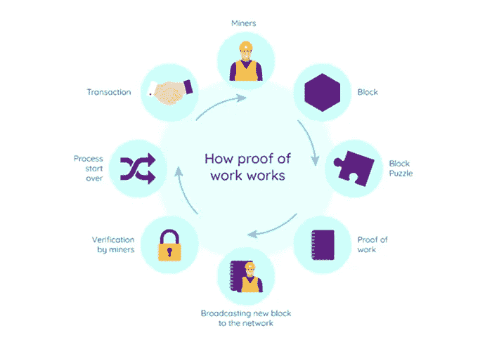
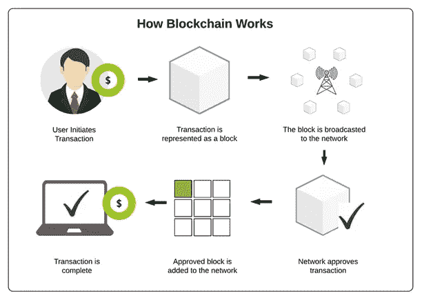

# 为什么很难篡改区块链？

> 原文：<https://medium.com/coinmonks/why-is-it-hard-to-tamper-with-blockchain-ad13c400a6ff?source=collection_archive---------19----------------------->

## 篡改块中的数据几乎是不可能的，因为数据一旦被定义，以后就不能被更改。

但这还不够，现在的计算机非常聪明，每秒钟可以计算成千上万次散列。因此，我们可以有效地篡改块，并重新计算以下块的所有哈希，使您的区块链再次有效。为了消除这种头脑风暴的条件，区块链提出了一个东西，那就是所谓的**工作证明。**

**什么是工作证明？**

工作证明是一种算法，可以减缓新块的创建速度。如果我们看到比特币，在这种情况下，工作证明将有效地在比特币区块链中添加新的区块。这些区块由执行工作证明的玩家管理，这些玩家通常被称为矿工。每一个新的数据块都会被网络接受，完成这个过程大约需要 10 分钟。这种机制使得篡改块变得非常困难，因为每次我们篡改一个块，您都需要重新计算所有后续块的工作证明。因此，可以确定，区块链提供的安全性来自于它对散列法的创造性使用和对一种机制的证明。

区块链超级安全的另一个主要原因是**分权**。区块链从不存储在单一系统中，而是存储在计算机网络中。区块链的每个参与者将在他们各自的计算机中存储该链的副本。它不是由中央政府管理，而是由一个计算机网络管理。

允许区块链在他们的电脑上运行的人或者这些区块链参与者被称为**节点**。这些节点中的一些是负责验证区块链中存在的最新数据的挖掘器，它们查看数据是否被适当地添加或任何篡改数据的尝试。

你一定在想，如果我没弄错的话，我为什么要把电脑 24/7 都放在街区网络上？

不，区块链的情况不是这样的，每台挖掘比特币并连接到比特币网络的计算机都会获得特定的比特币，作为为其工作的奖励。如果任何计算机错误地验证了一些数据，那么它也会受到惩罚。最重要的是，不需要任何中央权威机构，因为其参与者仅通过连接到计算机网络进行验证来管理它。

现在你一定在想，如果区块链将出现在每一个计算机网络中，那么你输入的任何数据都将被在场的每个人看到和审查。那么在这种情况下，隐私呢？区块链是一种先进的机制，不仅可以保护信息，还可以维护隐私。

我们将通过一个例子来理解，

我们必须知道我们的电子邮件地址和密码。把区块链作为你的电子邮件帐户，每次我们输入我们的电子邮件 id，公钥和密码，然后只有我们能够登录到我们的帐户，否则不能。我们在区块链遵循同样的程序。

如果有人试图入侵区块链的工作，该系统如何防止这种情况发生？

假设某人 x 给某人 y 转了 100 卢比，那么就会用某人 x 和 y 的公共地址创建一个块。网络上的计算机将记录这一交易，并将验证交易是什么？

这里，某人 x 向某人 y 的账户转账 100 卢比，但是如果一台电脑试图篡改交易，说转账不是从 x 到 y，而是已经转到我的账户，所有其他网络都会拒绝。该系统将监听其他计算机，并成功地使交易成为可能。因此，如果有人想改变，至少需要 51%的参与者，否则网络将被劫持。

但是，如果我们说实际参数，这几乎是不可能的，因为所有这些网络都是分散的，这意味着它们不以任何方式连接。它仍然被认为是区块链的一个显著缺点。

想象一下，在一个平台上连接着全球数百万台计算机的情况下，黑客攻击比特币。这怎么可能呢？在比特币领域，这几乎是不可能的。

区块链用在哪里？

如果我们进一步讨论更多的区块链技术的例子，它已经在选举中使用。

在非洲有一个国家，曾经使用区块链技术进行过选举，后来因为某些原因而变得有争议。因为研究人员认为如果在选举过程中使用它会有更多的缺点。除了选举之外，还有其他各种各样的部门，在这些部门中，区块链已经被高度接受并投入使用。其中一些行业包括医疗保健，数据存储在多个网络中，而不是一个集中的机构。它保证了病人的隐私和安全。除了医疗保健领域，区块链在其他领域也非常有用，包括交易领域、物业管理、政府数据管理和大众融资。

我们经常会遇到诸如政府数据库被黑或公共信息被泄露之类的头条新闻，为了防止任何此类情况，区块链是一个合适的选择，因为它不依赖于政府，只有在分散的网络中，我们才能为自己和彼此验证数据。所有这些理由都足以证明区块链及其职能的正当性。

在当今这个一切都在数字平台上的时代，区块链是可以给世界带来变革的一步。几十年前，当互联网第一次被引入时，没有人会想到它会是这样。但是今天我们没有人能想象没有互联网的生活。同样，人们也相信没有区块链的生活是不可能的。

这就把我们带到了“为什么篡改区块链很难？”博客。希望它是有帮助的和信息丰富的。