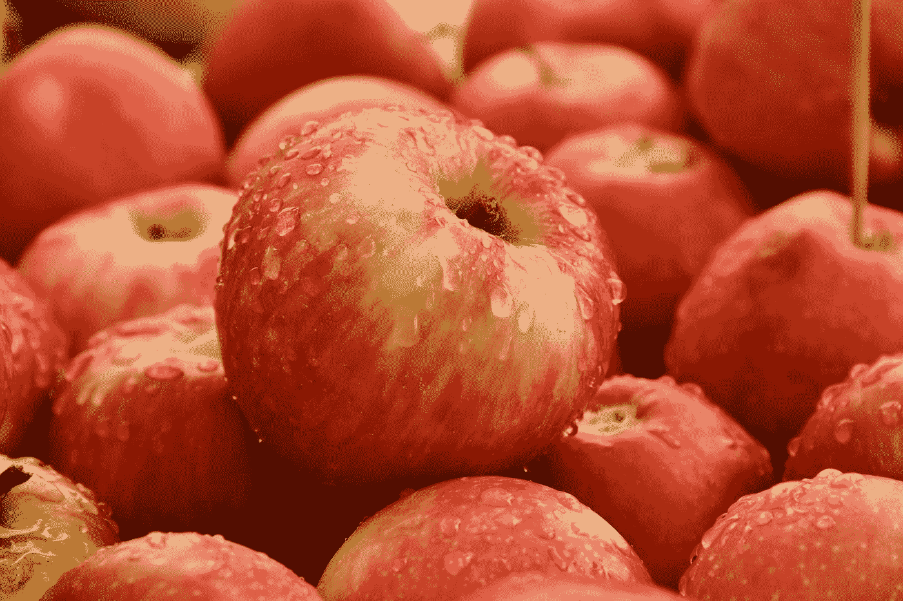

# 为什么金钱是有价值的(是什么驱动了金钱)？

> 原文：<https://medium.com/coinmonks/why-is-money-valuable-at-all-89ca658dd080?source=collection_archive---------11----------------------->

货币是一种法定货币，一种工具，只是一张没有价值的纸，或者只是任何可以用来交换商品或服务的东西。几乎所有人都相信这一点。但是随着时间的推移，我们有没有问过为什么钱看起来是有价值的？。为什么我们总是需要这张纸或硬币来得到我们需要和想要的东西？金钱通过其价值获得权力背后的东西是什么？

Photo by [Giorgio Trovato](https://unsplash.com/@giorgiotrovato?utm_source=medium&utm_medium=referral) on [Unsplash](https://unsplash.com?utm_source=medium&utm_medium=referral)

让我们深入讨论一下，为什么钱是有价值的；

货币之所以有价值，主要是基于“需求和供给”这个简单的术语。根据阿尔弗雷德·马歇尔在 1890 年的说法。他提出了需求和供给定律，我们将会看到它是如何给我们答案的，为什么钱是有价值的。简单地说，他说，“价值，即；商品的价格；说商品和服务依赖于该商品的需求和供给”。

假设商品需求增加或供给减少。在这种情况下，该商品的价值增加，如果对一种商品的需求减少或供应增加，该商品的价值下降，所有的东西都是平等的。

这意味着稀缺驱动价值。让我们举个例子；让我们想象一下，一个国家只能有 100 个苹果，由于这种水果的甜味，人们爱上了它。这是否意味着那个国家没有其他丰富的水果？不，这个国家可能有很多香蕉、橘子、木瓜等。，但他们最关心的是苹果的供应，对吗？。

Photo by [Shelley Pauls](https://unsplash.com/@shelleypauls?utm_source=medium&utm_medium=referral) on [Unsplash](https://unsplash.com?utm_source=medium&utm_medium=referral)

现在，在我们想象中的国家，苹果的价值将超过该国几乎所有的水果，如果不是全部的话。为什么会这样呢？如前所述，这可能是由于需求增加或供应减少。我们可以看到每年 100 个苹果的供应量是相当低的。此外，谈到市场，有些人会想得到苹果，因为它是稀缺的，对它的需求会不断增加，它可能只会保留给那个国家的前 1%作为阶级的展示。

这里有一个小提示，这是否意味着苹果是最好的水果？这不可能是真的，但它有价值，因为它似乎很难得到。所以价值上升，以便只分配给那些买得起的人或社会中某个特定阶层的人。

现在，让我们把这个概念引入金钱，慢慢地，我们可以看到是什么在驱动我们所花的钱的价值。在我们继续之前，不要让我们把钱误认为货币，尽管它们是可以互换的，但货币代表着钱。正如米之于距离，货币之于金钱。

工作和奋斗的人群都是你努力赚钱的对象。在这里，我们说有对它的需求，这种需求是通过不同的人努力工作来获得更多的信息以满足他们的需求。

使钱有价值的另一件事是人们相信他们有能力支付这笔钱；钱越保值。例如，在战争期间，受影响国家的货币贬值。

这是因为；1)供应可能超过需求，因为该国人民可能不再工作来获得它。

2)货币供应持续增加(因为国家财政部可能会继续印刷更多的货币)

3)该国的公民可能不再相信他们的货币/货币的效率和可负担性。

可能还有其他的东西驱动着钱的价值，让钱变得有价值，但是前面强调的东西似乎才是钱的价值背后的首要因素。

> 加入 Coinmonks [电报频道](https://t.me/coincodecap)和 [Youtube 频道](https://www.youtube.com/c/coinmonks/videos)了解加密交易和投资

# 另外，阅读

*   [创造并出售你的第一个 NFT](https://coincodecap.com/create-nft) | [密码交易机器人](https://coincodecap.com/best-crypto-trading-bots)
*   [如何在 CoinDCX 上购买柴犬(SHIB)币？](https://coincodecap.com/buy-shiba-coindcx)
*   [CBET 评论](https://coincodecap.com/cbet-casino-review) | [库科恩 vs 比特币基地](https://coincodecap.com/kucoin-vs-coinbase)
*   [折叠 App 回顾](https://coincodecap.com/fold-app-review) | [本地比特币回顾](/coinmonks/localbitcoins-review-6cc001c6ed56) | [Bybit vs 币安](https://coincodecap.com/bybit-binance-moonxbt)
*   [加密保证金交易交易所](/coinmonks/crypto-margin-trading-exchanges-428b1f7ad108) | [赚取比特币](/coinmonks/earn-bitcoin-6e8bd3c592d9) | [Mudrex 投资](https://coincodecap.com/mudrex-invest-review-the-best-way-to-invest-in-crypto)
*   [WazirX vs CoinDCX vs bit bns](/coinmonks/wazirx-vs-coindcx-vs-bitbns-149f4f19a2f1)|[block fi vs coin loan vs Nexo](/coinmonks/blockfi-vs-coinloan-vs-nexo-cb624635230d)
*   [比斯勒评论](https://coincodecap.com/bitsler-review)|[WazirX vs coin switch vs coin dcx](https://coincodecap.com/wazirx-vs-coinswitch-vs-coindcx)
*   [7 大顶级副本交易平台](https://coincodecap.com/copy-trading-platforms) | [BuyCoins 审核](https://coincodecap.com/buycoins-review)
*   [XT.COM 评论](https://coincodecap.com/profittradingapp-for-binance)币安评论 |
*   [SmithBot 评论](https://coincodecap.com/smithbot-review) | [4 款最佳免费开源交易机器人](https://coincodecap.com/free-open-source-trading-bots)