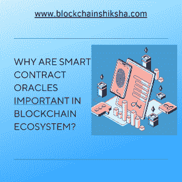

# 为什么智能合约 Oracle 在区块链生态系统中很重要？

> 原文：<https://medium.com/coinmonks/why-is-smart-contract-oracle-important-in-blockchain-ecosystem-8ea5dcdfce84?source=collection_archive---------57----------------------->

智能合约甲骨文到底是什么？这是一本详尽的手册，帮助你理解智能契约预言的基础和高级概念。我们开始吧！

区块链是 21 世纪科技创新的最佳范例吗？的确是！与此同时，由于它的挫折，它卷入了一些争议。区块链的主要功能是允许个人和组织在没有集中的第三方的情况下交换数字资产。

相反，区块链只能执行简单的交易，这意味着需要智能合约。近年来，智能合约在基于区块链的应用程序中的作用发生了显著的变化。例如，[以太坊虚拟机](https://blockchainshiksha.com/ethereum-virtual-machine-evm/)增加了智能合约的多功能性和可编程性。

然而，智能合约受到无法从现实世界获取外部信息的限制。下面的讨论解释了智能合同 oracles 如何帮助解决区块链技术最关键的问题。

要理解智能合同神谕，有必要更多地了解智能合同的概念。

# 什么是智能合约？

智能合约是独立的计算机程序，在满足特定条件时可以自动执行。智能合约允许你与陌生人分享任何有价值的东西，更加透明，没有冲突。

智能合约也可以被视为自动售货机，尽管是由区块链驱动的。我们可以将智能合约与自动售货机相比较。就像自动售货机在插入货币时交付货物一样，基于以太坊的智能合同依靠以太根据预定义的规则执行代码。

智能合同是运行时没有任何创新含义或法律意义的代码片段。然而，近年来，对智能合同的传统看法发生了巨大变化。智能合约的最新趋势强调了确定性和不变性。部署后，智能合约的代码变得不可改变。

因此，您可以删除智能合约，同时在运行智能合约的区块链上保留交易历史记录。此外，即使代理人创建了它们，智能合同也具有自我所有权的特征。智能 cAny 私钥不控制智能合约，也不能自我执行。

根据定义，甲骨文区块链是与外界相连的。Oracles 通过利用市场数据馈送和在线 API 来帮助检索和验证区块链和智能合同的外部数据。根据不同的用例，智能合同可能需要各种形式的数据。

例如，智能合约可能需要需求、供应或价格输入数据。区块链技术人员可以在智能合同应用程序中使用 oracles 来查询数据源和请求特定信息。oracles 在数据源和区块链到数据馈送接口之间建立了连接。

# 智能合同甲骨文的分类:

oracle 的源是指数据的来源，无论是来自硬件还是软件。智能合约 oracle 中的信任方面突出了 Oracle 智能合约的#集中或#分散特征。信息的方向(可能是传出或传入)也会影响智能合同神谕的分类。让我们来看看智能契约甲骨文的许多形式，以便更好地掌握甲骨文。

硬件甲骨文的工作重点是将现实世界的事件转换成智能合约可以理解的数字值。

可以访问互联网的软件 oracles 具有显著的优势，因为它们可以向智能合同提供信息，同时还可以确保实时数据交付。实时交易信息、利率和数字资产价格是软件智能合约甲骨文提供的信息的例子。

需要从各种来源收集数据的公司可能会发现特定于合同的预言不可行。然而，可以基于独特的用例来设计单个智能合约的 oracles。最重要的是，开发人员可以根据自己的需求灵活地定制智能合同 oracle。

另一方面，智能锁是出站 oracle 的一个很好的例子。智能合约使用出站 oracle 发送有关资金存款的信息。

此外，流氓代理的任何有害参与都可能直接影响智能合同。因此，单点故障是集中式 Oracle 智能合同中最严重的问题。因此，集中的神谕会降低契约抵御攻击和漏洞的能力。

另一方面，分散的先知与公共区块链有相似的目标，专注于避免交易对手的危险。分散的 oracles 可以增加提供给智能合同的数据的可信度。怎么会？分散的 Oracle 不依赖于单一的信息源，几个 Oracle 必须决定数据的有效性和准确性。由于它们的功能，分散神谕有时被称为一致神谕。

**结论:**由于无法访问外部数据，区块链技术尚未找到流行的应用。因此，一个向区块链和智能合同提供外部数据的可靠系统，如智能合同 oracle，可以提供有希望的结果。根据用例，区块链 oracles 帮助智能合同访问外部、真实世界的信息。

因此，oracles 可以在各种实际应用程序中拓宽区块链实现的范围。请继续关注下一个激动人心的话题。团队区块链 Shiksha 很乐意与您互动。

*原载于 2022 年 5 月 24 日 https://blockchainshiksha.com***。**

> *加入 Coinmonks [电报频道](https://t.me/coincodecap)和 [Youtube 频道](https://www.youtube.com/c/coinmonks/videos)了解加密交易和投资*

# *另外，阅读*

*   *[3 商业评论](/coinmonks/3commas-review-an-excellent-crypto-trading-bot-2020-1313a58bec92) | [Pionex 评论](https://coincodecap.com/pionex-review-exchange-with-crypto-trading-bot) | [Coinrule 评论](/coinmonks/coinrule-review-2021-a-beginner-friendly-crypto-trading-bot-daf0504848ba)*
*   *[莱杰 vs Ngrave](/coinmonks/ledger-vs-ngrave-zero-7e40f0c1d694) | [莱杰 nano s vs x](/coinmonks/ledger-nano-s-vs-x-battery-hardware-price-storage-59a6663fe3b0) | [币安评论](/coinmonks/binance-review-ee10d3bf3b6e)*
*   *[加密交易机器人](/coinmonks/crypto-trading-bot-c2ffce8acb2a) | [Bingbon 评论](https://coincodecap.com/bingbon-review)*
*   *[Bybit Exchange 审查](/coinmonks/bybit-exchange-review-dbd570019b71) | [Bityard 审查](https://coincodecap.com/bityard-reivew) | [Jet-Bot 审查](https://coincodecap.com/jet-bot-review)*
*   *[3 commas vs crypto hopper](/coinmonks/3commas-vs-pionex-vs-cryptohopper-best-crypto-bot-6a98d2baa203)|[赚取加密利息](/coinmonks/earn-crypto-interest-b10b810fdda3)*
*   *最好的比特币[硬件钱包](/coinmonks/hardware-wallets-dfa1211730c6) | [BitBox02 回顾](/coinmonks/bitbox02-review-your-swiss-bitcoin-hardware-wallet-c36c88fff29)*