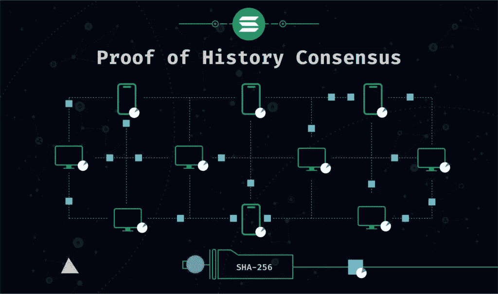

# 为什么索拉纳比以太坊和其他区块链快？

> 原文：<https://medium.com/coinmonks/why-is-solana-faster-than-ethereum-and-other-blockchains-a80f96257ab?source=collection_archive---------24----------------------->

Solana 是一个能够处理大规模应用程序的快速区块链平台。以下是索拉纳速度如此之快的三个原因。

*   首先，Solana 的历史证明算法消除了对工作证明的需要，这使得交易更快。
*   其次，网络拓扑优化了节点之间的通信，从而加快了事务处理时间。
*   第三，该团队投入了大量精力来优化代码，以使系统尽可能快地运行。

PoH Consensus

当谈到区块链技术时，大多数项目使用两种主要类型的协议:工作证明(PoW)和利益证明(PoS)。两者各有利弊，但总的来说，PoW 被认为更安全，而 PoS 则更具可扩展性。

然而，有一个新的协议正在开发中，它结合了两个世界的优点:历史证明(PoH)。

PoH 背后的想法是使用时间戳机制来创建过去发生的所有事件的记录。这将用于核实区块链的交易和冻结。

这种方法的好处是它比 PoW 更具可伸缩性，因为不再需要处理每个块中的所有事务。此外，它也将更加安全，因为有人很难篡改历史。

为了使 PoH 成为现实，还有一些工作要做，但这是一个令人兴奋的新发展，有可能改变我们对区块链缩放的看法。

感谢阅读！如果你有任何问题，欢迎在下面的评论区提问。

阅读这篇文章的人阅读了[Solana 如何革新区块链技术](/@hydrogencoin/how-solana-is-revolutionizing-blockchain-technology-6344dd9fa199)

 [## Hydrogencoin -基于 Solana 区块链的 DeFi 基金

### Hydrogencoin.io 是全球首个绿色氢的 DeFi 基金

氢币. io](https://hydrogencoin.io) 

> *加入 Coinmonks* [*电报频道*](https://t.me/coincodecap) *和* [*Youtube 频道*](https://www.youtube.com/c/coinmonks/videos) *了解加密交易和投资*

# 另外，阅读

*   [Bookmap 评论](https://coincodecap.com/bookmap-review-2021-best-trading-software) | [美国 5 大最佳加密交易所](https://coincodecap.com/crypto-exchange-usa)
*   最佳加密[硬件钱包](/coinmonks/hardware-wallets-dfa1211730c6) | [Bitbns 评论](/coinmonks/bitbns-review-38256a07e161)
*   [新加坡十大最佳加密交易所](https://coincodecap.com/crypto-exchange-in-singapore) | [收购 AXS](https://coincodecap.com/buy-axs-token)
*   [红狗赌场评论](https://coincodecap.com/red-dog-casino-review) | [Swyftx 评论](https://coincodecap.com/swyftx-review) | [CoinGate 评论](https://coincodecap.com/coingate-review)
*   [投资印度的最佳加密软件](https://coincodecap.com/best-crypto-to-invest-in-india-in-2021)|[WazirX P2P](https://coincodecap.com/wazirx-p2p)|[Hi Dollar Review](https://coincodecap.com/hi-dollar-review)