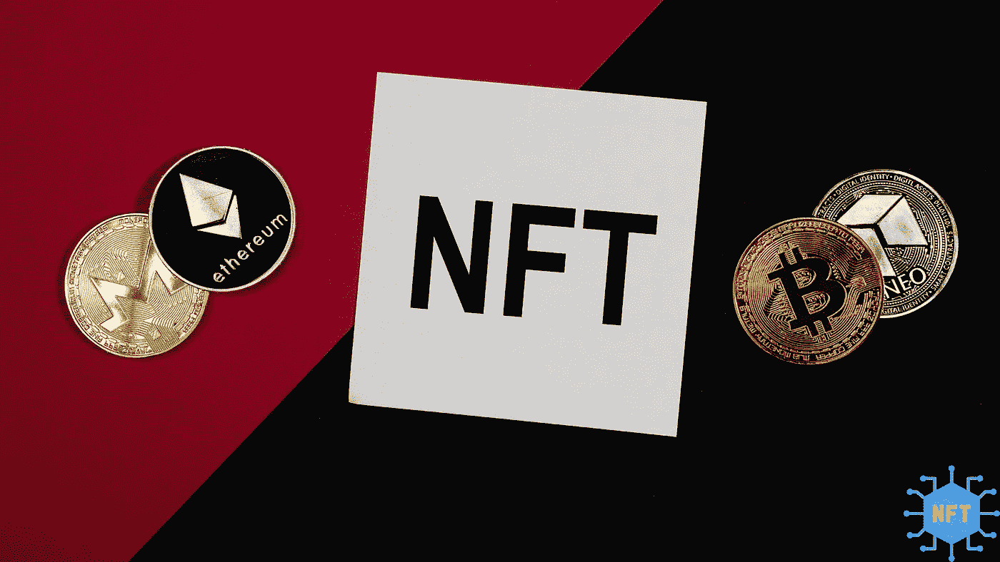

# 为什么 NFT 的白名单总是那么难磨？

> 原文：<https://medium.com/coinmonks/why-is-the-nft-whitelist-grinding-always-so-hard-74b915e5c706?source=collection_archive---------21----------------------->

NFT

区块链白名单是导致 NFT 等大规模项目可扩展性问题的主要问题领域之一。这篇博文旨在回顾区块链和分布式系统中关于白名单的最常见案例，以及这些领域中的一些难题。它还将提供一些如何克服这些问题的解决方案。

为了澄清，这不是白名单的所有潜在问题的完整列表，但它应该给出这些障碍的可能解决方案的潜在广度的想法。

首先要考虑的问题是核查员的作用。这个可以用博弈论和信息经济学来解决。第二个问题是验证者的诚实性，这可以通过诸如 ZK-斯纳克这样的加密解决方案来解决。第三个问题是 Sybil 攻击，攻击者可以创建许多假身份来欺骗系统。这可以通过使用身份证明来解决，如政府颁发的身份证或微信等可信来源。

白名单通常用于从系统中过滤出有害用户或不良行为者，这可以在区块链中使用类似 auger(REP)的赌注系统来完成。

白名单用于分配稀缺资源，在区块链，这可以通过以下解决方案实现:

资源跟踪器，例如网络时间协议(NTP)或 BitTorrent (DHT)中的跟踪器服务器。基于激励的经济奖励模式，如 Filecoin (FIL)。资源分配解决方案，如利益证明(POS)或委托利益证明(DPOS)。

关于区块链的可扩展性，已经使用不同的共识协议实现了白名单，以构建公共区块链，如比特币和以太坊，以及私有链，如 Hyperledger Fabric。比特币使用 BIP(比特币改进提案)9，以太坊使用 BFT(拜占庭容错)。

在分布式系统领域，密码经济学已经被用来解决博弈论问题。陈蓉和维奈·古普塔提出了基于区块链的投票方式，每个用户都可以通过授权投票，而不是由一个中央机构来决定是否抵制审查。

在区块链，白名单也被用来从公共网络中过滤掉恶意用户。不幸的是，这在安全性和可用性方面具有很高的成本，因为这使得恶意行为者更难以控制具有大量用户的网络。一种解决方案是在公共网络上使用利益一致机制的证明。这可以通过在块创建时创建铸造过程来实现，该过程允许可信的演员或团体铸造新硬币。Cosmos 和 Tezos 等区块链公司允许通过委托股权证明来做到这一点(DPOS)。像比特币这样的工作证明方案没有安全性和可用性问题，因为它不需要任何可信的参与者在网络上拥有更多权力。

虚拟机(VM)是事务性机器，是自治系统，运行在其他系统之上。虚拟机有它们自己的代码、数据和环境，但它们有自己的输入/输出行为，并会在被告知要输出时产生输出。虚拟机可以与主系统隔离，并且可以在没有安装任何应用程序的沙箱中运行。虚拟机是许多组织的安全和隐私功能，允许机器学习、人工智能和深度学习进行计算。

创建作为虚拟机的区块链的想法非常有趣，因为它允许区块链作为第 2 层技术工作。区块链可以像 DVR(数字录像机)一样工作，它可以捕捉以下事件:

系统接收的数据或广播信息。数据通过合同的外部接口传输。与契约相关联的代码将在事件发生时执行，并在其内部数据结构上执行功能，例如，在事件数据上执行 API 调用。契约的内部状态包括加密签名和事务输出或事务输入上的签名。协定的输出包含已签名的数据。

区块链可用于将此信息作为文档的一部分进行存储和传输，或者作为审核日志的一部分进行捕获。这是区块链在银行和金融领域的一个常见用例。

此外，在隐私方面也有安全性，如加密消息、Tor 等私人浏览软件、匿名加密货币钱包、VPN IP 欺骗和加密存储系统，以提供敏感业务活动的匿名性。区块链通过在本地加密数据而不是通过网络发送数据，在这些方面提供了性能改进。

白名单也用于安全性，因为它可以用于控制对网络的访问。这允许区块链作为您的专用网络。例如，可以使用私有和公共密钥等数据类型的权限，设置每个用户的传输限制，或者禁止用户输入姓名，以便陌生人无法识别用户。

白名单管理仍处于起步阶段，有一些解决方案，但是它们相当昂贵，而且都是研究项目或非常特殊的情况。

麻省理工学院提出了一个区块链白名单，它可以基于检查和平衡来限制对区块链的访问。例如，可以要求用户执行签名事务以获得对每个块的许可。

我们可以在区块链上使用“编程语言”，如以太坊的 Solidity 语言，在执行期间处理交易的权限，这是通过创建称为智能合同的合同脚本来完成的，该脚本具有检查权限和根据区块链满足的条件触发操作的逻辑。

另一个提议是授权证明(PoA ),它是基于工作的系统证明的解决方案。这是通过让授权机构或受信任的参与者建立能够执行和授权交易的中央授权机构来实现的。在这个系统中，在区块链上拥有更多权力的人将有权决定谁可以被添加为权威。这就导致了一些问题，比如某些行为者可以聚在一起控制决策过程的共谋。作为一种对策，PoA 允许随机或通过某种抽奖系统选择参与者，但是，就网络上每个节点所需的计算能力而言，这似乎非常昂贵。

另一个问题是，该系统需要可信的参与者来维护分类帐，然而，这是不可靠的，并且可以由参与者自己操纵。此外，由于需要信任中央权威机构，系统可能很快崩溃。最后，PoA 发布时没有计算出运行所需的计算能力。有人可能会说，一些集中的第三方更适合作为可信的参与者，因为它们比单个参与者或节点更有效率。

输入由私人公司创建的证书颁发机构(CA ),这些公司通过加密来控制和管理证书的生成和撤销。应用程序使用这些证书来声明公钥，这些公钥对应于提供对不同系统或网络的访问的证书。可以要求证书管理机构为其他参与者(如确认交易或验证证书的各方)执行和授权交易。

然而，CA 的问题是，他们的管理成本可能会成为他们管理系统的负担，并且由于他们管理不善的历史，他们的安全性应该受到仔细检查。另一方面，一些 CA 是由政府运营的，政府可能会意外地取消或阻止某个参与者使用他们创建的 CA。在这种情况下，证书将不会被当局核实，然后可能被视为无效。

总之，所有这些系统都存在许多相关问题，包括治理以及计算能力消耗方面的管理成本透明度。此外，系统可以很容易地被黑客攻击、破坏或损坏，并且数据可以被操纵以给予参与者不应得的访问。

此外，还没有找到在像区块链这样的开放的无许可系统上自动创建可信角色的解决方案。要创建有权限的区块链，您必须信任第三方来维护参与者的数量和访问权限。

目前还不知道这个问题将如何解决，但很明显，当我们看到许可的区块链时，需要某种解决方案，因为在系统中仍然必须存在一些可信的参与者。

许可区块链的另一个问题是要求提前知道所有参与者，这使得它不可伸缩。这是因为参与者必须提前执行合同，这意味着系统受限于参与者的数量及其转让限制。解决这个问题的一个方法是委托给每个人一定数量的交易，但这在公平和谁可以在交易中委托他们的股份的治理方面提出了问题。

从长远来看，许可的区块链可能会在未来导致更多的许可系统，但目前还不知道。

总而言之，对区块链的许可是一个常见的问题，很可能不会很快得到解决。除此之外，任何解决方案都有几个限制，而且不清楚人们将如何在不放弃像区块链这样的开放系统的情况下解决这些限制。这可能意味着可能永远不会有一个提前知道所有参与者的系统。

> 加入 Coinmonks [电报频道](https://t.me/coincodecap)和 [Youtube 频道](https://www.youtube.com/c/coinmonks/videos)了解加密交易和投资

# 另外，阅读

*   [3 商业评论](/coinmonks/3commas-review-an-excellent-crypto-trading-bot-2020-1313a58bec92) | [Pionex 评论](https://coincodecap.com/pionex-review-exchange-with-crypto-trading-bot) | [Coinrule 评论](/coinmonks/coinrule-review-2021-a-beginner-friendly-crypto-trading-bot-daf0504848ba)
*   [莱杰 vs n rave](/coinmonks/ledger-vs-ngrave-zero-7e40f0c1d694)|[莱杰 nano s vs x](/coinmonks/ledger-nano-s-vs-x-battery-hardware-price-storage-59a6663fe3b0) | [币安评论](/coinmonks/binance-review-ee10d3bf3b6e)
*   [Bybit Exchange 审查](/coinmonks/bybit-exchange-review-dbd570019b71) | [Bityard 审查](https://coincodecap.com/bityard-reivew) | [Jet-Bot 审查](https://coincodecap.com/jet-bot-review)
*   [3 commas vs crypto hopper](/coinmonks/3commas-vs-pionex-vs-cryptohopper-best-crypto-bot-6a98d2baa203)|[赚取加密利息](/coinmonks/earn-crypto-interest-b10b810fdda3)
*   最好的比特币[硬件钱包](/coinmonks/hardware-wallets-dfa1211730c6) | [BitBox02 回顾](/coinmonks/bitbox02-review-your-swiss-bitcoin-hardware-wallet-c36c88fff29)
*   [BlockFi vs Celsius](/coinmonks/blockfi-vs-celsius-vs-hodlnaut-8a1cc8c26630)|[Hodlnaut 点评](/coinmonks/hodlnaut-review-best-way-to-hodl-is-to-earn-interest-on-your-bitcoin-6658a8c19edf) | [KuCoin 点评](https://coincodecap.com/kucoin-review)