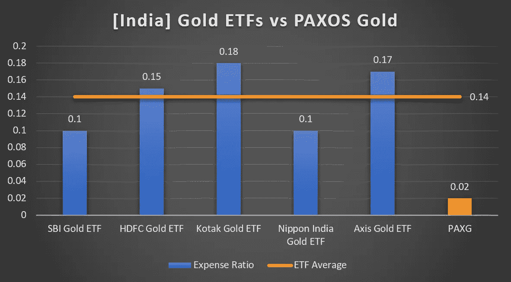
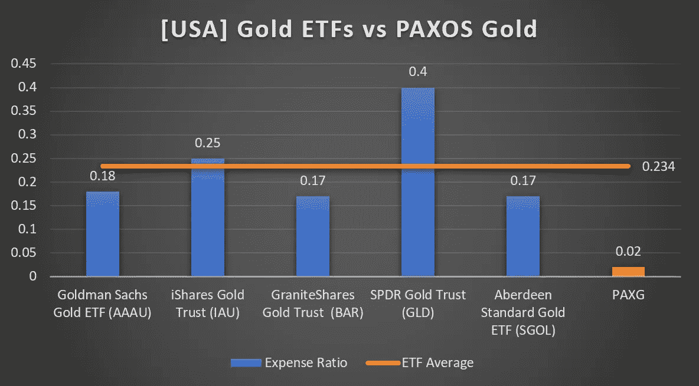

# 为什么令牌化黄金是散户的大赢家？

> 原文：<https://medium.com/coinmonks/why-is-tokenized-gold-a-big-win-for-retail-investors-7069713c35ad?source=collection_archive---------38----------------------->

## 黄金支持的金融资产的详细比较分析

**黄金作为金融资产**

黄金是最受欢迎的投资资产之一，传统上被认为是一种优秀的价值储存手段。事实上，直到 1971 年，美元都是由金本位制支撑的。这是一个很好的对冲通货膨胀的方法，通过将你资产净值的 10%-15%投资于黄金来分散你的投资组合是一个好主意。

**黄金令牌**

虽然黄金作为金融资产有很多好处，但它不容易移动或储存，也很难分成更小的单位进行交易。因此，拥有一个**黄金支持的加密令牌**是一个巧妙的想法。你可以像存储任何其他加密资产一样，安全地存储在硬件钱包或 MetaMask 中，接触黄金市场，并能够在任何时候用你的密码兑换实际的黄金，而不必担心它的安全或存储。

在本文中，我们将主要关注 [PAXOS-Gold](https://www.paxos.com/paxgold/) ，尽管几乎所有令牌化黄金加密的特征&优势都是相似的。PAXG 是 2019 年在区块链以太坊作为 ERC-20 代币创建的。每个 PAXG 代币可兑换 1 金衡盎司的黄金，由 Paxos 保管。让我们将其与散户投资者可获得的其他黄金支持资产进行比较，即。、[黄金 ETF](https://www.investopedia.com/terms/g/gold_fund.asp)、[主权黄金债券(SGB)](https://m.rbi.org.in/scripts/FAQView.aspx?Id=109)，实物黄金。请注意，SGB 只与印度投资者相关。

**最低投资额**

对于 PAXG，最低购买金额仅为 20 美元，对于大多数黄金 ETF，最低购买金额约为 200 美元，而对于 SGBs，最低购买金额相当于 1 克黄金，即 4800 卢比或 65 美元。因此，令牌化的黄金显然是赢家，任何散户投资者都很容易买到。

**费用支出**

让我们比较一下 PAXG 的链上交易和代币创建/销毁费用(0.02%)与印度和美国知名黄金交易所交易基金的费用比率。

All figures in % | Lower is better | [[source]](https://www.valueresearchonline.com/funds/selector/category/144/commodities-gold/?end-type=1&plan-type=direct&star-rating=5%2C4%2C3%2C2%2C1&tab=snapshot)

All figures in % | Lower is better | [[source]](https://www.investopedia.com/articles/etfs/top-gold-etfs/) | [[source]](https://www.investopedia.com/articles/investing/031913/most-affordable-way-buy-gold-physical-gold-or-etfs.asp)

正如我们所见，黄金 ETF 的费用明显高于 PAXG。此外，对于 ETF，费用率是按年收取的，而对于令牌化黄金，仅在交易期间收取 0.02%的费用，并且不收取任何费用。

也就是说，当你交易 PAXG 时，你需要在 ETH 支付汽油费，但如果你投资大量资金，这在百分比方面是非常低的。对于小额基金，你可以把它们放在交易所里，这种情况下不涉及汽油费。由于极低的链上交易费用和零存储费用，tokenized gold-PAXG 是全球最实惠的黄金投资方式。

还有，本文没有考虑黄金期货或差价合约，因为它们只是基于价格投机的衍生品，根本不涉及实物黄金的后盾。

**法规**

ETF 由 SEC 和其他同等的中央机构监管，而 PAXG 由 [NYDFS](https://www.ny.gov/agencies/department-financial-services) 监管。类似地，SGB 是由印度储备银行( [RBI](https://www.rbi.org.in/Scripts/AboutusDisplay.aspx) )发行的政府证券，使其成为高度安全的投资。在这方面，所有这些资产都受到高度监管，非常安全。

**所有权&结算**

所有黄金交易所交易基金的所有权记录都由一个中央机构跟踪和管理，例如印度的 NSDL/CDSL 和美国的 DTCC。而另一方面，PAXG 以分散的方式被跟踪和拥有，通过利用以太坊区块链来转移和创建/销毁令牌。这使得它非常安全，健壮，速度极快。PAXG token 的结算周期接近即时，而 ETF 和 SGB 的结算周期为 2 个工作日。

**讨论&结论**

上面讨论的所有因素，如非常低的成本、部分所有权、没有地域障碍以及闪电般的结算时间，使 PAXG 成为一种优秀的金融资产，具有**易获得性和高流动性**。虽然我们在本文中只看到了&对 PAXG 细节的比较，但其他令牌化黄金资产(如 DigixGlobal、OneGram、PerthMint 等)的大部分优势大体相同。

虽然可以肯定的是，这些资产都不会像你的热门新 ICO 令牌那样提供 100 倍的回报，但黄金将为你的加密投资组合提供急需的稳定性，具有稳定一致的回报和坚实的通胀对冲。此外，请注意，您可以将 PAXG 令牌安全地借给像 [Celsius 和 BlockFi](https://www.youtube.com/watch?v=JiqaPTpk0Sc) 这样的加密贷款平台，并获得大约 6–7%的年利率。

我们当然处于采用区块链的早期阶段，到目前为止，它的应用似乎非常有前途。在未来几年，我们可以预期越来越多的商品和资产，如土地、股票、交易所交易基金和贵金属的令牌化，加密和分散金融的未来似乎充满希望。

> 加入 Coinmonks [电报频道](https://t.me/coincodecap)和 [Youtube 频道](https://www.youtube.com/c/coinmonks/videos)了解加密交易和投资

# 另外，阅读

*   [3 商业评论](/coinmonks/3commas-review-an-excellent-crypto-trading-bot-2020-1313a58bec92) | [Pionex 评论](https://coincodecap.com/pionex-review-exchange-with-crypto-trading-bot) | [Coinrule 评论](/coinmonks/coinrule-review-2021-a-beginner-friendly-crypto-trading-bot-daf0504848ba)
*   [莱杰 vs n rave](/coinmonks/ledger-vs-ngrave-zero-7e40f0c1d694)|[莱杰 nano s vs x](/coinmonks/ledger-nano-s-vs-x-battery-hardware-price-storage-59a6663fe3b0) | [币安评论](/coinmonks/binance-review-ee10d3bf3b6e)
*   [Bybit Exchange 审查](/coinmonks/bybit-exchange-review-dbd570019b71) | [Bityard 审查](https://coincodecap.com/bityard-reivew) | [Jet-Bot 审查](https://coincodecap.com/jet-bot-review)
*   [3 commas vs crypto hopper](/coinmonks/3commas-vs-pionex-vs-cryptohopper-best-crypto-bot-6a98d2baa203)|[赚取秘密利息](/coinmonks/earn-crypto-interest-b10b810fdda3)
*   最好的比特币[硬件钱包](/coinmonks/hardware-wallets-dfa1211730c6) | [BitBox02 回顾](/coinmonks/bitbox02-review-your-swiss-bitcoin-hardware-wallet-c36c88fff29)