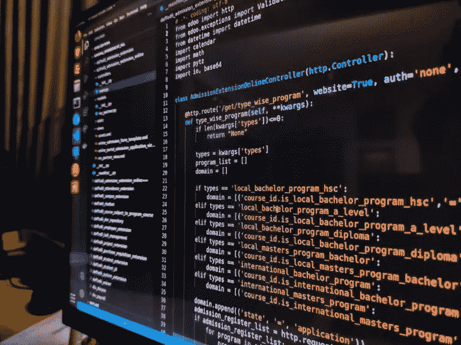

# 律师为什么要学基础编码？

> 原文：<https://medium.com/coinmonks/why-lawyers-should-learn-basic-coding-bef423f686ee?source=collection_archive---------25----------------------->

**律师应该学习基本编码**

这听起来违背直觉，但我认为这是现代社会的一项必要技能。律师需要了解技术是如何塑造我们的世界的，他们需要对技术有一个基本的了解，以处理任何技术发挥作用的案件。这包括从理解 web3 是什么，到了解智能合约如何工作或为什么加密货币很重要，以及更一般地说，了解新技术对不同行业的颠覆性力量。

这不仅仅是你自己能够使用技术:如果你想让你的客户(甚至你自己)能够利用这些新的机会和服务，那么你就要有某种知识库来帮助指导他们完成决策过程，并回答他们在决策过程中可能遇到的任何问题

**新网络中的区块链、加密货币和智能合约 3**

区块链是一种支持可靠分布式计算的技术。加密货币是区块链的第一个现实应用。智能合约是第二个现实世界的区块链应用，是一个可编程的区块链。

**未来的律师需要了解塑造当今世界的技术。**

当谈到理解正在塑造当今世界的技术时，区块链和智能合同是一个不断增长的法律领域。加密货币是一个快速增长的金融市场，在各种区块链上有数百个项目正在开发或已经推出。作为 web3 运动(一种去中心化应用和服务的方式)的一部分，区块链技术正在以许多令人兴奋的方式被使用，包括去中心化的交易所和预测市场。

区块链技术提出了独特的法律挑战，因为其底层架构要求将代码嵌入在其网络上执行的每项交易中。这意味着使用该系统的每个人都可以获得其他人如何进行交易的信息，这使得在使用区块链时很难实现隐私。

> 加入 Coinmonks [电报频道](https://t.me/coincodecap)和 [Youtube 频道](https://www.youtube.com/c/coinmonks/videos)了解加密交易和投资

# 另外，阅读

*   [Bybit 融资融券交易](/coinmonks/bybit-margin-trading-e5071676244e) | [币安融资融券交易](/coinmonks/binance-margin-trading-c9eb5e9d2116) | [Overbit 审核](/coinmonks/overbit-review-9446ed4f2188)
*   [有哪些交易信号？](https://coincodecap.com/trading-signal) | [Bitstamp vs 比特币基地](https://coincodecap.com/bitstamp-coinbase)
*   [10 本最佳加密书籍](https://coincodecap.com/best-crypto-books) | [英国 5 个最佳加密机器人](https://coincodecap.com/uk-trading-bots)
*   [ko only Review](https://coincodecap.com/koinly-review)|[Binaryx Review](https://coincodecap.com/binaryx-review)|[Hodlnaut vs CakeDefi](https://coincodecap.com/hodlnaut-vs-cakedefi-vs-celsius)
*   [40 个最佳电报频道](https://coincodecap.com/best-telegram-channels) | [1xBit 回顾](https://coincodecap.com/1xbit-review) | [Keevo 钱包回顾](https://coincodecap.com/keevo-wallet-review)