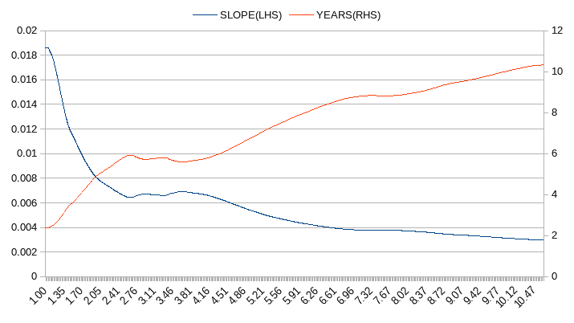

# 为什么 LINK 是 1 万亿美元资产的首选

> 原文：<https://medium.com/coinmonks/why-link-is-the-top-candidate-for-1t-asset-bb34bba36353?source=collection_archive---------0----------------------->

在[上一篇文章](/@next.trillion.assets/how-to-identify-track-the-next-trillion-dollar-assets-2045f5b2a29a)中，我们阐述了定位下一个 1 万亿美元市值的候选资产的方法，并列出了一些被认为有很大潜力成为这样的加密货币和股票。今天， ***从链环的令牌 LINK 开始，我们开始逐个研究候选者，并试图在每次分析的最后得出一些具体而有意义的结论*** 。

Chainlink 成立于 2017 年，是建立在以太坊抽象层上的甲骨文，允许“区块链安全地与外部数据馈送、事件和支付方式进行交互，提供复杂智能合约所需的关键链外信息，以成为数字协议的主导形式”。

截至 2022 年 3 月 22 日，LINK 的寿命为 4+年，市值为 72.5 亿美元，流通供应量为 467，009，550 个 LINK 币，最大供应量为 1，000，000，000 个 LINK 币。

由于 LINK 完全符合方法文章中概述的标准，现在让我们看看 LINK 如何适合我们的分析框架。

*联系比特币和以太坊，附上趋势线*

从历史上看，LINK 显然位于比特币和以太坊趋势线所定义的范围内，其从持续 4.5 年的曲线中得出的趋势线是稳定的，完全符合，并指向未来 3 年将达到 1 万亿美元的目标。

由于迄今为止的分析主要依赖于趋势，趋势基本上是历史市值曲线的指数拟合，我们必须研究趋势线的稳定性，以便从中获得任何预测性的指示。

比特币的趋势线首先值得研究，希望有助于揭示其他资产。

*比特币的斜率及其生命周期的预测年数*

这两条线几乎是相互镜像的，蓝色线代表趋势线的斜率，而橙色线代表趋势线预测的达到 1T 美元目标的总年数，两者都是根据从最开始到 X 轴刻度指示的年数之间的数据计算的。值得注意的是，预测年份的梯度非常稳定并呈上升趋势，在此基础上，总年份的预测可以根据趋势线本身的趋势进行调整。我们以以太坊为例。

*以太坊坡度及其寿命预测年数*

以太坊的趋势梯度看起来类似于比特币的趋势梯度，除了在最初几年有一个可观察到的梯度反转，最近的梯度比比特币的尾部更水平，基于此，可以得出一个合理的结论，以太坊的趋势预测将在 6.5 至 7.5 年之间保持稳定，直到最终达到 1 万亿美元的目标。这就是趋势线的稳定性在预测中的重要性，这种分析使预测更加可靠。

在检查了比特币和以太坊的趋势模式后，让我们看看这种分析如何应用于 LINK。

*连接坡度和整个生命周期的预测年数*

与比特币或以太坊不同，LINK 并不是一开始就很花哨，它花了近两年时间徘徊在 ICO 市值附近，最终恢复了上升趋势。因此，最早一年的趋势线甚至向负值倾斜，这意味着 LINK 呈下降趋势，永远不会达到 1T 美元。幸运的是，在接下来的几年里，林克通过在下降趋势中建立稳固的上升趋势和稳定的目标年趋势梯度拯救了自己。目前，趋势预测表明，在 3 年内，或多或少 1 年内，LINK 将确保其市场资本增加 100 多倍，如果考虑到供应的增加，其市场价格将增加 75-100 倍。

在一个试探性的结论中，LINK 以其 4.5 年的坚实“漫长”交易历史脱颖而出，具有 90% R2 决定系数的值得信赖的趋势线，具有稳定梯度的趋势，***3 至 4 年的有利投资期限，以及最重要的约 100 倍收益率*** 的诱人潜力。

在证明了这篇文章的标题之后，我们进一步进行了另一项分析，看看现在是否是进入 LINK 任何头寸的最佳时机。为了进行这种分析，引入了一种称为“趋势偏离指数”或“TDI”的指数，通过计算实际市值与相应日期的趋势指示值之间的差异来实现。下图是这个指数的曲线图。

*链接 TDI(趋势偏离指数)*

TDI 图表在某种程度上具有指示性，因为事后来看，每次指数触及黄色水平线(即-0.4)时，链接价格/市值都会随后大幅反弹。根据该图，最近在黄线下方的跳水创下了该指数的历史新低，这可以被解释为要么是罕见的优秀买入信号，要么是表明市场价格落后于趋势，没有任何迹象表明会很快赶上。

如果我们稍微调整一下 TDI 的算法，用当前趋势线代替每个日期各自的趋势值，下一个图表就会出现，显示最近的发展更像是一个买入机会。

*链接 TDI(趋势偏离指数)变化*

虽然进一步的 TDI 分析及其变化似乎增加了 LINK 是我们库存中最好的产品之一的说法的可信度，但它也揭示了这样的风险:如果 LINK 的价格持续更长时间，目标年趋势梯度可能会进一步转向北方，从而危及 3-4 年 1 万亿美元的预测。此外，应该密切关注任何基本面风险以及宏观系统性风险。

*请注意，本文不作为投资建议，只应被视为提供信息。*

> 加入 Coinmonks [电报频道](https://t.me/coincodecap)和 [Youtube 频道](https://www.youtube.com/c/coinmonks/videos)了解加密交易和投资

# 另外，阅读

*   [CoinFLEX 评论](https://coincodecap.com/coinflex-review) | [AEX 交易所评论](https://coincodecap.com/aex-exchange-review) | [UPbit 评论](https://coincodecap.com/upbit-review)
*   [AscendEx 保证金交易](https://coincodecap.com/ascendex-margin-trading) | [Bitfinex 赌注](https://coincodecap.com/bitfinex-staking) | [bitFlyer 审核](https://coincodecap.com/bitflyer-review)
*   [Bitget 评论](https://coincodecap.com/bitget-review) | [双子星 vs BlockFi](https://coincodecap.com/gemini-vs-blockfi) cmd| [OKEx 期货交易](https://coincodecap.com/okex-futures-trading)
*   [AscendEx Staking](https://coincodecap.com/ascendex-staking)|[Bot Ocean Review](https://coincodecap.com/bot-ocean-review)|[最佳比特币钱包](https://coincodecap.com/bitcoin-wallets-india)
*   [霍比审核](https://coincodecap.com/huobi-review) | [OKEx 保证金交易](https://coincodecap.com/okex-margin-trading) | [期货交易](https://coincodecap.com/futures-trading)