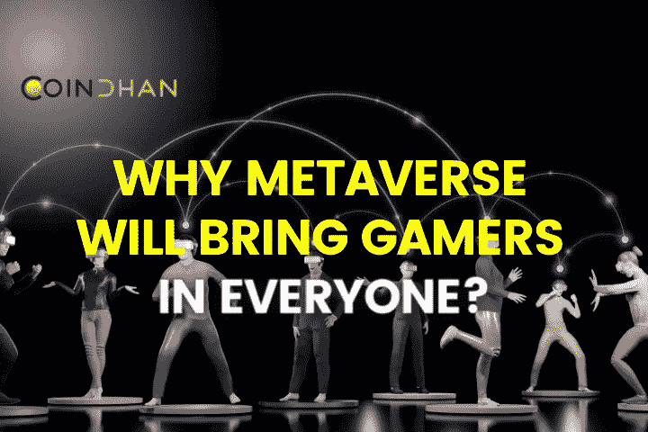

# 为什么元宇宙会给大家带来游戏玩家？

> 原文：<https://medium.com/coinmonks/why-metaverse-will-bring-gamers-in-everyone-a7dde18ec90?source=collection_archive---------67----------------------->

不久前，在 2009 年，詹姆斯·卡梅隆推出了他的代表作《阿凡达》，我们戴着 3D 眼镜超越了潘多拉。风景如画的森林，动物外星人，有瀑布的飞山。一切看起来如此迷人，这确实像一个科幻小说的经验。我们不知道的是，在电影上映前一年，一个名叫中本聪的匿名人士已经为一种技术献上了花圈，这种技术不仅可以绕过残缺和陈旧的金融系统，还可以通过一个叫做元宇宙的术语建立一个新的替代维度。

元宇宙是新的，但它有潜力调整现实的每一个结构，把每个人传送到一个新的维度，在那里一切皆有可能。从呼唤死者到与被国界分隔的朋友和家人互动。也就是说，为什么元宇宙准备让每个人都成为游戏玩家或虚拟现实的信徒。

# 元宇宙将如何为沉浸式体验建立真正的忠诚

# 多样性和跨文化

如果有人提议你可以在一个地方同时体验美国、加拿大、巴西、阿根廷、英国、德国、法国、俄罗斯和印度文化，你会怎么说？也就是说，你可以真正地在一个地方遇到来自所有这些文化的人，与他们互动，做你想做的任何事情，从商务到娱乐到你能想到的任何事情。听起来有点不真实，但元宇宙可以很好地实现同样的目标，让每个人都成为他们生态系统中的游戏玩家。这种变革的好处是，品牌可以在元宇宙轻松销售，没有任何商业壁垒。他们不需要获得许可证、文件或受边境限制来进行贸易。因此，它将打开更多的可能性领域，不仅可以实现跨文化交流，还可以以极低的成本了解世界各地的人们。

# 基础游戏

在元宇宙崛起之前，游戏或多或少一直是一种娱乐选择。然而，在元宇宙崛起之后，游戏更像是所有人的真实体验。现在的元宇宙一代不仅会玩游戏，还会了解游戏化的经济激励。从这个角度来看，年轻人和青少年可以玩游戏，开商店，在元宇宙收集稀有的 NFT 进行交易。在这个过程中，除了享受娱乐，他们甚至可以在很小的时候就获得财务自由。通过这种方式，元宇宙确实将通过这些优势把每个人带到游戏世界。

# [开发商的崛起](https://blog.coindhan.com/2022/05/19/how-to-make-money-in-the-metaverse/)

到目前为止，游戏开发者在娱乐大众方面的真正贡献还没有得到认可。他们将第一次成为建立在虚拟现实和游戏之上的整个经济的负责人。这不仅会推动他们超越帽子的思维，而且游戏逻辑和想象力将首次在 3D 模型中流动。通过这种方式，它将使游戏化成为所有人与生俱来的习惯。在这个过程中，每个人都会以这样或那样的方式与游戏联系在一起，这将意味着在不久的将来对游戏开发者的需求会增加，这一事实无疑将成为现实。

# 结论

因此，在不久的将来，如果有人说出《一号玩家》并邀请你约会，不要被吓到，因为也许你正站在元宇宙的正中央，有人想玩《反恐精英》或在咖啡馆见你。这就是世界将如何改变，我们有元宇宙要为此负责！

> 加入 Coinmonks [电报频道](https://t.me/coincodecap)和 [Youtube 频道](https://www.youtube.com/c/coinmonks/videos)了解加密交易和投资

# 另外，阅读

*   [我的密码交易经历](/coinmonks/my-experience-with-crypto-copy-trading-d6feb2ce3ac5) | [AAX 交易所评论](/coinmonks/aax-exchange-review-2021-67c5ea09330c)
*   [Bybit 融资融券交易](/coinmonks/bybit-margin-trading-e5071676244e) | [币安融资融券交易](/coinmonks/binance-margin-trading-c9eb5e9d2116) | [Overbit 审核](/coinmonks/overbit-review-9446ed4f2188)
*   [有哪些交易信号？](https://coincodecap.com/trading-signal) | [比特斯坦普 vs 比特币基地](https://coincodecap.com/bitstamp-coinbase)
*   [10 本关于加密的最佳书籍](https://coincodecap.com/best-crypto-books) | [英国 5 个最佳加密机器人](https://coincodecap.com/uk-trading-bots)
*   [ko only 回顾](https://coincodecap.com/koinly-review) | [Binaryx 回顾](https://coincodecap.com/binaryx-review)|[Hodlnaut vs CakeDefi](https://coincodecap.com/hodlnaut-vs-cakedefi-vs-celsius)
*   [40 个最佳电报频道](https://coincodecap.com/best-telegram-channels) | [1xBit 回顾](https://coincodecap.com/1xbit-review) | [Keevo 钱包回顾](https://coincodecap.com/keevo-wallet-review)
*   [如何在印度购买以太坊？](https://coincodecap.com/buy-ethereum-in-india) | [如何在币安购买比特币](https://coincodecap.com/buy-bitcoin-binance)