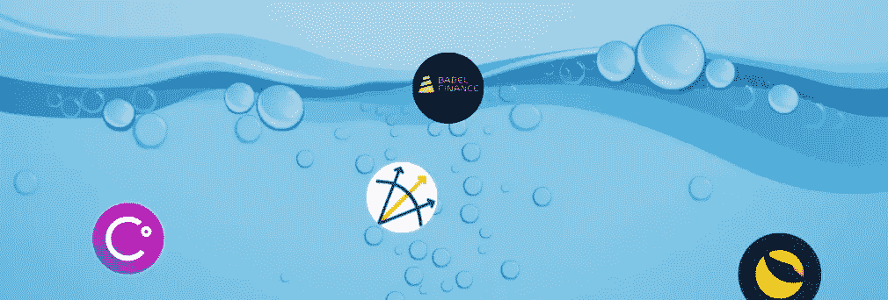

# 为什么最近的加密崩溃从长远来看可能是好的？

> 原文：<https://medium.com/coinmonks/why-might-the-recent-crypto-collapses-be-good-in-the-long-term-e2b02fce060d?source=collection_archive---------60----------------------->

最近，我们在密码领域发生了三件大事:

*   UST 脱钩了，露娜坠毁了
*   摄氏网络崩溃
*   据传三箭资本(3AC)已经资不抵债

卢纳的稳定货币 UST 已经失去了与美元的挂钩，并且在此之后没有恢复，这使得最近达到 119 美元左右的 ATH 的代币价格变为零。

承诺年利率高达 17%的加密贷款机构 Celsius 阻止了所有提款。他们基本上拿了客户的钱，投资于 DeFi 协议，以获得更高的收益率——在牛市中，这非常有效。现在情况变了，人们想退出，但公司没有流动资金。

3AC 是 10 亿美元的加密对冲基金，是全球最大的加密借款人之一。当你借 crypto 时，你必须把其他资产作为抵押，比如 BTC 和 ETH。随着最近的市场暴跌，一些传言称，不可预见的强制清算发生了，全球最受尊敬的加密对冲基金有破产的风险。

强制平仓是指当价格下跌时，交易者没有更多的保证金来维持杠杆。

对加密部门有什么好处？

无担保的加密资产代表着金融稳定的风险，而这些公司不负责任的杠杆和贷款可能会加速监管过程。

早在 2008 年，金融危机发生后，监管机构对杠杆敞口进行了限制，并制定了严格的风险管理框架。自 2009 年成立以来，加密行业发展过快，而对监管的需求仅在几年前才开始激增，这一官僚程序需要时间来完成。

我们现在看到的是这个行业完全缺乏监管。显而易见，交易所、基金和贷款平台等加密公司应该接受风险管理程序、压力测试和传统金融公司面临的其他措施和限制。

预计同行业的其他公司，特别是上述公司的竞争对手，会格外小心，降低杠杆，更加关注他们以前没有考虑到的风险。人们还预计，机构投资者会推动一定程度的监管进入市场，以避免他们的投资组合遭受数百万美元和数十亿美元的损失。监管者正在缓慢地采取行动，但现在他们有充分的理由加快这一进程。

虽然这些事件令人震惊，特别是对最近的投资者来说，但如果你仍然保持对 crypto 的长期愿景，这是一个绝佳的买入机会窗口。即使可能会有其他大型加密公司倒闭(并可能推动价格跌至新的底部)，我们对加密的未来预期仍然保持不变。

[*乔·罗伯特*](https://joerobert.com/) *现任罗伯特风险投资公司首席执行官，拥有超过 20 年的资产管理经验。自从乔开始创业以来，他已经为投资者和合伙人创造了可预见的两位数回报。Joe 已经投资了股权和代币的种子轮，以及比特币、以太坊和其他顶级加密货币的投资组合。*

*如果您是合格投资者，并想了解更多关于我们产品的信息，请联系我们。*

> 加入 Coinmonks [电报频道](https://t.me/coincodecap)和 [Youtube 频道](https://www.youtube.com/c/coinmonks/videos)了解加密交易和投资

# 另外，阅读

*   [密码本交易平台](/coinmonks/top-10-crypto-copy-trading-platforms-for-beginners-d0c37c7d698c) | [Coinmama 审核](/coinmonks/coinmama-review-ace5641bde6e)
*   [印度的加密交易所](/coinmonks/bitcoin-exchange-in-india-7f1fe79715c9) | [比特币储蓄账户](/coinmonks/bitcoin-savings-account-e65b13f92451)
*   [OKEx vs KuCoin](https://coincodecap.com/okex-kucoin) | [摄氏替代品](https://coincodecap.com/celsius-alternatives) | [如何购买 VeChain](https://coincodecap.com/buy-vechain)
*   [币安期货交易](https://coincodecap.com/binance-futures-trading)|[3 commas vs Mudrex vs eToro](https://coincodecap.com/mudrex-3commas-etoro)
*   [如何购买 Monero](https://coincodecap.com/buy-monero) | [IDEX 评论](https://coincodecap.com/idex-review) | [BitKan 交易机器人](https://coincodecap.com/bitkan-trading-bot)
*   [CoinDCX 评论](/coinmonks/coindcx-review-8444db3621a2) | [加密保证金交易交易所](https://coincodecap.com/crypto-margin-trading-exchanges)