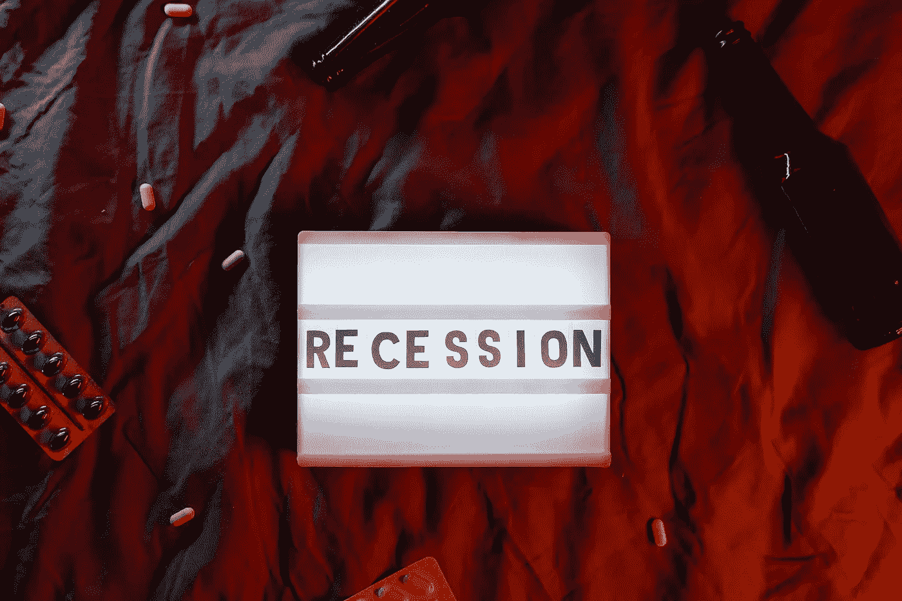

# 为什么大多数百万富翁都是在熊市中诞生的

> 原文：<https://medium.com/coinmonks/why-most-millionaires-are-made-in-a-bear-market-9e0531808f58?source=collection_archive---------1----------------------->

什么是熊市？真的很糟糕吗？

[*这篇博文最初来自我的网站组合 Hub*](http://www.portfolio-hub.co.uk)

熊市是指股票大幅下跌的一段时间。这通常发生在衰退或经济低迷时期。这个术语是在 1929 年股市崩盘后创造的。严格来说，我要讨论的是成为百万富翁…