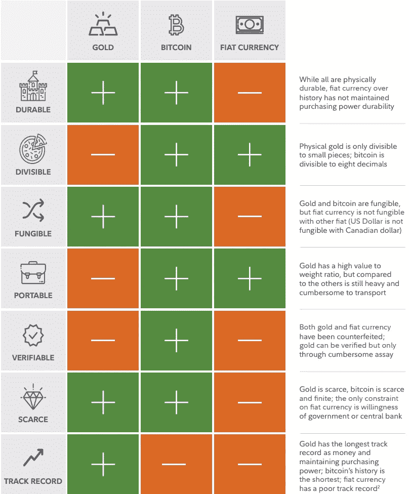
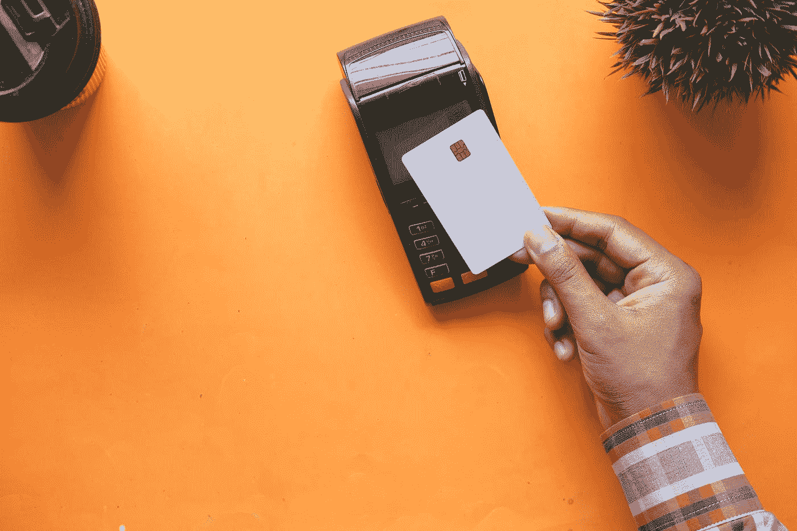

# 担心下一次熊市？这就是为什么我的 BTC 总是比你的值钱

> 原文：<https://medium.com/coinmonks/why-my-bitcoin-is-worth-more-than-yours-3dc8a34fe186?source=collection_archive---------35----------------------->

是的。你没看错。这不是打印错误。我的 1 BTC 比你的 1 BTC 更有价值。因为我是从网上一个叫 Satoshi69 的人那里得到的。

玩笑归玩笑，每当我听到关于加密的讨论，通常都是关于“我现在应该买哪个硬币？”、“我如何进入 NFTs”、“我应该购买 dip 吗？”我不禁想知道为什么有些硬币/NFT 值几百万，而有些却一文不值。

Photo by [Kanchanara](https://unsplash.com/@kanchanara?utm_source=medium&utm_medium=referral) on [Unsplash](https://unsplash.com?utm_source=medium&utm_medium=referral)

在写这篇文章的时候，BTC 大约在[* * * * *](https://coinmarketcap.com/currencies/bitcoin/)。对于那些你看不见摸不着的东西，它肯定很贵。
有什么特别的吗？为什么与其他比 BTC 更有用的硬币相比，它的价格如此之高？

对于股票，有一个概念叫做**内在价值。**金融模型(基本面/技术分析)被用来估计一只股票的价值。每当股票价格和内在价值之间存在差异时，这就意味着存在潜在的投资机会。
一般来说，这些模型会考虑公司的现金流和资产进行估值，这是 BTC 所没有的。

如果我们要定义，

*   内在价值=资产的潜在价值
*   外在价值=由外部因素决定的资产价值

很容易看出，BTC 和菲亚特一样，没有任何内在价值(除了生产成本之外？)到它，同时由于我们可以用它做什么而具有许多外在价值。那么 BTC 的价值从何而来呢？？？

Photo by [Jacek Dylag](https://unsplash.com/@dylu?utm_source=medium&utm_medium=referral) on [Unsplash](https://unsplash.com?utm_source=medium&utm_medium=referral)

**美国。**
它的价值来自于我们。像许多其他事情一样，我们是看到价值的人，作为回报，我们赋予它价值。
两个人对一瓶水会有不同的评价。一个在沙漠里，另一个在购物中心舒适地购物。

对于像[《星夜》](https://opensea.io/assets/matic/0x2953399124f0cbb46d2cbacd8a89cf0599974963/71727822647227279742357533264531868483438721824179667127680217699871593857025)这样的著名艺术作品，😆这是有价值的。如果我们除去创作它所需的原材料成本，我们如何将其他因素量化到艺术品的估价中？艺术家的名气？花在这上面的时间？创作杰作的技术水平和使用的技巧？

**黄金 VS BTC VS 菲亚特**

[https://www.reddit.com/r/Bitcoin/comments/shotki/fidelity_compares_gold_vs_btc_vs_fiat_based_on/](https://www.reddit.com/r/Bitcoin/comments/shotki/fidelity_compares_gold_vs_btc_vs_fiat_based_on/)

*我是个简单的人，我看到很多绿色，我就买。* (lol，请不要)我不太同意可替代的部分。对我来说，这三种货币应该被认为是可互换的，因为你的 1 美元和我的 1 美元是一样的，即使他们使用不同的货币进行比较。

看上面的图表，很容易得出结论，与其他两个国家相比，BTC 是“更好”的选择。那么，我们应该放弃菲亚特&黄金公司，转而选择其他公司吗？沉住气，事情没那么简单，因为 BTC 也不是没有缺点。为什么直到今天 BTC 还没有把它作为一种货币形式在日常交易中使用呢？

Photo by [Towfiqu barbhuiya](https://unsplash.com/@towfiqu999999?utm_source=medium&utm_medium=referral) on [Unsplash](https://unsplash.com?utm_source=medium&utm_medium=referral)

我们将探索 BTC 的一些属性(好/坏)，我发现这些属性有助于理解它的价值可能来自哪里。

1.  **最大供应量**
    与可以印刷以增加供应量的菲亚特不同，BTC 的总供应量只有 2100 万枚硬币。这是 BTC 的编码，所以那里总共只有 2100 万枚硬币(或者……)
    从技术上来说，它实际上有可能改变总供应量，但在 BTC 精神中，有一些改变被认为是被禁止的**，因为改变它将意味着产生的硬币不能再被认为是 BTC。增加供应量也没有意义，因为这会稀释你的持有量，如果需要更多的硬币，可分性就会增加**
2.  ****通货紧缩**
    除了 Pt1 之外，BTC 大约每 4 年就会经历一次被称为减半的事件，在这个事件中，整体薪酬将减半。50，25，12.5，6.25，3.125 等等，直到 2140 年左右最后一枚硬币被开采出来。不足为奇的是，一些 BTC 被送往错误的地址(烧毁)或私人钥匙丢失/遗忘，这将使 BTC 在 2140 年前陷入通货紧缩。**
3.  ****安全**
    BTC 使用 256 SHA 加密(由 NSA 设计)，因为它提供了高级别的安全性。它是安全的，因为它创建了一个单向散列，其中您得到一个 256 位的输出，但不能反向工作以获得原始输入。
    关于挖掘，挖掘者将试图通过重复改变 nonce 值来解决计算上困难的难题，直到它可以获得低于由难度级别设置的当前值的输出(散列值)。**
4.  ****先发优势**(受欢迎程度)
    作为第一种广泛普及的加密货币，它在加密市场上具有战略主导地位。虽然这种[优势](https://www.tradingview.com/symbols/CRYPTOCAP-BTC.D/)已经降到了 50%以下。路上一个随机的陌生人可能听说过比特币，但不知道像“Stacks”和“Quant”这样的硬币**
5.  ****【分散】** 这要看这是怎么定义的了。对我来说，*只要一个参与者(一个实体下的单个或多个节点)不可能对其他参与者拥有权力并做出威胁网络合法性的改变*，那么它将是分散的。
    但是真的够了吗？保护网络安全的单个节点数量越多，分散化程度越高。杰克·多西说 [*“比特币挖矿应该像给钻机插上电源一样简单。”*T9*。*我同意，如果他们能够成功做到这一点，任何普通人都能够参与，那么这将大大提高权力下放的水平。](https://www.benzinga.com/markets/cryptocurrency/22/01/24990476/jack-dorseys-block-to-develop-new-bitcoin-mining-microchip)**

1.  ****可扩展性**
    由于 BTC 的性质，使用 BTC(本身)不可能达到人们使用它作为支付形式的程度。相比之下，VISA 处理超过 24，000 个 TPS，而 BTC 只能处理 5 个 TPS。没有人愿意花时间排队等待交易获得批准。**
2.  ****计算密集型**
    由于工作证明的性质，大量的计算能力仅用于保持网络安全。所述资源可以被转移到其他应用。(研究，解决其他问题)
    能源使用和碳排放似乎是人们喜欢谈论的另一个话题。虽然我相信所有这些都会变得更好，因为矿工是利润驱动的。只要有更便宜、更清洁的能源，他们就可以转而降低运营成本。**
3.  ****波动性(价值储存)**
    考虑到 BTC 的价格波动，它可能不是保值的最佳资产。通常想到的另一种资产是贵金属，比如黄金。**
4.  **不受监管的
    在加密空间的蛮荒西部，资金被错误转移或诈骗经常发生。通常，监管机构将无法帮助你追回或收回那些损失的资金。**
5.  ****51%攻击/女巫攻击**
    查看[热图](https://chainbulletin.com/bitcoin-mining-map/)看看哈什拉特集中在哪里。网络有可能被攻击，使其无法使用。
    只要一个实体或一组恶意行为者设法累积超过 51%的散列率，他们就能够决定将哪个块添加到区块链。(双重消费/阻止特定交易)。**
6.  ****采矿**
    如果 BTC 价格大幅下跌，到了矿工们继续经营无利可图的地步。这带来了巨大的风险，因为网络中保护它的节点会更少。**

**BTC 的诞生颠覆了许多行业。但不管个人/组织持有它的原因是什么，最终还是要从中获利。(即使对于那些支持它但不采用它的人来说，通过营销他们仍然可以从中赚到美元)
快速的谷歌搜索会给你带来许多关于这个主题的不同观点，无论是骗局，庞氏骗局，快速致富计划，数字黄金，通货膨胀计数器，甚至是长期投资。**

****

**Photo by [Ibrahim Boran](https://unsplash.com/@ibrahimboran?utm_source=medium&utm_medium=referral) on [Unsplash](https://unsplash.com?utm_source=medium&utm_medium=referral)**

**虽然这篇文章可能让我听起来像是 BTC·马克西，但我不认为我是。鉴于 BTC 目前的状况，我不认为它会是我们未来需要的唯一数字货币，也不会是价值储存手段。它更有可能与菲亚特共存，给我们一个选择的机会。**

> **你的 BTC 和我的没有实际区别(可替换的)。但是由于我们对事物价值的感知方式不同，我把它看作是一种被低估的、 ***投机性和高风险性的*** *资产甚至还有它的缺点。区块链理工大学和 BTC 大学还可以做得更多。* ( *非财务建议*)。**
> 
> ****这就是为什么我的 1 BTC 比你的 1 BTC 值钱。****

**如果你喜欢读这篇文章，请在这里留下你感兴趣的话题的评论
谢谢！👍**

> **加入 Coinmonks [电报频道](https://t.me/coincodecap)和 [Youtube 频道](https://www.youtube.com/c/coinmonks/videos)了解加密交易和投资**

# **另外，阅读**

*   **最好的[加密税务软件](/coinmonks/best-crypto-tax-tool-for-my-money-72d4b430816b) | [硬币追踪评论](/coinmonks/cointracking-review-a-reliable-cryptocurrency-tax-software-5114e3eb5737)**
*   **[Stackedinvest 评论](https://coincodecap.com/stackedinvest-review) | [北海巨妖评论](/coinmonks/kraken-review-6165fc1056ac) | [bitFlyer 评论](https://coincodecap.com/bitflyer-review)**
*   **最佳[加密借贷平台](/coinmonks/top-5-crypto-lending-platforms-in-2020-that-you-need-to-know-a1b675cec3fa) | [杠杆令牌](/coinmonks/leveraged-token-3f5257808b22)**
*   **最佳[加密制图工具](/coinmonks/what-are-the-best-charting-platforms-for-cryptocurrency-trading-85aade584d80) | [最佳加密交易所](/coinmonks/crypto-exchange-dd2f9d6f3769)**
*   **[比斯勒评论](https://coincodecap.com/bitsler-review)|[WazirX vs coin switch vs coin dcx](https://coincodecap.com/wazirx-vs-coinswitch-vs-coindcx)**