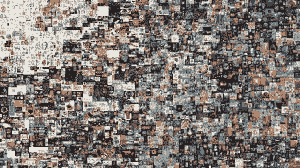

# 为什么没人买你的 NFTs

> 原文：<https://medium.com/coinmonks/why-no-one-is-buying-your-nfts-e59efcd35579?source=collection_archive---------10----------------------->

*以及您可以做哪些不同的事情*

Beeple Everyday- 5,000 Days art

有史以来最贵的 NFT 作品之一拍出了 6900 万美元的天价！

《每一天——前 5000 天》,作者是迈克·温克尔曼，也就是俗称的毕普。这个数字艺术品是他 13 年来每天拍摄的照片，用来练习一致性和磨练他的手艺。

这是一个广为流传的故事，自从 NFT 开始走红以来，这个故事被人们反复讲述。

但似乎没有人提到 Beeple 当时在 Instagram 上有超过 200 万粉丝的事实。

在过去的几天里，我与几位艺术家和摄影师交谈过，请求他们帮助如何将他们的作品列为 NFT 奖。

在大多数 NFT 平台上市是免费的。[这里有一个视频，教你如何在 Opensea 上免费列出你的 NFT。](https://youtu.be/_fWfPVL6wOA)

现在，你已经完成了列表。

接下来呢？

这是大多数创作者陷入困境的地方。

你首先要明白，NFT 是一个需求和供给的游戏。

你可以供应，但是你有需求市场吗？

社区是新互联网的支柱。

Bored Ape Yacht Club 是目前最昂贵的 NFT 之一，但它得到了最活跃的社区成员的支持，包括贾斯汀·比伯、小内马尔、凯文·阿特、唐·杰西等名人。

拥有一辆 BAYC NFT 会带来一些特权和好处，比如进入独家的 Discord 频道，额外的免费 NFT 奖励，以及该品牌可能出现的任何潜在合作的可能衍生物。

作为创作者出售你的 NFT:

1.  **合作**:如果你是一名插画师或艺术家，你可以为即将到来的 NFT 项目提供艺术创作。这不仅给了你一个在这个领域树立名声的机会，也给了你最终决定自己创业时所需的经验。
2.  **建立社群**:你知道营销的说法；先找市场再造产品？在 NFT 领域更是如此。了解你寻求服务的人，为他们建造，找到他们，无耻地出售你的手艺。
3.  **提供公用设施:**NFT 正在发展到需要向他们的社区提供公用设施、服务、独家访问或额外津贴的地步。

3.**营销技巧**:你已经有一个项目却死了？当我被聘为一个项目的营销人员或社区经理时，我意识到创作者只把营销人员当作最后的手段。

社区管理在与您的社区互动并帮助您的社区充分了解您的项目以投资该项目方面发挥着关键作用。花时间投资合适的社区经理和营销人员。

想出售你的 NFT 收藏或需要一个社区经理为你的项目设置一个结构？

让我们变点魔法吧！

联系我@abeabimbola40@gmail.com

> *加入 Coinmonks* [*电报频道*](https://t.me/coincodecap) *和* [*Youtube 频道*](https://www.youtube.com/c/coinmonks/videos) *了解加密交易和投资*

# 另外，阅读

*   [3 商业评论](/coinmonks/3commas-review-an-excellent-crypto-trading-bot-2020-1313a58bec92) | [Pionex 评论](https://coincodecap.com/pionex-review-exchange-with-crypto-trading-bot) | [Coinrule 评论](/coinmonks/coinrule-review-2021-a-beginner-friendly-crypto-trading-bot-daf0504848ba)
*   [莱杰 vs n 格拉夫](/coinmonks/ledger-vs-ngrave-zero-7e40f0c1d694) | [莱杰纳诺 s vs x](/coinmonks/ledger-nano-s-vs-x-battery-hardware-price-storage-59a6663fe3b0) | [币安评论](/coinmonks/binance-review-ee10d3bf3b6e)
*   [Bybit Exchange 审查](/coinmonks/bybit-exchange-review-dbd570019b71) | [Bityard 审查](https://coincodecap.com/bityard-reivew) | [Jet-Bot 审查](https://coincodecap.com/jet-bot-review)
*   [3 commas vs crypto hopper](/coinmonks/3commas-vs-pionex-vs-cryptohopper-best-crypto-bot-6a98d2baa203)|[赚取加密利息](/coinmonks/earn-crypto-interest-b10b810fdda3)
*   最好的比特币[硬件钱包](/coinmonks/hardware-wallets-dfa1211730c6) | [BitBox02 回顾](/coinmonks/bitbox02-review-your-swiss-bitcoin-hardware-wallet-c36c88fff29)