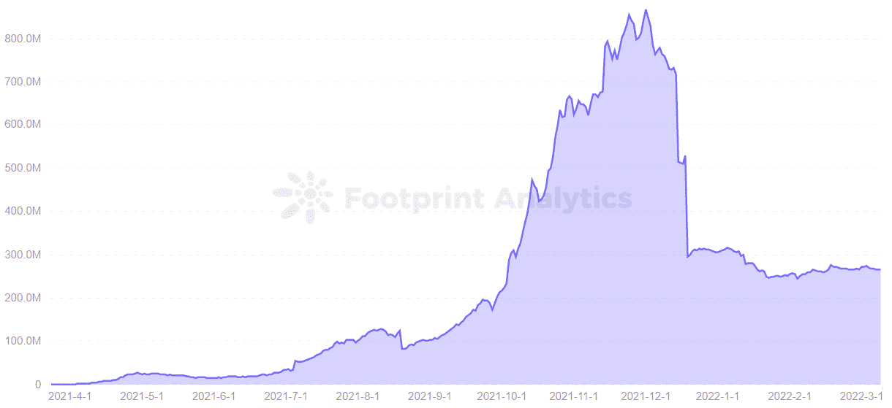

# 奥林巴斯道为何无法持续增长

> 原文：<https://medium.com/coinmonks/why-olympus-dao-cant-sustain-its-growth-e96b1cd392c7?source=collection_archive---------24----------------------->

Olympus DAO 是第一个超过 1000% APY 的去中心化储备货币协议。

2022 年 3 月

数据来源:足迹分析— [奥林巴斯 DAO 仪表盘](https://www.footprint.network/guest/dashboard/olympus-dao-dashboard-fp-16f31944-68a5-423e-aad5-1d6db229c62d?channel=ENG-221#secret=B69EBF68CBF78683CC82435AF35A0277)

[奥林巴斯道](https://www.footprint.network/guest/dashboard/olympus-dao-dashboard-fp-16f31944-68a5-423e-aad5-1d6db229c62d?channel=ENG-221#secret=B69EBF68CBF78683CC82435AF35A0277)受到近期市场抛售的重创，欧姆交易在 3 月 9 日低至 32 美元，较去年 4 月创下的 1415 美元的历史高点下跌 97.7%。

奥林巴斯 DAO 是一个去中心化的储备货币协议，会根据加密货币的价值自动发行欧姆。截至 10 月底，赌注欧姆超过 8，000% APY，目前为 1，039%。然而，在如此高的 APY 面前，它的 TVL 和 T4 令牌价格都大幅下跌。

是什么阻止了欧姆继续成长？

# 奥林巴斯道控制着自己的流动性

根据 Footprint Analytics 的数据，Olympus DAO 通过吸引用户以超过 1000%的 APY 入股和创建 LP 令牌，达到了 8.6 亿美元的峰值 TVL。然而，由于市场抛售，TVL 一直下跌到平衡状态，目前为 2.6 亿美元，下降了 70%。

*Footprint Analytics — TVL of Olympus DAO*

奥林巴斯 DAO 是第一个使用债券机制创建“流动性挖掘”模型替代方案的协议，通过折价发行 OHM 和创建 LP 代币来提供流动性，创造了“协议拥有流动性”的概念。

Olympus DAO 支持三种类型的用户操作:下注、债券买卖。

债券购买是 Olympus DAO 的一种独特机制，允许用户通过支持 wETH 和 DAI 等资产从财政部购买折扣欧姆。但获得贴现欧姆需要支付 wETH、DAI 等国库资产的相应价值，需要等待 2 到 5 天的时间才能完全获得购买的欧姆。

除了财政部支持的资产，用户还可以支付 LP 令牌以换取折扣欧姆，通常是与欧姆相关的流动性对令牌，如欧姆-戴 LP。稳定的货币形成了 LP 令牌，这确保了国库可以控制大部分流动性，并通过 LP 令牌赚取费用。

如此一来，LP 代币的捕获和欧姆的赌注功能，让奥林巴斯道捕获了欧姆 99.8%的流动性。

*Screenshot source — Olympus DAO website*

采用博弈论的囚徒困境模型

奥林巴斯道之所以吸引大量用户，是因为它的(3，3)经济模型，这个模型来源于博弈论中著名的“囚徒困境”模型。

股权、债券和出售这三种行为设计了一个(3，3)经济模型。当所有用户都参与赌注时，可以达到用户和协议双赢的效果，这就是(3，3)的状态。但用户之所以愿意购买和入股欧姆，是因为其高额的跑马圈地收益。

*Screenshot source — Olympus DAO website*

当通过购买债券获得欧姆时，用户将支付 wETH、戴和等资产，以增加奥林巴斯的国库资金，支持欧姆的价值。奥林巴斯道金库的增长结合协议控制欧姆 99.8%，那么固有 1 戴的欧姆可以有高出几百倍甚至上千倍的市场价格。

更高的 APY 也意味着更高的溢价，这将导致大量的欧姆作为通胀输出的激励。与此同时，市场上将出现大量的欧姆开采和出售操作，欧姆的价格和协议的质押 APY 也将降低。最坏的情况下，可能会跌到(-3，-3)阶段。这对奥林巴斯道和用户来说都意味着相应的损失。

在这个模型中，在正确的时间进入的用户可以获得高的短期回报，但用 APY 创造的贪婪的令牌组学也可以由人性驱动。所以高收益不是长久维持的。

# 欧姆价格自由浮动，由市场决定

欧姆的价格是由道的国债资产(如 wETH、戴、)支持的。底层逻辑:

*   当欧姆价格上涨时，协议通过发行额外的欧姆来压低价格。
*   当欧姆价格下降时，协议将回购并销毁欧姆，将价格拉回来。

从足迹分析图可以清楚地看出，欧姆是高度易挥发的。记录了两个超过 1100 美元的峰值，但截至 3 月 9 日，价格处于 32.60 美元的历史低点。

*Footprint Analytics — OHM of Price*

通过欧姆的硬币价格运动分析主要的上涨和下跌因素。

欧姆价格上涨:

*   奥林巴斯推出了一个债券功能，允许用户购买折扣欧姆形成 LP 代币，并赚取超 1000%至 8000% APY。
*   用户获得的回报每天复利 3 倍，加速了资产池的增长。

欧姆价格下降:

*   更多用户押注欧姆也会导致欧姆价格下跌。
*   OHM 的价格主要由新的购买者维持。
*   OHM 目前没有实际用途——对 OHM 的需求来自希望使用 OHM 获得高 APY 的用户，并为 OHM 交易对提供流动性，将其 LP 令牌与贴现的 OHM 挂钩。
*   1 月 17 日，一只鲸鱼卖出了 82526 欧姆的硬币(当时价值 1330 万美元)，引发价格跌至新低。

在 [Lido stake protocol](https://cryptoslate.com/what-made-lido-a-top-eth-staking-platform/) 中，用户不需要锁定 ETH 或 LUNA 等代币就可以以 1:1 的价格获得 stETH 或 stLUNA 的股份奖励，相比之下，在 Olympus 下注 wETH 或 DAI 的奖励是 OHM，这仍然具有很高的风险，因为 OHM 的价格高度依赖于市场因素。

# 摘要

仍处于早期阶段的 Olympus DAO 以(3，3)模型领导该项目，该模型要求用户一起参与下注，只有当所有 OHM 赌注者中没有反叛者时才有意义。

因此，在不断变化的加密货币市场中创造一个动态和平衡的趋势更加困难。想要高 APY 的用户需要冒更大的风险。

本文由[足迹分析](https://www.footprint.network/)社区提供。

Footprint 社区是一个世界各地的数据和加密爱好者相互帮助了解和获得关于 Web3、元宇宙、DeFi、GameFi 或区块链新兴世界任何其他领域的见解的地方。在这里，你会发现活跃的、不同的声音相互支持，推动着社区向前发展。

> 加入 Coinmonks [电报频道](https://t.me/coincodecap)和 [Youtube 频道](https://www.youtube.com/c/coinmonks/videos)了解加密交易和投资

# 另外，阅读

*   [有哪些交易信号？](https://coincodecap.com/trading-signal) | [比特斯坦普 vs 比特币基地](https://coincodecap.com/bitstamp-coinbase)
*   [ProfitFarmers 回顾](https://coincodecap.com/profitfarmers-review) | [如何使用 Cornix Trading Bot](https://coincodecap.com/cornix-trading-bot)
*   [如何在势不可挡的域名上购买域名？](https://coincodecap.com/buy-domain-on-unstoppable-domains)
*   [印度的秘密税](https://coincodecap.com/crypto-tax-india) | [altFINS 审查](https://coincodecap.com/altfins-review) | [Prokey 审查](/coinmonks/prokey-review-26611173c13c)
*   [赢取注册奖金——10 大最佳加密平台](https://coincodecap.com/earn-sign-up-bonus)