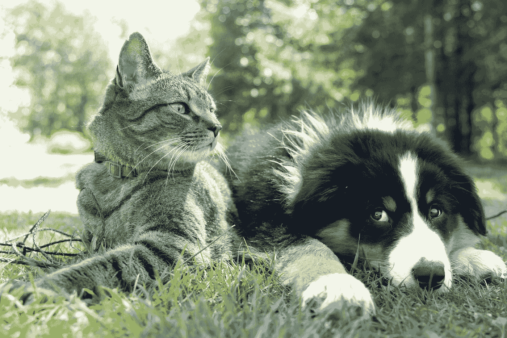

# 为什么宠物对你的心理健康有好处

> 原文：<https://medium.com/coinmonks/why-pets-are-great-for-your-mental-health-62ce7b99698f?source=collection_archive---------51----------------------->

Photo by [Andrew S](https://unsplash.com/@sita2?utm_source=medium&utm_medium=referral) on [Unsplash](https://unsplash.com?utm_source=medium&utm_medium=referral)

被困在里面的一个好处是，我们可以花时间和毛茸茸的朋友在一起。

你知道吗，科学表明宠物对你的精神健康有好处，而且已经证明可以提高工作效率。

以下是养宠物带来的一些好处。