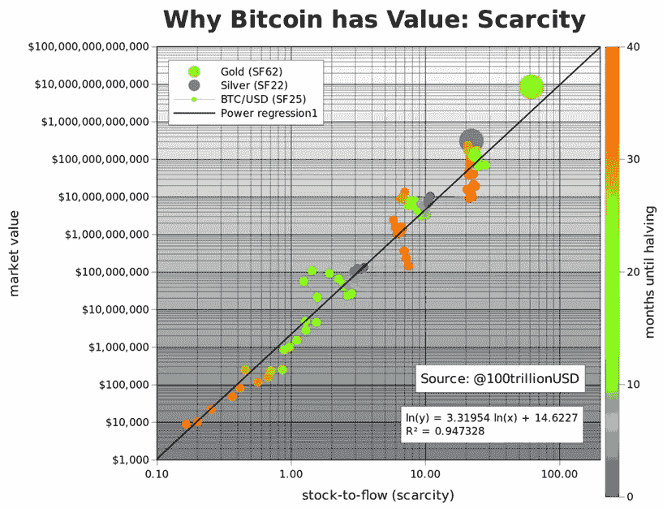
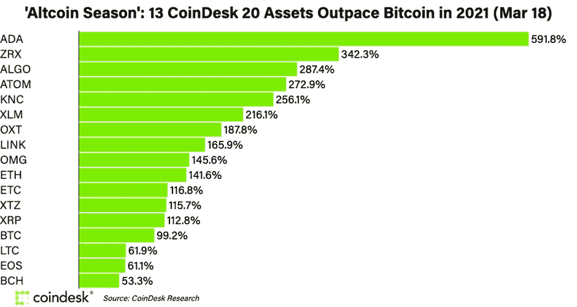
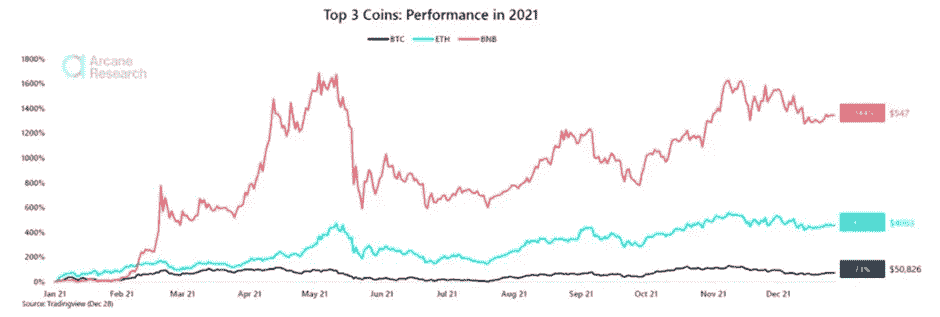

# 为什么 PlanB 的 S2F 模型有缺陷？

> 原文：<https://medium.com/coinmonks/why-planbs-s2f-model-is-flawed-e84fd48f000?source=collection_archive---------7----------------------->

PlanB 是比特币“股票到流量”价格模型的假名卖家，他提出，如果 BTC 在 2021 年 12 月前没有达到 10 万美元，他的预测将无效。然而，2022 年 2 月，两个月过去了，比特币的价值不到 45000 美元，从未达到这六位数。

## **如果您需要 PlanB 的 S2F 模型的概述**

PlanB 认为，比特币相对于矿业生产的流通供应量的可预测性解释了其惊人的增长，并允许对未来价格进行可靠的预测。它基于这样一个概念:当一种商品变得越稀缺，它就变得越有价值。比特币供应量有限，2100 万，其价值会随着需求的增加而上升。因此，随着比特币的存量-流量(S2F)增长，其价格也在上涨。planbtc.com 网站上发布的一项定量分析展示了比特币(BTC)可能达到 100 万亿美元资本化的模型和预测。

## **这就是为什么 PlanB 的预测不准确的原因**

10 亿个比特币意味着股票市场现值的 130 倍。按照 PlanB 的估计，未来几年价值将攀升 10 倍，显然是荒谬的。以下理由证明，PlanB 的 S2F 模型推理能力差，但却获得了很多关注和尊重

*   自 2019 年问世以来，S2F 模型有各种价格预测，包括短期和长期预测。它预测比特币在 2021 年 5 月价值 3 万美元，2021 年 9 月价值 9 万美元，2022 年 1 月价值 10 万美元，如下图所示。尽管该模型正确预测了 5 月份的硬币价格，但它对 9 月和 1 月的预测却大错特错，当时的价格约为 3.5 万美元。到目前为止，比特币不太可能很快达到 10 万美元。由于比特币无法达到这样的水平，S2F 模式被认为毫无价值。
*   S2F 模型崩溃的另一个原因是当意外事件发生时，如埃隆·马斯克对比特币能源使用的批评和中国对采矿的限制，都导致价格暴跌。
*   S2F 假设比特币的需求将继续以指数速度上升。根据这个概念，比特币价值 10 亿美元，需要近 4 万亿个钱包在流通，这在目前看来是不太可能的情况。事实上，比特币的需求经常超过供给，这解释了为什么它的价值在过去几年里飙升。只要需求继续以指数速度增长，库存-流量模型就会是准确的，就像过去十年一样。但比特币不再是唯一使用的加密货币。由于大量新项目吸引了人们的注意力，它的优势正在减弱。随着比特币达到历史新高，替代币也在聚光灯下占据了一席之地。

虽然比特币可能在 2021 年击败了股市，但其他加密货币今年已经超过了它。根据研究公司 Arcane 的报告，今年比特币的表现因 altcoins 的非凡增长而黯然失色。

股票到流量模型为比特币早期的飞速发展提供了一个新的视角。然而，它很快就会失败，因为它预计年复一年继续翻倍。

## **有没有优于 S2F 的车型？**

开发一个精确预测 BTC 未来价值的模型就像精确预测未来五年的天气一样棘手。因此，大多数定量分析师应该选择粗略的估计，而不是精确的预测，以根据假设做出现实、公平的投资决策。另一方面，那些被 PlanB 模型愚弄的人可能会通过了解比特币的特性、网络效应以及它与其他所有项目的区别，进而获得对比特币的实际信心。

> 加入 Coinmonks [电报频道](https://t.me/coincodecap)和 [Youtube 频道](https://www.youtube.com/c/coinmonks/videos)了解加密交易和投资

## 也阅读

 [## 杠杆代币[多头代币]终极指南

### 杠杆化令牌是具有杠杆化风险敞口的 ERC20 令牌，不考虑保证金、要求、管理…

medium.com](/coinmonks/leveraged-token-3f5257808b22)  [## 最佳加密交易所| 2022 年十大加密货币交易所| CoinCodeCap

### 哪一个是最好的加密交换？在本文中，我们将根据多种加密货币列出 10 大加密货币交易所

coincodecap.com](https://coincodecap.com/crypto-exchange)  [## 2022 年最佳加密交换平台| CoinCodeCap

### 随着时间的推移，我们大多数人将转向 dex 以获得更好的安全性和隐私。因此。在这里，我们将讨论…

coincodecap.com](https://coincodecap.com/best-swap-platforms)  [## 2022 年最佳加密和比特币赌场(美国批准，存款奖励)

### 接收、支付和赚取加密货币| |有各种各样的最佳在线赌场可供选择，有可能…

coincodecap.com](https://coincodecap.com/best-online-casinos)  [## 2021 年最佳加密借贷平台| 6 大比特币借贷平台

### 获得比特币和其他加密货币的最佳贷款利率

medium.com](/coinmonks/top-5-crypto-lending-platforms-in-2020-that-you-need-to-know-a1b675cec3fa)  [## 2021 年 6 大最佳硬件钱包|顶级加密硬件钱包[更新]

### 最好的加密货币硬件钱包是绝对必要的。我们将在 NGRAVE、Ledger Nano X 和…

medium.com](/coinmonks/the-best-cryptocurrency-hardware-wallets-of-2020-e28b1c124069)  [## 加密交易机器人——19 款最佳免费加密交易机器人

### 2022 年币安、比特币基地、库币和其他密码交易所的最佳密码交易机器人。四进制，位间隙…

medium.com](/coinmonks/crypto-trading-bot-c2ffce8acb2a)  [## 最佳 4 个加密交易信号电报通道

### 这是乏味的找到正确的加密交易信号提供商。因此，在本文中，我们将讨论最好的…

medium.com](/coinmonks/best-crypto-signals-telegram-5785cdbc4b2b)