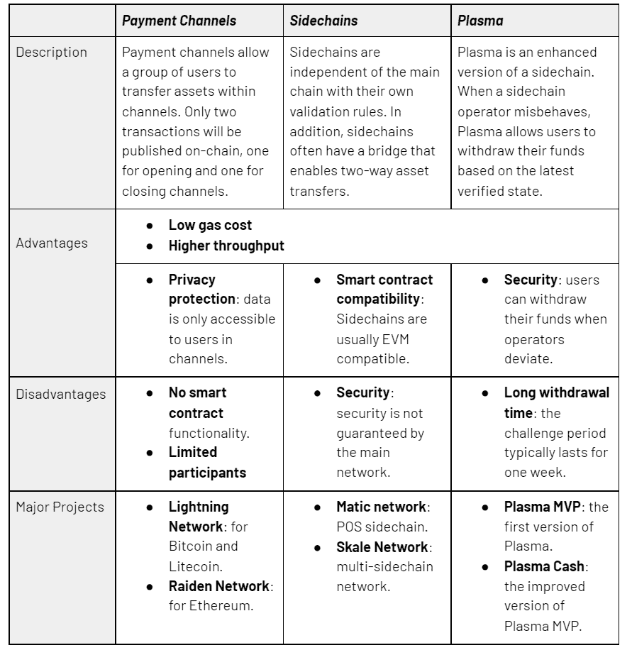

# 为什么多边形会赢得 L2 缩放战争

> 原文：<https://medium.com/coinmonks/why-polygon-will-win-the-l2-scaling-wars-d7aed1af3499?source=collection_archive---------5----------------------->

## 我相信你已经听说过很多关于 Polygon 的事情，Polygon 是一个“第二层”协议，最近从一个投资财团那里筹集了 4 . 5 亿美元。通过这篇文章，我希望打破炒作，带你了解它的产品演变以及我为什么相信它会赢。

# **上下文:**

区块链(尤其是以太坊)的最大问题之一是速度慢(以太坊支持 15 tx/sec，而 Visa 支持 1700 tx/sec)和交易成本高(当拥塞严重时，在以太坊区块链上执行一次交易可能需要几十美元)。**在传统区块链(称为第 1 层或 L1)的基础上创建解决方案的竞赛正在进行，该解决方案有助于扩展链，同时保持 L1 的安全性和分散性。**这种解决方案被称为第 2 层(或 L2)解决方案。L2 解决方案在推动下一波区块链采用方面非常重要，可以通过多种方式实施，包括侧链、等离子链、支付渠道和汇总(有关这些实施的差异，请参见附录 1)。

进入 Polygon(【https://polygon.technology/】)，一个从印度为世界建立的新兴 L2 解决方案。Polygon 的 sidechain (Polygon PoS)是其 L2 解决方案之一，在过去 6-8 个月中发展迅速，7000 个分散式应用程序或 dapps 在其平台(包括 OpenSea、Curve、Uniswap)上开发产品，累计创造了 1.4 亿个唯一钱包地址和 300 万笔交易/天。**虽然这些指标以任何标准衡量都令人印象深刻，但 Polygon 通过保持平台高速运行(每秒高达 65，000 次交易，阻塞时间为 2 秒，而以太坊为 13 秒)和保持交易费用最低(几乎为 0 美元)成功做到了这一点。**

然而，这仅仅是 Polygon 节俭敏捷团队的冰山一角。2021 年下半年，Polygon 收购了两家公司，Hermez 和 Mir，以开发“零知识汇总”或“zkrollups”，这是实施 L2 解决方案的另一种方式。Zkrollups 解决了 sidechains 等其他 L2 实现带来的速度和安全性问题，并被广泛吹捧为行业发展的方向。Hermez 和 Mir 领先于该领域其他资金雄厚的竞争对手，开发了尖端技术，将使 Polygon 能够提供速度和安全性更高的 ZK-roll 解决方案。

Polygon 面临的风险之一是来自竞争，这是很好的资本化。Starkware (Sequoia US 和 Paradigm 支持)和 zksync (a16z 支持)也创建了 zk-rollups，但它们的 EVM 兼容性进一步落后于 Hermez 和 Mir，这使 Polygon 具有优势。如果 Polygon 执行其产品路线图，鉴于其强大的开发人员关系(与以太坊领域的任何其他参与者相比，Polygon 拥有在其平台上构建的最多 dapps)和行业领先的技术，它处于有利地位。

2022 年初，红杉印度、老虎基金、软银和一个投资者财团(此处列出)以比当前价格 2 美元低 40%的价格购买了价值 4 . 5 亿美元的 MATIC 代币(3 年内有效)。Polygon 并不真正需要这笔钱，创始人控制着 Polygon 国库中 20-25%的$MATIC token(价值 40-50 亿美元),他们可以用这笔钱来进一步发展生态系统。然而，从机构风投那里筹集资金将有助于该公司积极招聘 web2 人才(希望转向 web3)，并在全球的 web2 公司中获得合法性。

# **产品进化:**

L2 链的工作原理是将大量交易移出主区块链(L1)，并将最终状态报告回 L1。有不同的方式来实现这一理念，包括支付渠道、侧链、血浆链和易拉宝(详见附录 1)。

Polygon 成立于 5 年前，其等离子和侧链支持一些最大的 DeFi 和 NFT 项目(它通过侧链支持 Curve、Sushiswap 和 Aave)。事实上，Polygon 为 the 10 个最大的 DeFi 项目中的 4 个提供服务(在 TVL 累计 330 亿美元)

Largest DeFi projects by TVL; Source: [https://www.defipulse.com/](https://www.defipulse.com/)

侧链就像独立的区块链，有自己的共识机制，因此可能会很慢，也不像主以太坊区块链那样安全。意识到这些可扩展性、安全性和体验的问题，Polygon 在 2021 年初对 zk-rollups 进行了大胆的押注。

**从那以后，Polygon 迅速推进了它的 zk-rollup 野心，包括:**

1/ **与 Hermez Network** (现在叫 Polygon Hermez)合并，开源 zk-rollup 推出 zkEVM。Polygon Hermez 可以将多达 2000 个事务压缩到 1 个有效性证明中，并且可以将多达 15 个有效性证明写入以太坊上的 1 个块中，支持每秒 2000 个事务。Polygon Hermez 使用了一种不同的共识机制，称为捐赠证明，其中 40%的中标金额作为捐赠返回，用于再投资以太坊，以太坊级别的安全性由 zk-SNARKS 保证。根据此次合并的条款，1 HEZ 将通过智能合同交换 3.5 MATIC。Polygon Hermez 能够快速、安全且经济高效地将代币转移出区块链。

*Diagrammatic explanation of how Polygon Hermez works; source:* [https://polygon.technology/solutions/polygon-hermez](https://polygon.technology/solutions/polygon-hermez)

2/ **发布了 Polygon Miden** ，这是一款基于 STARK、兼容以太坊的 rollup。虽然 ZK 汇总很有前途，但问题是它们不能支持任意的逻辑和事务，包括 EVM 的逻辑和事务。Polygon Miden 希望解决这个问题，从而使构建 ZK 卷变得更加简单。

3/ **推出了 Polygon Nightfall】，这是一款与 EY 合作开发的隐私保护产品。注重隐私的汇总结合了乐观汇总和 ZK-汇总解决方案的优点。**

4/ **以 4 亿美元收购 Mir**(2021 年 11 月 1 亿美元现金+价值 3 亿美元的 1.9 亿美元 MATIC 代币)；Mir 将在 Polygon 保护伞下工作，推出 Polygon Zero，这是一种可扩展的以太坊兼容汇总
Mir 创造了一种技术，通过这种技术，区块链的吞吐量与网络中的节点数量成比例。这是对当前系统的重大改进，在当前系统中，吞吐量取决于最弱的节点，因为所有节点都需要验证交易。这项技术是一个名为 plonky2 的递归证明系统。

除了上面列出的产品，Polygon 还拥有大量其他产品，包括 PoS(在“上下文”中提到的 EVM 兼容侧链)、Edge(用于构建私有或公共以太坊兼容区块链网络的模块化和扩展框架)和 Avail(用于独立链和链外扩展解决方案的区块链)，使该公司的产品非常强大。

# **团队:**

Polygon 的核心团队自 2017 年以来节俭而坚持不懈地建立了公司。最近筹集的 4.5 亿美元只是该公司收到的第二轮资金，最后一轮是一张 75 万美元的支票。

联合创始人:
1/ Jaynti Kanani: ex 住房；Dharmsinh Desai 大学 11 届；众所周知，他是一位令人难以置信的技术领袖
2/ Sandeep Nailwal:创建 dapps 和其他区块链产品的初创公司的前创始人
3/ Anurag Arjun:印度商业咨询公司的前产品/项目经理；nirma’06
4/Mihailo bje lic:最近成为联合创始人

# **比赛:**

Polygon 面临着 Solana 和 Avalanche 等 L1 的竞争，以及 zksync 和 Starkware 等其他 L2 的竞争(见下面的完整列表)

Polygon’s many competitors

> **然而，Polygon 在市场中胜出有三个原因:**
> 
> 1/通往领先的 DeFi 和 NFT 项目的重要道路(4/10 的顶级 DeFi 项目建立在 Polygon 解决方案之上，在 TVL 总计 330 亿美元)。Polygon 可以将这些项目“升级”为 zk-rollup 解决方案
> 
> 2/通过 Hermez 和 Mir 在创建与 EVM 兼容的 ZK-roll 解决方案方面走在最前面
> 
> 3/快速行动的动态团队。Polygon 在短短 12 个月内就在 zk-rollup 领域取得了重大进展(Polygon Hermez、Miden、nighth 和 Zero 以及 PoS、SDK 和 Avail 等产品的推出)

# **指标**(针对 Polygon 的侧链解决方案，PoS):

Polygon 的使用在 6 月 21 日之后急剧增加，8 个月内累计钱包地址迅速增长到今天的约 1 . 4 亿。因此，日交易量在 2011 年 6 月达到约 900 万笔，现在每天在 300 万至 400 万笔之间波动(累计 14 亿以上)。虽然交易量大幅上升，但这并没有导致平均汽油价格随之上涨，平均汽油价格仍保持在 150-200 Gwei 左右(相当于约 0.001 美元)。总体而言，Polygon 网络每天盈利约 70，000 MATIC(1 MATIC = 1.5 美元)，不包括 Polygon 国库的补贴。这一惊人的增长是由大约 7000 个 dapps 推动的，包括 Aave、Sushiswap、Uniswap、Opensea、分散土地和沙盒。街区时间基本保持在 2 秒/街区，远低于以太坊的 13 秒/街区。

【polygonscan.com】来源:T4

# **前进路径:**

Polygon 在 L2 扩展生态系统中具有独特的地位，在其网络上建立了最大的 dapps 网络，并与 Hermez 和 Mir 一起开发了尖端的 zk-rollup 技术。展望未来，这是我对 Polygon 的设想:

1.  **在其 sidechain 和 zk-rollup** *:* 上增加开发者/ dapp 生态系统建设:我相信每个 L2 缩放技术都会有自己的买家，sidechains 吸引游戏开发者，zk-rollup 吸引 DeFi 协议。Polygon 希望通过(A)积极的对外销售和(B)通过 1 亿美元的开发者基金投资有前途的开发者，来增加其平台上的开发者数量。随着 Ryan Watt 加入 Polygon，我看好他们的游戏社区在未来几个月的快速增长
2.  **构建更多 L2 扩展解决方案，并深入现有解决方案** *:* 根据不同使用案例有特定 L2 扩展解决方案的理念，Polygon 继续投资开发新的扩展解决方案(成为 L2 扩展解决方案的“瑞士军刀”)并完善其现有产品也是明智之举
3.  *通过收购实现无机增长:*最近，Polygon treasury 向红杉(Sequoia)、老虎基金(Tiger)、软银(Softbank)和其他公司出售了代币，从而获得了充足的资金来收购符合其产品路线图的业务

# **风险与挑战:**

尽管 Polygon 在新兴市场处于领先地位，但仍存在两大风险:

1.  **执行风险**:当 L2 扩展解决方案帮助解决 Vitalik 的可扩展性、安全性和去中心化三难问题时，它们才真正发挥作用。执行 zk-rollups 的愿景是关键。
2.  **竞争风险**:如前所示，市场上有大量的竞争对手，而且每一家都资金雄厚。

另一个风险，虽然明显很小，是以太坊在成为 L1 解决方案的竞争中失败，因此默认情况下，建立在其上的 L2 解决方案也失败了。

# **附录 1 —部署 L2 链的方法:**

参考:[https://medium . com/amber-group/ether eum-layer-2-solutions-aa 95 C1 a 1821 e](/amber-group/ethereum-layer-2-solutions-aa95c1a1821e)

TL；博士:国家频道和血浆链现在用得不多了。侧链是独立的区块链，定期与以太坊同步他们的分类帐。因此很慢，也不安全，而卷被吹捧为未来，因为它们更快，并且依赖以太坊主链来保证安全。在汇总中，乐观汇总依赖于 7 天的争议窗口，因此效率低下，zk-rollups 旨在解决这一问题。在 zk-rollups 中，Starkware(使用 Cairo 进行编码，而不是 Solidity)由 Sequoia US + Paradigm 资助，zksync 由 a16z 资助。

1/国家渠道(也称为支付渠道):受雇于比特币闪电。写入 L1 链的开始交易->添加到智能合同的加密以执行双方之间的支付->双方完成交易->写入 L2 链的结束交易

2/ Sidechain:有自己的验证器和共识方法，并且只有在有一定数量的验证器时才是可行的

3/等离子链(以太坊使用):类似于侧链，每个块的压缩表示被提交给以太坊上的智能契约

4/汇总:交易在链外执行，答案发布在 L1 链上。Rolllups 旨在减少主链的计算负担。

(A)乐观汇总:

*   他们很慢，因为确认一笔交易需要 7 天时间。乐观汇总假设所有交易默认有效，并允许网络参与者/验证者在汇总确认交易后的 7 天内对交易提出异议
*   犯下欺诈行为的人会受到惩罚，而抓住欺诈行为的人会得到奖励。
*   乐观汇总的优点是验证器只需要验证有争议的挑战，而不是所有的事务，从而节省了计算资源
*   乐观汇总项目包括 Arbitrum(由 off chain Labs—[https://offchainlabs.com/](https://offchainlabs.com/)开发)和乐观；这两者都支持以太坊虚拟机(EVM
*   “乐观”汇总的图示:

(B)零知识汇总:

*   捆绑(或汇总)L2 上的数百个交易，并生成一个名为 SNARK(简洁的非交互式知识论证)的加密证明，这是一个有效性证明。这个有效性证明贴在 L1 链上。
*   甚至需要更少的计算能力(与乐观汇总相比),因为您只需要检查有效性证明，而不是所有的事务数据。
*   Zkrollups 不需要验证器来检查，而是依赖于数学证明，这使得它比乐观的 Rollups 更安全
*   ZK-rollup 项目包括 zksync(由 Matter Labs 开发)和 StarkEx(由 Starkware 开发)

# **附录 2——L2 解决方案测绘项目**

# **附录 3:来源** -

1.  [https://TechCrunch-com . cdn . amp project . org/c/s/TechCrunch . com/2022/02/07/polygon-raises-4.5 亿 from-sequoia-capital-India-Softbank-and-tiger-global/amp/](https://techcrunch-com.cdn.ampproject.org/c/s/techcrunch.com/2022/02/07/polygon-raises-450m-from-sequoia-capital-india-softbank-and-tiger-global/amp/)
2.  [https://academy.binance.com/en/glossary/plasma](https://academy.binance.com/en/glossary/plasma)
3.  [https://ether eum . org/en/developers/docs/scaling/layer-2-roll ups/](https://ethereum.org/en/developers/docs/scaling/layer-2-rollups/)
4.  [https://India . sequoia cap . com/build/polygon-building-ether eums-internet-of-区块链/](https://india.sequoiacap.com/build/polygon-building-ethereums-internet-of-blockchains/)
5.  [https://blog . polygon . technology/the-polygon-thesis-strategic-focus-on-ZK-technology-as-the-next-major-chapter-for-polygon-1b-treasury-allocation/](https://blog.polygon.technology/the-polygon-thesis-strategic-focus-on-zk-technology-as-the-next-major-chapter-for-polygon-1b-treasury-allocation/)
6.  [https://hermez.io/](https://hermez.io/)
7.  [https://blog . polygon . technology/polygon-announces-polygon-miden-a-stark-based-ether eum-compatible-roll up/](https://blog.polygon.technology/polygon-announces-polygon-miden-a-stark-based-ethereum-compatible-rollup/)
8.  [https://blog . polygon . technology/ey-collaborates-with-polygon-to-co-develop-ether eum-scaling-solutions-and-enterprise-区块链/](https://blog.polygon.technology/ey-collaborates-with-polygon-to-co-develop-ethereum-scaling-solutions-and-enterprise-blockchains/)
9.  [https://blog . coin base . com/a-simple-guide-to-the-web 3-stack-785240 e 557 f 0](https://blog.coinbase.com/a-simple-guide-to-the-web3-stack-785240e557f0)
10.  [https://blog . coin base . com/scaling-以太坊-十亿用户加密-715ce15afc0b](https://blog.coinbase.com/scaling-ethereum-crypto-for-a-billion-users-715ce15afc0b)
11.  [https://polygonscan.com/](https://polygonscan.com/)
12.  [https://polygon.technology/](https://polygon.technology/)
13.  HBS·区块链俱乐部的成员

> *加入 Coinmonks* [*电报频道*](https://t.me/coincodecap) *和* [*Youtube 频道*](https://www.youtube.com/c/coinmonks/videos) *了解加密交易和投资*

# 另外，阅读

*   [Bookmap 评论](https://coincodecap.com/bookmap-review-2021-best-trading-software) | [美国 5 大最佳加密交易所](https://coincodecap.com/crypto-exchange-usa)
*   最佳加密[硬件钱包](/coinmonks/hardware-wallets-dfa1211730c6) | [Bitbns 评论](/coinmonks/bitbns-review-38256a07e161)
*   [新加坡十大最佳加密交易所](https://coincodecap.com/crypto-exchange-in-singapore) | [购买 AXS](https://coincodecap.com/buy-axs-token)
*   [红狗赌场评论](https://coincodecap.com/red-dog-casino-review) | [Swyftx 评论](https://coincodecap.com/swyftx-review) | [CoinGate 评论](https://coincodecap.com/coingate-review)
*   [投资印度的最佳密码](https://coincodecap.com/best-crypto-to-invest-in-india-in-2021)|[WazirX P2P](https://coincodecap.com/wazirx-p2p)|[Hi Dollar Review](https://coincodecap.com/hi-dollar-review)
*   [加拿大最佳加密交易机器人](https://coincodecap.com/5-best-crypto-trading-bots-in-canada) | [KuCoin 评论](https://coincodecap.com/kucoin-review)
*   [火币加密交易信号](https://coincodecap.com/huobi-crypto-trading-signals) | [HitBTC 审核](/coinmonks/hitbtc-review-c5143c5d53c2)
*   [如何在 FTX 交易所交易期货](https://coincodecap.com/ftx-futures-trading) | [OKEx vs 币安](https://coincodecap.com/okex-vs-binance)