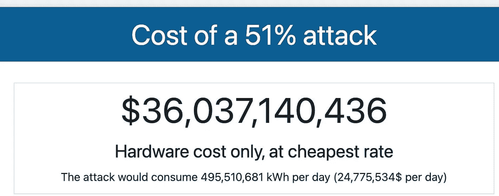

# 为什么工作证明很重要

> 原文：<https://medium.com/coinmonks/why-proof-of-work-pow-matters-af00b73f1be1?source=collection_archive---------36----------------------->

加密货币网络使用工作证明(PoW)或股份证明(PoS)来建立各自的区块链，也称为包含网络上发生的所有交易的所有块的分类账。

比特币网络使用 PoW，这需要在所有人之前解决一个数学难题，以赢得向区块链添加新交易块的能力。

给网络增加一个新的区块区块链带来了区块奖励&网络交易费用。

当前成功挖掘一个比特币区块，又名解决数学难题的区块奖励为 6.25 比特币。这是由网络本身发给开采最后一个区块的矿工的。

当这个网络在 2009 年开始运行时，解决这个数学难题并为比特币区块链添加一个新区块的区块奖励是 50 个比特币。

然而，每开采 210，000 个区块，区块奖励就会减半。

这一事件被称为减半或减半——两者都是被接受的版本，但我更喜欢减半，所以，我将坚持这一点——因为找到数学难题的解决方案和挖掘新的区块需要大约 10 分钟，这一事件大约每 4 年发生一次。

基本上，在第一次 halvening 后，区块奖励下降，从 50 比特币，到 25 比特币。

在第二次 halvening 时，方块奖励再次下降，从 25 比特币降至 12.5 比特币。

发生在 2020 年 5 月的最近一次 halvening 将我们带到了当前的 6.25 比特币的块奖励。

这种“趋势”将继续下去，因为它嵌入在比特币协议中，直到所有 2100 万枚比特币被开采出来，预计这将在 2140 年的某个时候发生。网络交易费用是希望在比特币网络上进行交易的人支付的费用。

找到解决方案所需的工作&成功开采一个比特币区块是通过称为 ASICs(专用集成电路)的专用计算机来完成的。

这些是专门为挖掘比特币而打造的专用硬件。

你不能用它们来玩堡垒之夜，但你可以用它们来加热你的家或你的热水浴缸，这很酷。

现在，你可以想象，为了开采比特币，你需要专门的硬件，这需要用电，并且需要物理空间来保持，因为，你知道，东西会坏掉。

那些都是不能凭空打印出来的资源。

另一方面，使用 PoS 进行“挖掘”和验证交易的加密货币网络没有任何这些限制。由于这个原因，他们被宣传为绿色，但他们远不能以一种不信任和没有许可的方式做他们真正想做的事情。

要扩展区块链和验证交易，使用 PoS，你所需要的只是拥有和下注网络的代币。卡达诺就是这样一个网络。

我不会深入探讨这个网络是如何工作的，因为这不是本文的目的。

这样想…

假设 YouCoin 是一个使用 PoS 的加密货币网络，YouCoin 的供应量目前为 100，每“开采”一个区块奖励“矿工”1 个 you coin。为了使这个例子尽可能简单，我们将交易费用排除在外。假设你押了 10 个金币，但是罗柏押了 20 个，艾玛押了 40 个。

您下注的硬币总数为 70 枚，您拥有 10 枚，占所有下注硬币的 14.28%，用于“挖掘”区块和验证交易。

同时，Rob 的 20 YouCoins 代表 28.57%，Emma 的 40 YouCoins 代表 57.14%。

因为在 PoS 中，不存在寻找问题解决方案的竞争，就像在 PoW 中一样，网络分配谁“开采”新区块并验证交易的方式是基于赌注硬币总量的所有权百分比。

因此，根据你下注的 YouCoins 的数量，你将被网络选中，14.28%的时间去“挖掘”一个新的区块并验证该区块中的交易。

另一方面，Rob 和 Emma 会去“挖掘”一个新的块并验证该块中的事务，分别有 28.57%的时间和 57.14%的时间。由于 Emma 拥有网络上下注的所有 YouCoins 的大部分，她将比你或 Rob 更经常地被网络选择去“开采”一个新区块并验证该新区块中的交易。

这意味着艾玛将收集，总体来说，更多的网络新发行的 YouCoins 作为“挖掘”这一块的奖励。

那也是什么意思？这意味着，为了“挖掘”和验证网络上的交易，艾玛在赌注 YouCoins 总额中的所有权百分比将越来越快。

为什么？因为她比你或 Rob 更经常获得奖励，这反过来增加了她被网络选中的机会，再次“挖掘”块并验证交易。

这是一种自我强化机制。

你可能听说过复利。

工作原理完全一样。

那 PoS 有什么问题？

让你下注的唯一方法是通过“挖掘”和验证交易获得奖励，或者从 Emma 和 Rob 那里购买。但是为什么艾玛和罗伯会想把他们珍贵的金币卖给你，而失去他们通过做绝对操所有人而变得越来越富有的巨大特权呢？

记得…

在 PoS 中，不需要额外的资源来“挖掘”和验证交易，而在 PoW 中，矿工需要硬件、工程师、电力、安装硬件的空间等资源。开采街区。

在比特币的势力范围内，你不需要任何人的许可就可以开始挖矿。

你甚至可以用纸和笔来做，世界上没有人需要知道你正在解决这个数学难题。你不会在专业硬件上做得很好，但是你可以购买/制造你自己的专业硬件来帮你做这件事。这个想法是没有人能够决定谁可以开始挖掘比特币，谁不可以。

为什么？因为当你在比特币网络上挖掘区块时，你所做的只是在解决一个数学问题。

如果有人告诉你不允许你做数学，那会很傻，对吗？

在 PoS 的情况下，持有大部分下注硬币的人控制着网络，如果你想减少他们对网络的控制，你必须购买他们的硬币，但他们必须想把它们卖给你或其他任何人。

但是他们为什么要这样做呢？

保持他们的堆栈并让其自然增长，通过“挖掘”和验证交易获得越来越多的回报，他们完全没有成本。通过向你出售他们的硬币，他们绝对不会得到什么，也会失去一切。

基本上，在 PoS 中，富人越来越富，穷人越来越穷。

下注的硬币越多，获得的奖励就越多。你下注的硬币越少，获得的奖励就越少。

如果这听起来是你熟悉的概念，那是因为它确实是。

我们现在的货币金融体系就是一个 PoS 网络，在这个网络里，富人越来越富，穷人越来越穷。这就是权力重要原因。这是我们拥有一个诚实、公平的货币网络的唯一途径，在这个网络中，没有人可以通过不工作或不冒险来控制规则或获得大部分回报。你可能会说“但举例来说，政府可以购买大量比特币矿工，并通过拥有大部分比特币采矿基础设施来开始控制网络”。虽然这在理论上听起来可能，但有两个重要的方面你需要考虑。

1。例如，虽然像美国这样的政府可以凭空印刷钞票，但为了购买比特币采矿硬件并建立运行它们的基础设施，你必须明白采矿硬件或运行它们的基础设施不能凭空印刷。

这将需要数年时间，成本将继续上升，因为越来越多的矿工加入了这个网络，希望获得成功解决数学难题的奖励。前几天我看到了这个帖子，它很好地补充了第一点。

试图拥有比特币采矿网络 51%的股份，目前需要花费 360 多亿美元。
2
2。不像在 PoS 中，拥有 51%的开采能力，并不能给你在网络上的权力，因为你必须遵守网络的协议共识规则。节点决定了比特币的规则。

矿工只是向节点提供服务。

这些节点是检查矿工确实找到了数学难题的解决方案，以及该块中的所有交易都与分类账的当前状态相匹配，也就是谁拥有多少比特币。

如果矿工试图通过提交不符合网络协议规则标准的解决方案或交易来欺骗系统，他们的解决方案或交易会立即被拒绝，并且他们花费在产生该解决方案上的所有资源都会浪费。

据估计，全球有超过 10，000 个比特币节点在运行。

这是超过 10，000 台计算机运行比特币网络协议规则，并在矿工身上执行这些规则。

节点还通过确保所有节点的分类帐相同并且它们都在同一页上来相互检查。

基本上就像大家都在检查别人的作业。

在比特币网络上玩游戏就像试图让数万台电脑相信 2+2=5 一样。

祝你好运！

世界上任何人都可以在一台旧笔记本电脑上运行自己的比特币节点，或者购买专用硬件，这将花费约 250 美元。

运行一个比特币节点并验证整个区块链和其中所有交易的便利性和可负担性，是比特币网络真正去中心化的原因。

相比之下，其他加密货币网络(如以太坊)需要仅在数据中心找到的硬件来运行节点，以验证区块链和其中的所有交易。

有多少人能够负担得起花费数千或数万美元，在某些情况下，只是为了运行一个节点？

可能不多吧？

这一点限制了网络的分散程度。

如果只有一小部分人可以运行节点，验证网络的区块链和其中的所有交易，因为疯狂的成本只会越来越高，这意味着网络将越来越集中。

这也意味着，能够并负担得起运行节点来验证区块链的人也是能够决定网络协议规则的人。

为以太坊和其他 DINO(名义上是分散的)网络运行几个节点的人是决定网络协议规则的人。

他们也是可以改变这些规则的人，其他人都必须遵守这些规则。

另一方面，在比特币中，因为网络已经是分散的，并且将继续变得更加分散，因为成本低，没有一小部分人可以决定网络协议规则是什么。

每个已经运行比特币节点的人都在执行与其他数千个节点相同的协议规则。

你可以说，从本质上来说，他们说的是完全相同的语言，玩的是同样的游戏。

如果一个节点决定改变它执行的规则，例如，将供应上限从 2100 万比特币改为 4800 万比特币，他们可以这样做，因为比特币是开源代码，但他们将不再运行一个比特币节点。

没有其他比特币节点有义务接受，更不用说执行那些“新协议规则”，这些规则说供应上限是 4800 万比特币，而不是 2100 万。

这么想吧。

世界上每个人都知道国际象棋的规则。

这项运动已经有 1500 年的历史了，它的规则一直保持不变。

每个人都和其他人一起玩游戏，遵守和其他人一样的规则。

他们所做的不同是建立和部署围绕游戏规则设计的游戏策略。

试图改变比特币网络协议规则，在这个时间点上，类似于改变国际象棋的规则，然后试图说服每个玩游戏的人，现在，玩你的国际象棋。

也祝你好运！

所以，总而言之，为了拥有一个不受信任、不受允许的货币网络，它必须去中心化，使用权力，因为:

你不能伪造工作。

你要么做，要么不做。你要么解决新的数学问题，要么不解决。

这就是保持比特币网络诚实的原因。找到这道数学题答案的唯一方法是靠蛮力，这需要花费时间、精力和资源，也就是做这项工作。这道数学难题平均需要 10 分钟才能找到答案。这是骗不了的。

你不能假装花费了时间、精力和资源。

由于这个原因，所有靠 PoS 而不是 power 运作的 cRaPtO 网络，都可以而且将会被那些能够轻易获得金钱(即凭空印刷金钱)并购买大量加密令牌的人接管，并开始控制它。

希望你能更好地理解权力的重要性以及它的重要性。

感谢阅读！🧡

> 加入 Coinmonks [电报频道](https://t.me/coincodecap)和 [Youtube 频道](https://www.youtube.com/c/coinmonks/videos)了解加密交易和投资

# 另外，阅读

*   [加拿大最佳加密交易机器人](https://coincodecap.com/5-best-crypto-trading-bots-in-canada) | [库币评论](https://coincodecap.com/kucoin-review)
*   [用于 Huobi 的加密交易信号](https://coincodecap.com/huobi-crypto-trading-signals) | [HitBTC 审查](/coinmonks/hitbtc-review-c5143c5d53c2)
*   [如何在 FTX 交易所交易期货](https://coincodecap.com/ftx-futures-trading) | [OKEx vs 币安](https://coincodecap.com/okex-vs-binance)
*   [OKEx vs KuCoin](https://coincodecap.com/okex-kucoin) | [摄氏替代品](https://coincodecap.com/celsius-alternatives) | [如何购买 VeChain](https://coincodecap.com/buy-vechain)
*   [ProfitFarmers 回顾](https://coincodecap.com/profitfarmers-review) | [如何使用 Cornix 交易机器人](https://coincodecap.com/cornix-trading-bot)
*   [如何匿名购买比特币](https://coincodecap.com/buy-bitcoin-anonymously) | [比特币现金钱包](https://coincodecap.com/bitcoin-cash-wallets)