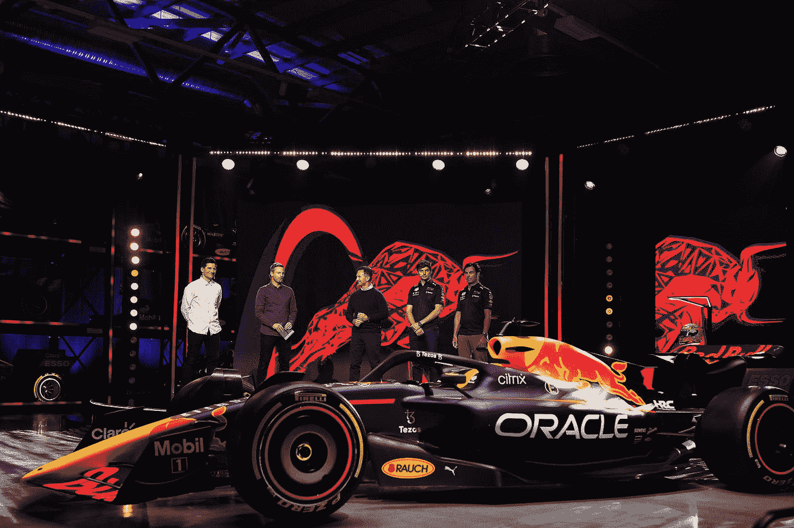

# 为什么红牛车队与 Bybit 平台签署 1.5 亿美元的交易？

> 原文：<https://medium.com/coinmonks/why-red-bull-racing-signs-150-million-deal-with-bybit-platform-a70b8dd4f7b7?source=collection_archive---------45----------------------->

四届世界冠军**红牛车队和 Bybit 交流平台签署了一份为期三年、价值 1 . 5 亿美元的协议。** Bybit 的标志将**出现在 RB18 赛车**上，预计将于本月晚些时候亮相，该平台将负责开发 F1 车队未来的不可替代令牌(NFT)等。

