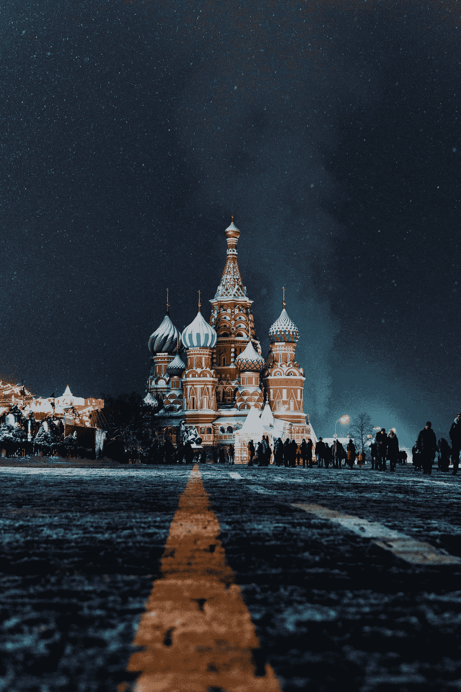
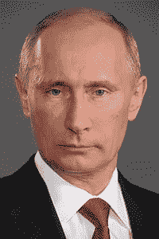

# 俄罗斯不在乎哈萨克斯坦停止向西伯利亚出口铁矿石——圣彼得堡国际经济论坛

> 原文：<https://medium.com/coinmonks/why-russia-doesnt-care-that-kazakhstan-stopped-exporting-iron-ore-to-siberia-st-a40ea346ce1f?source=collection_archive---------23----------------------->

我写这篇文章是为了分享俄罗斯乌克兰战争的一些最新影响，主要是对欧洲和亚洲相关能源和大宗商品的影响。我还想借此机会介绍我最近的一篇关于印度-太平洋的中型文章——对抗性地缘政治的新时代 。

我在这里介绍这篇文章，是为了和大家分享我对俄罗斯-中国-美国地缘政治竞争未来轨迹的感受；这是海洋领域对于未来国际冲突和争端解决的重要性。

Photo by [Nikita Karimov](https://unsplash.com/@messlifer?utm_source=medium&utm_medium=referral) on [Unsplash](https://unsplash.com?utm_source=medium&utm_medium=referral)

# **责备游戏**

[**2022 年 5 月 18 日**](https://eurasianet.org/amid-sanctions-kazakh-firm-stops-supplying-russian-steelworks) 哈萨克斯坦最大的铁矿石出口商和富集商索科洛夫-萨里拜矿业生产协会(SSGPO)决定暂时停止向位于西伯利亚的俄罗斯马格尼托戈尔斯克钢铁厂(MMK)供货。

俄罗斯 MMK 的回应是 [**指责**](https://www.vedomosti.ru/business/articles/2022/05/17/922281-posle-otkaza-kazahstana-metalloinvesta) 美国和西方制裁造成的局势。

 [## 处于上升期的俄罗斯采矿业——矿物加工

### 当前市场发展摘要:尽管全球经济不稳定和对俄罗斯的部门制裁，但…

www.at-minerals.com](https://www.at-minerals.com/en/artikel/at_Russia_s_mining_industry_on_an_upswing_3507564.html) 

尽管世界钢铁协会预测钢铁需求将在 2022 年出现约 0.4%的低增长，2023 年将增长约 2.2%，但由于地缘政治紧张局势和中国从上海新冠肺炎封锁中恢复，因此编制了****短期展望。****

****与此同时，能源在欧洲对俄罗斯天然气的依赖上占据了中心位置。俄罗斯天然气工业股份公司 减少了对德 33%的天然气供应，同时也中断了通过北溪管道对意大利埃尼集团的供应。据报道，这是由于波罗的海 Portovaya 压缩机站的一些管道涡轮机的操作问题，由于维护问题，Gazprom 指责西门子能源公司为回应西方的制裁而取消了对管道的服务。****

# ******真实效果******

****[**几内亚**](/coinmonks/crude-oil-iron-ore-are-signaling-a-reboot-in-the-global-commodity-supercycle-2e87325a8a05) 的铁矿石开采项目显示，在 [**全球大宗商品超级周期**](/coinmonks/goldman-sachs-bull-market-for-battery-metals-is-over-ab3a41e29d48) 期间，不管地缘政治如何，随着中国和澳大利亚等国家争夺铁矿石和其他金属的供需，对金属的强劲需求将会上升。****

****这就是为什么哈萨克斯坦和俄罗斯之间最近的局势不应该被轻视。只要看看发生在里海管道财团身上的事情，就能理解现在能源和商品的地缘政治本质。****

****由于俄乌战争，能源和大宗商品成为全球经济最大的担忧。德国的 [**煤电厂**](https://www.cnbc.com/2022/06/20/ukraine-war-germany-turns-to-coal-as-russia-throttles-gas-supplies.html?__source=androidappshare) 正在点火，加拿大的矿业公司为其位于美国亚利桑那州的 [**铜业世界综合体**](https://www.mining.com/hudbay-minerals-needs-1-3bn-for-copper-world-project-in-arizona/) 发布了初步经济评估(PEA)，法国总统马克龙正在与罗马尼亚商谈恢复一条从敖德萨到多瑙河的旧铁路运输路线，以增加从乌克兰到国际市场的 [**粮食出口**](https://whbl.com/2022/06/17/frances-macron-sceptical-on-russia-odesa-grain-deal-sees-romania-option/) 。****

****所有这些经济活动都是在美国和欧洲制裁俄罗斯关键液化天然气行业的背景下发生的，例如 Novatek 的 [**北极液化天然气 2 号项目**](https://www.upstreamonline.com/politics/sanctions-hit-russian-manufacturers-struggle-to-advance-countrys-lng-ambitions/2-1-1242028?utm_term=upstream) **。******

# ****圣彼得堡论坛****

****圣彼得堡国际经济论坛被用作俄罗斯向世界展示其政治议程的舞台。****

****用俄国总统弗拉基米尔·普京的话说:****

> ****该论坛的周年纪念是在整个国际社会面临困难的时候举行的。西方国家多年来在经济政策上的错误和不合理的制裁导致了全球通货膨胀的浪潮，正常供应链的中断，以及贫困和粮食短缺的急剧增加。然而，随着这些挑战的出现，新的前景正在出现。这就是为什么论坛的口号——新世界中的新机遇——看起来如此贴切。****

****“新世界中的新机遇”听起来像是经典的修正主义，但它也表明了俄罗斯对全球大宗商品超级周期的重要性——或者至少自认为如此。例如，中国国家主席兼董事长[**【Xi】**](https://www.reuters.com/world/europe/putin-dismisses-stupid-western-sanctions-blitzkrieg-2022-06-17/)在圣彼得堡论坛上站在俄国一边，宣称由美国领导的******的“单极世界时代”已经结束。**********

******虽然可以理解的是，大多数人会关注俄罗斯对乌克兰发动的非人道战争，但随着世界各地国际难民和国内流离失所者(IDPs)的激增，全球大宗商品超级周期正在推动俄罗斯等国家的经济实力。******

******这使得俄罗斯能够改变中亚后苏联地区的整个局势。哈萨克斯坦非常担心。面对日益逼近的俄罗斯边境威胁，俄罗斯不得不利用圣彼得堡论坛向世界表明其领土完整。******

******这在很多方面都是对世界的绝望恳求——美国？—促进哈萨克斯坦的主权事业，因为美国和欧洲对俄罗斯石油和天然气行业的制裁会给这个国家带来很大损失。******

************

******Source: St. Petersburg International Economic Forum, “To participants, organizers and guests of the 25th St. Petersburg International Economic Forum” [https://forumspb.com/en/](https://forumspb.com/en/)******

> ******亲爱的朋友们:******
> 
> ******今年是圣彼得堡国际经济论坛举办 25 周年。我真诚地祝贺论坛的组织者以及在这个重要的周年纪念日已经和正在参与其工作的所有人。******
> 
> ******多年来，该论坛已成为一个备受尊重和具有代表性的国际事件。与会者包括俄罗斯和外国的政治家、科学家和企业家，他们关注有关国内和世界经济的各种主题:从工业合作的具体领域到信息安全和环境保护。在直接和建设性的沟通过程中，双方签署了互利的长期合同，并交流了商业经验。******
> 
> ******该论坛的周年纪念是在整个国际社会面临困难的时候举行的。西方国家多年来在经济政策上的错误和不合理的制裁导致了全球通货膨胀的浪潮，正常供应链的中断，以及贫困和粮食短缺的急剧增加。然而，随着这些挑战的出现，新的前景正在出现。这就是为什么论坛的口号——新世界中的新机遇——看起来如此贴切。******
> 
> ******我相信，对俄罗斯来说，21 世纪 20 年代将成为该国加强其经济主权的时期，这包括加速发展其基础设施和技术基础，提高专家培训水平的质量，以及建立独立和高效的金融体系。此外，俄罗斯经济将越来越依赖私人倡议，当然，将继续致力于透明度和广泛的国际合作。******
> 
> ******促进贸易和投资、鼓励联合开发技术、加强金融和股票市场以及增加各国货币结算份额符合我们的共同利益。引入和发展真正互利的一体化模式至关重要，正如欧亚经济联盟正在做的那样。******
> 
> ******我坚信，论坛将继续为解决人类面临的众多高度优先挑战做出重大贡献，而相互信任、富有意义和致力于富有成效的对话和伙伴关系将始终是其显著特征。******
> 
> ******我祝你一切顺利，万事如意。******
> 
> ******弗拉基米尔·普京******

> ******加入 Coinmonks [电报频道](https://t.me/coincodecap)和 [Youtube 频道](https://www.youtube.com/c/coinmonks/videos)了解加密交易和投资******

# ******另外，阅读******

*   ******[用信用卡购买密码的 10 个最佳地点](https://coincodecap.com/buy-crypto-with-credit-card)******
*   ******[加拿大最佳加密交易机器人](https://coincodecap.com/5-best-crypto-trading-bots-in-canada) | [Bybit vs 币安](https://coincodecap.com/bybit-binance-moonxbt)******
*   ******[阿联酋 5 大最佳加密交易所](https://coincodecap.com/best-crypto-exchanges-in-uae) | [SimpleSwap 评论](https://coincodecap.com/simpleswap-review)******
*   ******购买 Dogecoin 的 7 种最佳方式 | [ZebPay 评论](https://coincodecap.com/zebpay-review)******
*   ******[最佳期货交易信号](https://coincodecap.com/futures-trading-signals) | [流动性交易回顾](https://coincodecap.com/liquid-exchange-review)******
*   ******【Huobi 的加密交易信号 | [Swapzone 审查](/coinmonks/swapzone-review-crypto-exchange-data-aggregator-e0ad78e55ed7)******