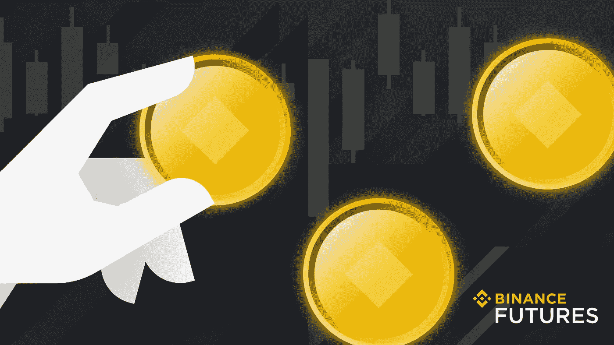

# 我为什么要从币安贷款？

> 原文：<https://medium.com/coinmonks/why-should-i-borrow-from-binance-loans-eb24dcaa822d?source=collection_archive---------8----------------------->

为现货、保证金或期货交易而借款。股份，以赚取高 APY。

Photo: Binance Loans

*还款容易。按小时计算利息，不收交易费。*

**加密货币贷款:介绍**

币安贷款是一项令人兴奋的金融服务；让用户满足他们的短期流动性需求。[币安贷款](https://www.binance.com/en/loan?ref=P10U1GSP)让你借高达 65%的抵押品价值，使用这些贷款资金是你自己的特权。太棒了，不是吗？肯定比你银行的个人贷款好得多。CeFi 借贷平台提供增强的安全性；它们通常得到声誉良好的加密货币交易所(如币安期货)的支持。

加密货币贷款的不同之处在于它们的会计。仅仅是因为在加密货币贷款中，交易者可以利用他们的加密货币资产作为抵押品来履行贷款人手续。

利用比特币贷款既简单又快捷。这些贷款提供了足够的加密货币资产流动性和可兑换性，以充分利用市场前景。一旦借入资金，币安贷款的利息就会累计，并按小时计算(最低 0.00000001 BUSD)。

只需提交一份贷款申请，从现货账户中发起抵押品转让，然后在您的现货账户中接收贷款。方便时还款，以获得现货账户中的抵押品。无需支付交易费用。鼓舞人心，不是吗？还有更多，继续读。

**币安贷款的优势**

Photo: Binance

> 你知道吗？
> 
> 你可以用你的抵押品来抵消币安贷款利率。
> 
> 无需支付提前还款罚金。

Photo: Binance

1.  **灵活贷款期限**:灵活贷款期限有 7 天、14 天、30 天、90 天、180 天。币安贷款的利息(可能提前支付)是根据实际借款时间计算的。过了到期时间，按小时收取 3 倍利息。如果任何一个头寸逾期超过 168 小时，它们将自动平仓以供偿还。
2.  **无需支付提前还款违约金**:是的，没错。币安贷款的提前还款不会被征收罚息。归还本金后，按实际借款小时数收取利息。
3.  **自由使用资金**:按照自己认为合适的方式使用资金。对贷款的用途没有限制(无论是交易、入股还是提款)。
4.  **贷款押记**:您可以押记抵押品资产以获得加密货币回报，并缓冲贷款利率。用于借款的担保资产被存放在用于区块链网络支持的加密货币钱包中。与此相反，你会得到降低利率的奖励。在 BTC 贷款的情况下，交易者可以利用 BTC 贷款作为抵押来获得 BUSD(或 USDT)贷款。偿还贷款及其利息后，抵押品将被发送到您的币安现货账户。在贷款期间，BTC 的升值会给借款人带来利润。

**利用币安贷款的例子**

商人比利急需周转资金来维持健康的营业额。他现在是 HODL 的 5 BTC(比特币)(长期不卖)。知道什么？比利足够幸运了。知道为什么吗？嗯，比利可以用他的 5 BTC 作为抵押来认购币安贷款。他可以简单地借出他的加密货币资产，以利用他的 BTC 资产的相应价值的资产(借出)。

比利可以用这笔贷款在币安进行交易，也可以提取资金用于周转。比利可以通过简单的步骤获得币安贷款。

比利需要:

1.  登录他的币安账户
2.  点击“金融”并选择“加密贷款”
3.  分别选择要借入和抵押的加密货币。
4.  输入贷款金额。选择“贷款期限”

各种加密货币的相应担保利率(最初)会有所不同。具体利率取决于贷款页面显示。确认利息和还款金额后，Billy 会点击“立即开始借款”，并访问订单页面。然后，Billy 会点击“币安贷款服务协议”复选框进行确认。Billy 在查看条款和条件后点击“确认”。你猜怎么着？当比利收到他的币安现货钱包中的贷款资产时，他将感受到最终的启示。

是的，我明白了。一旦拿到钱，比利就会担心贷款能否及时偿还。当 Billy 准备在还款日或之前偿还贷款时，Billy 只需点击“订单”选项卡，即可访问“贷款历史记录”最后，Billy 会点击“偿还”来偿还加密货币和利息。偿还贷款和利息后，比利会看到他的抵押品重新出现在他自己的币安现货钱包里。很干净，不是吗？确实是。

**你什么时候订阅你的币安贷款？**

加密货币贷款的支付速度使币安贷款对市场参与者具有吸引力。因此，利用加密货币资产的流动性和可兑换性(加上合适的市场渠道)变得非常简单快捷。只要记住，永远不要忘记:你可以借高达 65%的价值，你的抵押品通过币安贷款，使用贷款资金是你的个人特权。

通过[币安贷款常见问题](https://www.binance.com/en/support/faq/360041277432)了解更多关于币安贷款的信息。

[币安贷款利弊](https://www.binance.com/en/blog/loans/should-you-borrow-against-crypto-pros-and-cons-421499824684903345)。

新来币安吗？[今天就注册](https://accounts.binance.com/en/register?ref=P10U1GSP)！

**免责声明**:本文仅用于教育目的，不应被理解为投资建议。

> 加入 Coinmonks [电报频道](https://t.me/coincodecap)和 [Youtube 频道](https://www.youtube.com/c/coinmonks/videos)了解加密交易和投资

# 另外，阅读

*   [密码本交易平台](/coinmonks/top-10-crypto-copy-trading-platforms-for-beginners-d0c37c7d698c) | [Coinmama 审核](/coinmonks/coinmama-review-ace5641bde6e)
*   [印度的加密交易所](/coinmonks/bitcoin-exchange-in-india-7f1fe79715c9) | [比特币储蓄账户](/coinmonks/bitcoin-savings-account-e65b13f92451)
*   [OKEx vs KuCoin](https://coincodecap.com/okex-kucoin) | [摄氏替代品](https://coincodecap.com/celsius-alternatives) | [如何购买 VeChain](https://coincodecap.com/buy-vechain)
*   [币安期货交易](https://coincodecap.com/binance-futures-trading)|[3 commas vs Mudrex vs eToro](https://coincodecap.com/mudrex-3commas-etoro)
*   [如何购买 Monero](https://coincodecap.com/buy-monero) | [IDEX 评论](https://coincodecap.com/idex-review) | [BitKan 交易机器人](https://coincodecap.com/bitkan-trading-bot)
*   [CoinDCX 评论](/coinmonks/coindcx-review-8444db3621a2) | [加密保证金交易交易所](https://coincodecap.com/crypto-margin-trading-exchanges)
*   [红狗赌场评论](https://coincodecap.com/red-dog-casino-review) | [Swyftx 评论](https://coincodecap.com/swyftx-review) | [造币厂评论](https://coincodecap.com/coingate-review)