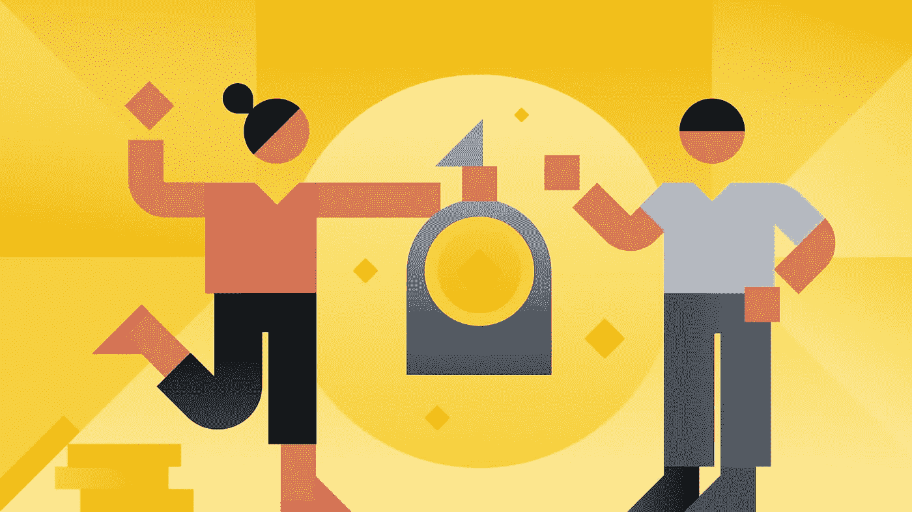

# 我为什么要从币安贷款？

> 原文：<https://medium.com/coinmonks/why-should-i-borrow-from-binance-loans-ed5206815dc7?source=collection_archive---------17----------------------->

[https://www.binance.com/en/loan](https://www.binance.com/en/loan)

> “如果一个人认为生活是一种简单的贷款，他可能会不那么苛刻。我们实际上一无所有；一切都要经过我们。”
> ——**尤金·德拉克洛瓦**

W ikipedia 将贷款定义为*一个或多个个人、组织或其他实体向其他个人、组织等出借*资金。许多人已经到了不得不求助于贷款来完成工作的时候。

另一方面，加密贷款，尤其是**币安加密贷款**是一种金融服务，它通过提供加密贷款为币安用户提供满足其短期流动性需求的机会。为了进一步掌握加密贷款的含义，这里举一个例子；塞拉斯目前有 20 个 ETH，他急需资金周转。但是，塞拉斯不想卖掉他的第 20 套房子，他更愿意长期拥有。塞拉斯现在可以用 20 ETH 作为抵押，借出相应价值的加密货币资产。塞拉斯可以用这笔贷款在币安平台上进行任何交易，如果他愿意，他也可以提取这笔贷款。

# 一些需要了解的专业术语

*   **清算价格**是被清算资产的总价格，这是达到清算 LTV 时的价格
*   **追加保证金通知**通知你在抵押品因市场波动而贬值时增加抵押品。这是为了避免清算你的资产。
*   **LTV(贷款价值比)**比率是贷款价值与抵押品价值的比率。此处使用指数价格。当您使用不同的加密货币作为相同价值的抵押品时，您所做的贷款也具有不同的价值，因为不同的抵押品硬币具有不同的初始 ltv。**高 LTV 意味着高金融风险**一旦你的 LTV 高于保证金通知 LTV，币安会通知你增加更多抵押品或偿还贷款。如果你的 LTV 高于清算 LTV，币安将清算你的抵押品来偿还你的贷款。不要忘记，加密市场可能会非常不稳定，因此所有这一切。您可以随时在 [**订单页面**](https://www.binance.com/en/loan?ref=ZCF73TU7) 上通过添加更多抵押品来调整您的抵押品，当您的 LTV 低于初始 LTV 时，您也可以删除一些抵押品

LTV 是这样计算的…

*   **LTV =(贷款金额/担保金额)x 100%**

# 如何使用币安加密贷款

**借款；**

1. [**登录**](http://accounts.binance.com/) 到你的币安账户。

如果你还没有一个免费的币安账户**并获得 [**验证**](https://www.binance.com/en/support/faq/360027287111) 的话，就在这里开一个吧**

**2.从**财务菜单** > > >中选择**加密贷款****

**3.选择您希望借入的资产和金额、抵押资产和金额以及贷款期限>>>选择**立即开始借款****

**4.检查通过>>>选择**确认。**借来的资产应该放在你的钱包里供你使用。**

****还款；****

1.  **从**财务菜单** > > >中选择**加密贷款****
2.  **选择**正在进行的订单****
3.  **选择硬币>>>选择**偿还****
4.  **直接输入还款金额或选择还款比例或只选择**最大** > > >选择**确认还款****
5.  **还款已成功进行。**

# ****币安贷款的优势****

*   ****灵活的贷款期限:**可借 7 天、14 天、30 天、90 天、180 天[贷款期限](https://www.binance.com/en/loan/data)。请注意，利息是从获得贷款时开始每小时计算的。**
*   ****提前还款不罚息:**已经通过币安贷款平台获得贷款的用户，可以提前还款，除贷款利息外，不收取额外费用。**
*   **在任何地方使用资金:借入的资产可以用于用户希望的任何目的。无论是交易，还是下注，甚至是提款，借来的资产都可以用来做这些事情。**
*   ****贷款押记:**币安有一些抵押品期权，可以押记以产生加密奖励并降低贷款利息费用。**

**总之，**币安贷款**是当你想在加密货币上多待一会儿，但仍想交易时的一个选择。如果你有任何问题或意见，请告诉我。**

**获得币安贷款？[https://www.binance.com/en/loan](https://www.binance.com/en/loan)**

**今天就创建一个免费的币安帐户[https://www.binance.com/en/buy-sell-crypto?ref=ZCF73TU7](https://www.binance.com/en/buy-sell-crypto?ref=ZCF73TU7)**

****快乐交易:)****

> **加入 Coinmonks [电报频道](https://t.me/coincodecap)和 [Youtube 频道](https://www.youtube.com/c/coinmonks/videos)了解加密交易和投资**

# **另外，阅读**

*   **[币安交易机器人](/coinmonks/binance-trading-bots-d0d57bb62c4c) | [OKEx 评论](/coinmonks/okex-review-6b369304110f) | [阿塔尼评论](https://coincodecap.com/atani-review)**
*   **[最佳加密交易信号电报](/coinmonks/best-crypto-signals-telegram-5785cdbc4b2b) | [MoonXBT 评论](/coinmonks/moonxbt-review-6e4ab26d037)**
*   **[如何在 Bitbns 上购买柴犬(SHIB)币？](https://coincodecap.com/buy-shiba-bitbns) | [购买弗洛基](https://coincodecap.com/buy-floki-inu-token)**
*   **[CoinFLEX 评论](https://coincodecap.com/coinflex-review) | [AEX 交易所评论](https://coincodecap.com/aex-exchange-review) | [UPbit 评论](https://coincodecap.com/upbit-review)**
*   **[十大最佳加密货币博客](https://coincodecap.com/best-cryptocurrency-blogs) | [YouHodler 评论](https://coincodecap.com/youhodler-review)**